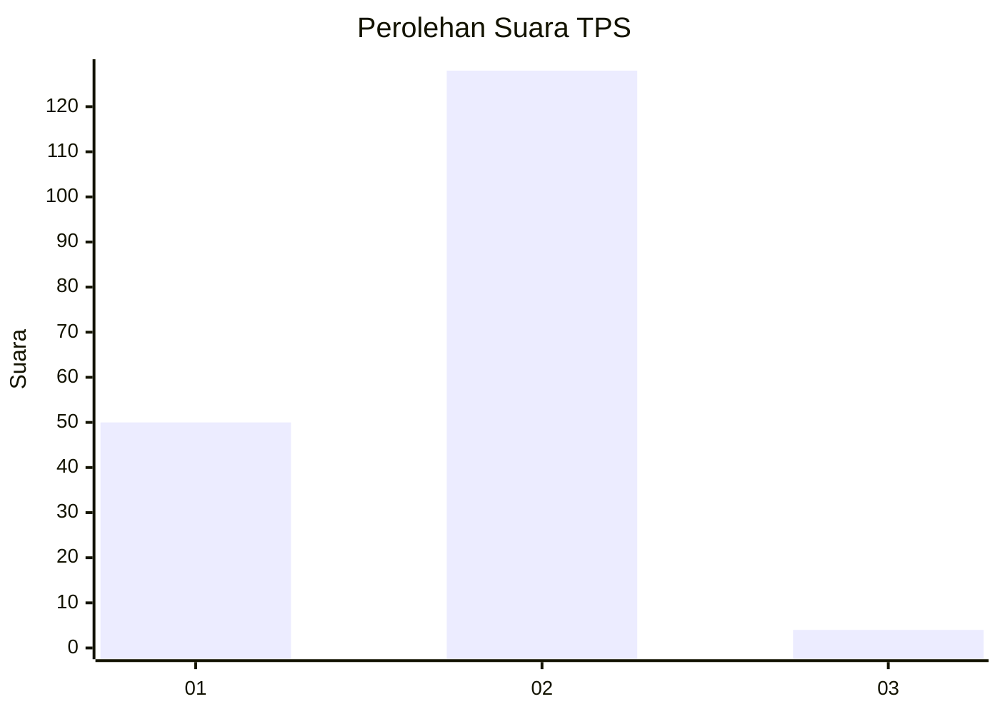
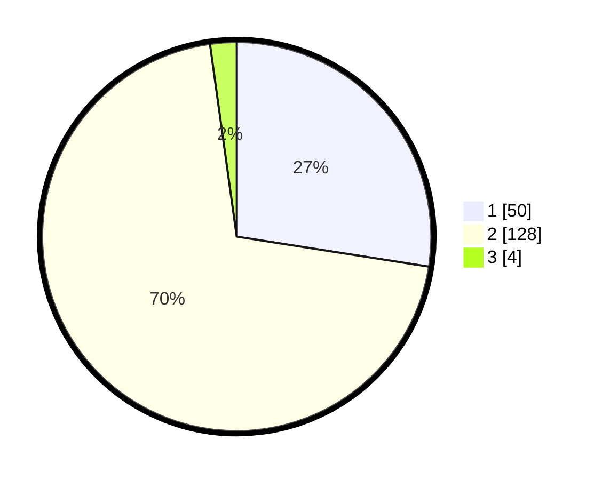

# Hasil

## Grafik

## Tabel

| No. | Nama Paslon    | Suara | Suara (raw) | Persentase |
|:--- |:-------------- | -----:| -----------:| ----------:|
| 1   | ANIES MUHAIMIN | 50    | [50][p-1]   | 27,47      |
| 2   | PRABOWO GIBRAN | 128   | [128][p-2]  | 70,33      |
| 3   | GANJAR MAHFUD  | 4     | [4][p-3]    | 2,20       |

[p-1]: https://github.com/gigit-pemilu/pemilu-2024/blob/main/pilpres/hitung-suara/sub/12-sumatera-utara/sub/23-labuhanbatu-utara/sub/06-na-ix-x/sub/1001-aek-kota-batu/sub/007-tps/sub/paslon-1.txt
[p-2]: https://github.com/gigit-pemilu/pemilu-2024/blob/main/pilpres/hitung-suara/sub/12-sumatera-utara/sub/23-labuhanbatu-utara/sub/06-na-ix-x/sub/1001-aek-kota-batu/sub/007-tps/sub/paslon-2.txt
[p-3]: https://github.com/gigit-pemilu/pemilu-2024/blob/main/pilpres/hitung-suara/sub/12-sumatera-utara/sub/23-labuhanbatu-utara/sub/06-na-ix-x/sub/1001-aek-kota-batu/sub/007-tps/sub/paslon-3.txt

## Foto C Plano

https://sirekap-obj-formc.kpu.go.id/9e39/pemilu/ppwp/12/23/06/10/01/1223061001007-20240215-133030--9e55b2c3-3fb9-4a2c-8870-0960bf6d9006.jpg

https://sirekap-obj-formc.kpu.go.id/9e39/pemilu/ppwp/12/23/06/10/01/1223061001007-20240215-133147--d0620ff7-a4ec-4cde-a4c4-467dc7a0c5d7.jpg

https://sirekap-obj-formc.kpu.go.id/9e39/pemilu/ppwp/12/23/06/10/01/1223061001007-20240215-133117--ed3a2e21-82ee-43a1-9da6-23b25921a1c5.jpg

## Metadata

| Key        | Value               |
| ---------- | ------------------- |
| Time Stamp | 2024-02-16 02:30:27 |

