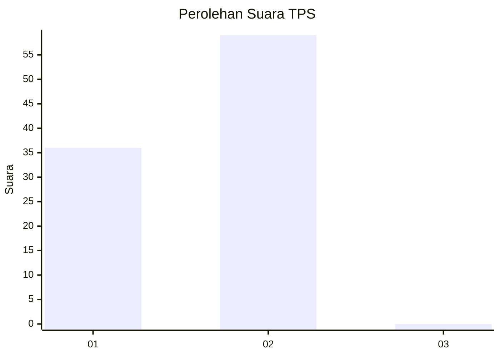
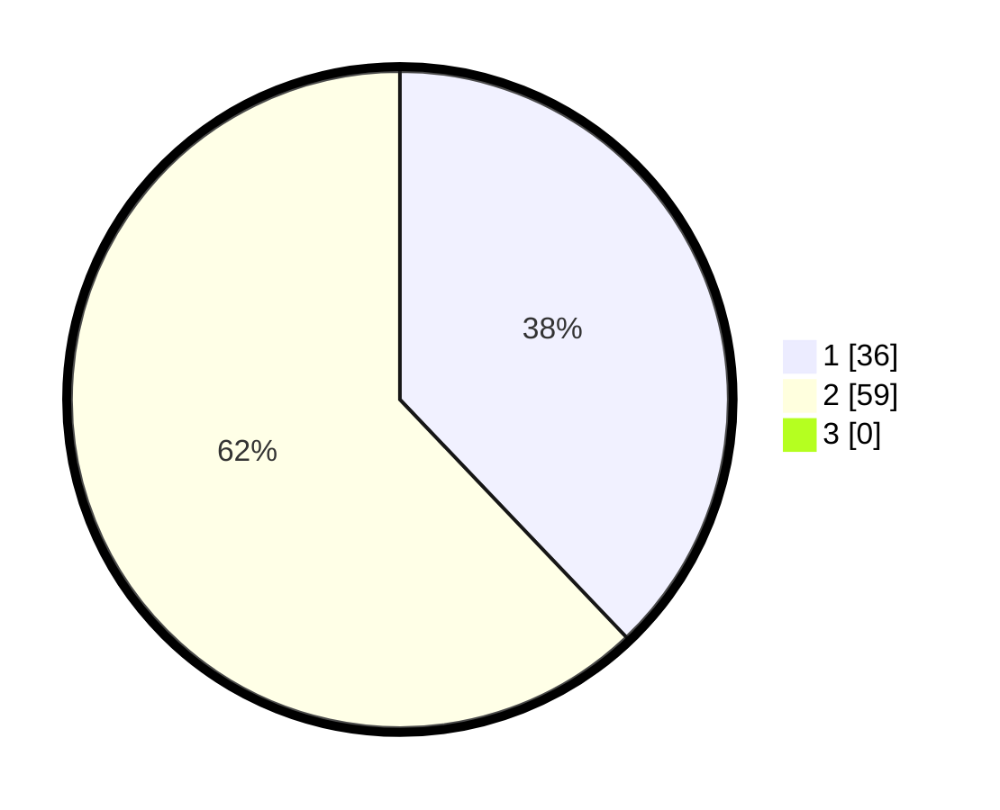

# Hasil

## Grafik

## Tabel

| No. | Nama Paslon    | Suara | Suara (raw) | Persentase |
|:--- |:-------------- | -----:| -----------:| ----------:|
| 1   | ANIES MUHAIMIN | 36    | [36][p-1]   | 37,89      |
| 2   | PRABOWO GIBRAN | 59    | [59][p-2]   | 62,11      |
| 3   | GANJAR MAHFUD  | 0     | [0][p-3]    | 0,00       |

[p-1]: https://github.com/gigit-pemilu/pemilu-2024/blob/main/pilpres/hitung-suara/sub/12-sumatera-utara/sub/23-labuhanbatu-utara/sub/06-na-ix-x/sub/1001-aek-kota-batu/sub/018-tps/sub/paslon-1.txt
[p-2]: https://github.com/gigit-pemilu/pemilu-2024/blob/main/pilpres/hitung-suara/sub/12-sumatera-utara/sub/23-labuhanbatu-utara/sub/06-na-ix-x/sub/1001-aek-kota-batu/sub/018-tps/sub/paslon-2.txt
[p-3]: https://github.com/gigit-pemilu/pemilu-2024/blob/main/pilpres/hitung-suara/sub/12-sumatera-utara/sub/23-labuhanbatu-utara/sub/06-na-ix-x/sub/1001-aek-kota-batu/sub/018-tps/sub/paslon-3.txt

## Foto C Plano

https://sirekap-obj-formc.kpu.go.id/ff70/pemilu/ppwp/12/23/06/10/01/1223061001018-20240215-052149--a52ecfd5-8d09-4660-9d34-a6ddc2a6cd9e.jpg

https://sirekap-obj-formc.kpu.go.id/ff70/pemilu/ppwp/12/23/06/10/01/1223061001018-20240215-052807--c74a6b66-6986-44f5-afeb-428a7aa2ccfb.jpg

https://sirekap-obj-formc.kpu.go.id/ff70/pemilu/ppwp/12/23/06/10/01/1223061001018-20240215-053421--d67dc292-2298-42af-ab4f-eab28f329e8b.jpg

## Metadata

| Key        | Value               |
| ---------- | ------------------- |
| Time Stamp | 2024-02-16 02:30:27 |

