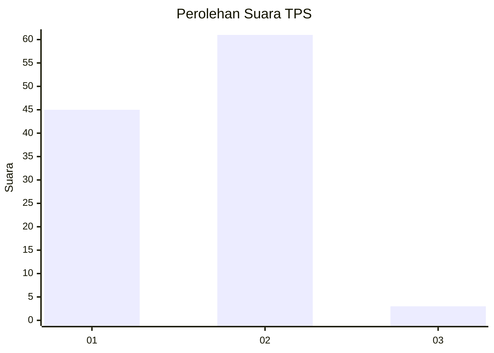
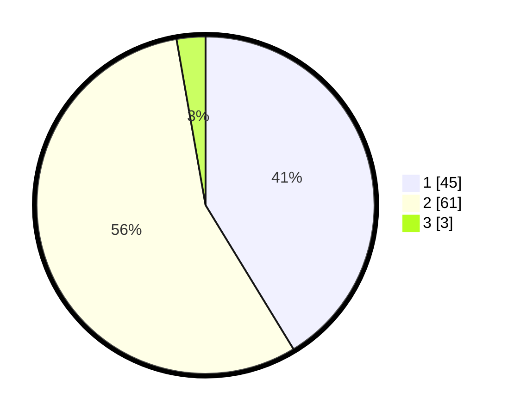

# Hasil

## Grafik

## Tabel

| No. | Nama Paslon    | Suara | Suara (raw) | Persentase |
|:--- |:-------------- | -----:| -----------:| ----------:|
| 1   | ANIES MUHAIMIN | 45    | [45][p-1]   | 41,28      |
| 2   | PRABOWO GIBRAN | 61    | [61][p-2]   | 55,96      |
| 3   | GANJAR MAHFUD  | 3     | [3][p-3]    | 2,75       |

[p-1]: https://github.com/gigit-pemilu/pemilu-2024/blob/main/pilpres/hitung-suara/sub/12-sumatera-utara/sub/23-labuhanbatu-utara/sub/06-na-ix-x/sub/2004-sungai-raja/sub/004-tps/sub/paslon-1.txt
[p-2]: https://github.com/gigit-pemilu/pemilu-2024/blob/main/pilpres/hitung-suara/sub/12-sumatera-utara/sub/23-labuhanbatu-utara/sub/06-na-ix-x/sub/2004-sungai-raja/sub/004-tps/sub/paslon-2.txt
[p-3]: https://github.com/gigit-pemilu/pemilu-2024/blob/main/pilpres/hitung-suara/sub/12-sumatera-utara/sub/23-labuhanbatu-utara/sub/06-na-ix-x/sub/2004-sungai-raja/sub/004-tps/sub/paslon-3.txt

## Foto C Plano

https://sirekap-obj-formc.kpu.go.id/f554/pemilu/ppwp/12/23/06/20/04/1223062004004-20240214-205456--eb02b720-d498-41be-9d38-347e188d9e1b.jpg

https://sirekap-obj-formc.kpu.go.id/f554/pemilu/ppwp/12/23/06/20/04/1223062004004-20240214-205518--8dd6f403-8d06-4c12-bfd8-7c808512962b.jpg

https://sirekap-obj-formc.kpu.go.id/f554/pemilu/ppwp/12/23/06/20/04/1223062004004-20240214-205537--d76d9864-482b-499f-92ad-1850fbe94a21.jpg

## Metadata

| Key        | Value               |
| ---------- | ------------------- |
| Time Stamp | 2024-02-16 03:30:26 |

