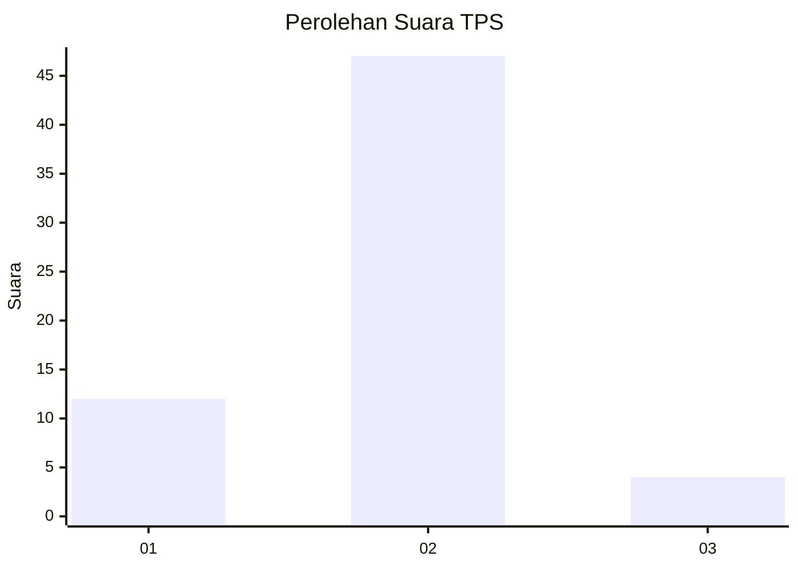
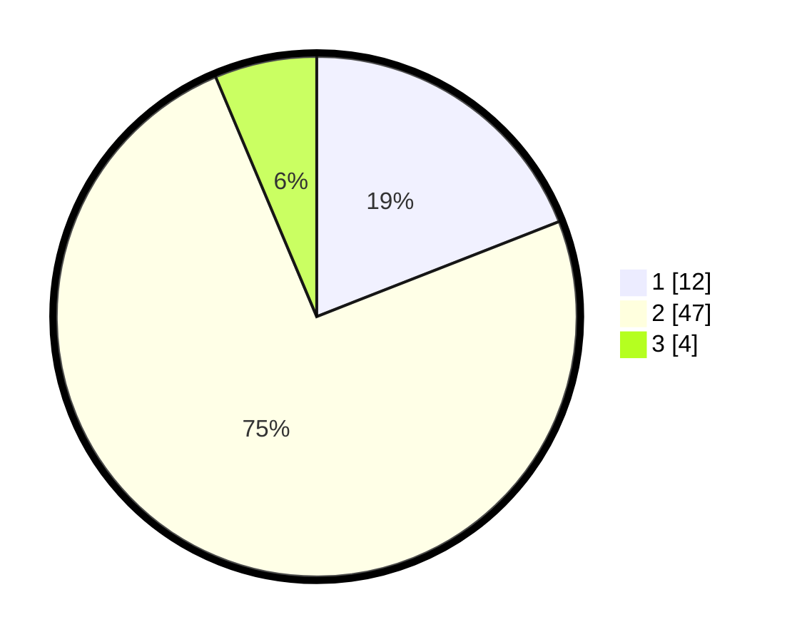

# Hasil

## Grafik

## Tabel

| No. | Nama Paslon    | Suara | Suara (raw) | Persentase |
|:--- |:-------------- | -----:| -----------:| ----------:|
| 1   | ANIES MUHAIMIN | 12    | [12][p-1]   | 19,05      |
| 2   | PRABOWO GIBRAN | 47    | [47][p-2]   | 74,60      |
| 3   | GANJAR MAHFUD  | 4     | [4][p-3]    | 6,35       |

[p-1]: https://github.com/gigit-pemilu/pemilu-2024-12-sumatera-utara/blob/main/pilpres/hitung-suara/sub/12-sumatera-utara/sub/23-labuhanbatu-utara/sub/06-na-ix-x/sub/2005-perkebunan-berangir/sub/001-tps/sub/paslon-1.txt
[p-2]: https://github.com/gigit-pemilu/pemilu-2024-12-sumatera-utara/blob/main/pilpres/hitung-suara/sub/12-sumatera-utara/sub/23-labuhanbatu-utara/sub/06-na-ix-x/sub/2005-perkebunan-berangir/sub/001-tps/sub/paslon-2.txt
[p-3]: https://github.com/gigit-pemilu/pemilu-2024-12-sumatera-utara/blob/main/pilpres/hitung-suara/sub/12-sumatera-utara/sub/23-labuhanbatu-utara/sub/06-na-ix-x/sub/2005-perkebunan-berangir/sub/001-tps/sub/paslon-3.txt

## Foto C Plano

https://sirekap-obj-formc.kpu.go.id/155b/pemilu/ppwp/12/23/06/20/05/1223062005001-20240214-185317--89341f3a-275c-4fd6-8b9b-31c9068724db.jpg

https://sirekap-obj-formc.kpu.go.id/155b/pemilu/ppwp/12/23/06/20/05/1223062005001-20240214-184840--f6c5c8ff-fc63-48b2-80a8-de894e13face.jpg

https://sirekap-obj-formc.kpu.go.id/155b/pemilu/ppwp/12/23/06/20/05/1223062005001-20240214-155718--41fb8906-543d-4fbb-b077-b1b0601754c9.jpg

## Metadata

| Key        | Value               |
| ---------- | ------------------- |
| Time Stamp | 2024-02-14 21:46:01 |

