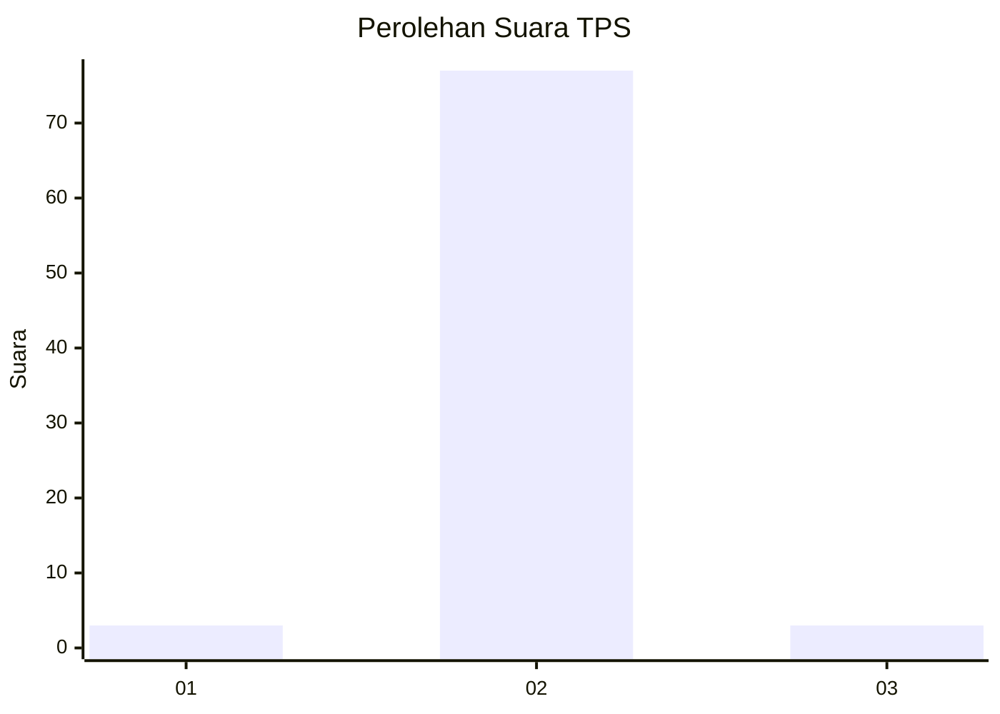
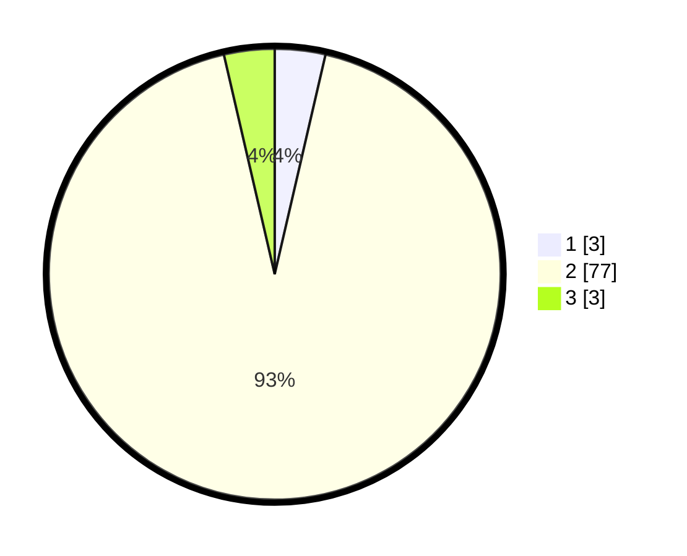

# Hasil

## Grafik

## Tabel

| No. | Nama Paslon    | Suara | Suara (raw) | Persentase |
|:--- |:-------------- | -----:| -----------:| ----------:|
| 1   | ANIES MUHAIMIN | 3     | [3][p-1]    | 3,61       |
| 2   | PRABOWO GIBRAN | 77    | [77][p-2]   | 92,77      |
| 3   | GANJAR MAHFUD  | 3     | [3][p-3]    | 3,61       |

[p-1]: https://github.com/gigit-pemilu/pemilu-2024/blob/main/pilpres/hitung-suara/sub/12-sumatera-utara/sub/23-labuhanbatu-utara/sub/06-na-ix-x/sub/2005-perkebunan-berangir/sub/006-tps/sub/paslon-1.txt
[p-2]: https://github.com/gigit-pemilu/pemilu-2024/blob/main/pilpres/hitung-suara/sub/12-sumatera-utara/sub/23-labuhanbatu-utara/sub/06-na-ix-x/sub/2005-perkebunan-berangir/sub/006-tps/sub/paslon-2.txt
[p-3]: https://github.com/gigit-pemilu/pemilu-2024/blob/main/pilpres/hitung-suara/sub/12-sumatera-utara/sub/23-labuhanbatu-utara/sub/06-na-ix-x/sub/2005-perkebunan-berangir/sub/006-tps/sub/paslon-3.txt

## Foto C Plano

https://sirekap-obj-formc.kpu.go.id/3af4/pemilu/ppwp/12/23/06/20/05/1223062005006-20240215-021042--15dfc3d1-1251-418f-a466-1bfa710be850.jpg

https://sirekap-obj-formc.kpu.go.id/3af4/pemilu/ppwp/12/23/06/20/05/1223062005006-20240215-021451--48818fb4-4775-4f02-bf69-e3de39351052.jpg

https://sirekap-obj-formc.kpu.go.id/3af4/pemilu/ppwp/12/23/06/20/05/1223062005006-20240215-021642--c1c3b1a3-1647-4c32-8d2d-07f521911f51.jpg

## Metadata

| Key        | Value               |
| ---------- | ------------------- |
| Time Stamp | 2024-02-16 02:30:27 |

