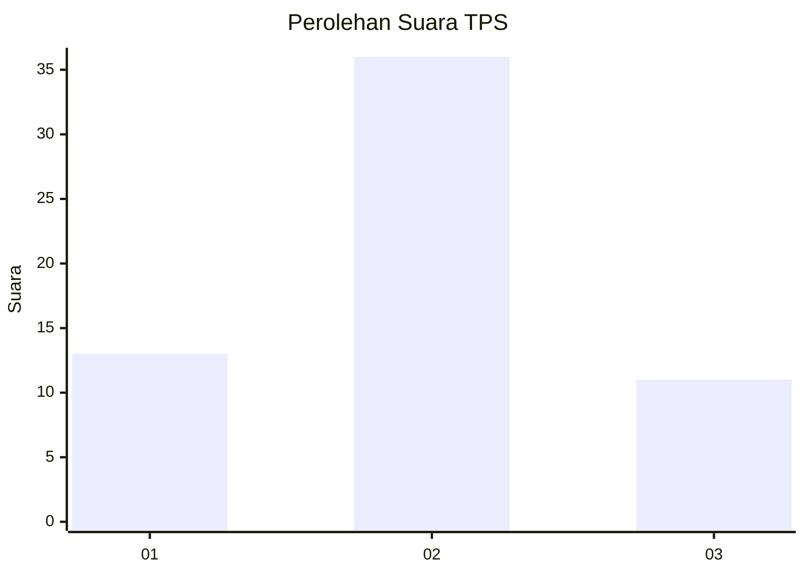
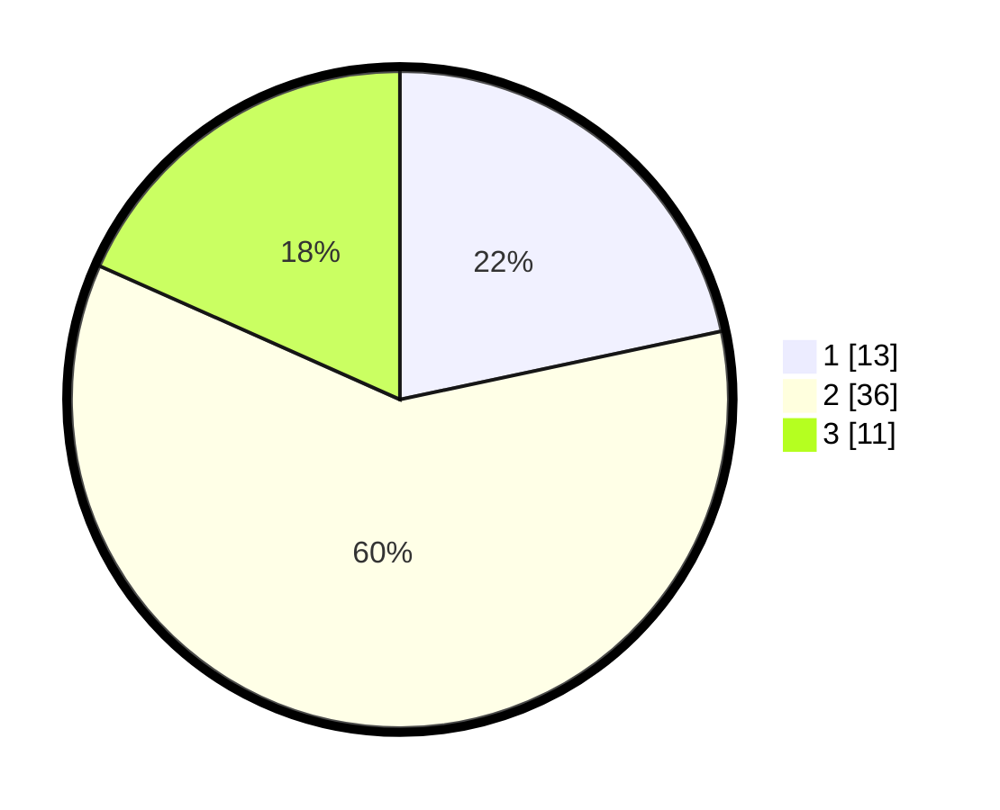

# Hasil

## Grafik

## Tabel

| No. | Nama Paslon    | Suara | Suara (raw) | Persentase |
|:--- |:-------------- | -----:| -----------:| ----------:|
| 1   | ANIES MUHAIMIN | 13    | [13][p-1]   | 21,67      |
| 2   | PRABOWO GIBRAN | 36    | [36][p-2]   | 60,00      |
| 3   | GANJAR MAHFUD  | 11    | [11][p-3]   | 18,33      |

[p-1]: https://github.com/gigit-pemilu/pemilu-2024-12-sumatera-utara/blob/main/pilpres/hitung-suara/sub/12-sumatera-utara/sub/23-labuhanbatu-utara/sub/06-na-ix-x/sub/2007-pulo-jantan/sub/012-tps/sub/paslon-1.txt
[p-2]: https://github.com/gigit-pemilu/pemilu-2024-12-sumatera-utara/blob/main/pilpres/hitung-suara/sub/12-sumatera-utara/sub/23-labuhanbatu-utara/sub/06-na-ix-x/sub/2007-pulo-jantan/sub/012-tps/sub/paslon-2.txt
[p-3]: https://github.com/gigit-pemilu/pemilu-2024-12-sumatera-utara/blob/main/pilpres/hitung-suara/sub/12-sumatera-utara/sub/23-labuhanbatu-utara/sub/06-na-ix-x/sub/2007-pulo-jantan/sub/012-tps/sub/paslon-3.txt

## Foto C Plano

https://sirekap-obj-formc.kpu.go.id/7ea0/pemilu/ppwp/12/23/06/20/07/1223062007012-20240215-003251--b8a079e4-e5b1-4d02-9054-c72c7b29c0bd.jpg

https://sirekap-obj-formc.kpu.go.id/7ea0/pemilu/ppwp/12/23/06/20/07/1223062007012-20240215-003541--930ee9c9-3c89-44f9-b32a-245e690ea5e5.jpg

https://sirekap-obj-formc.kpu.go.id/7ea0/pemilu/ppwp/12/23/06/20/07/1223062007012-20240215-003848--971c1402-b0dc-4e45-b38f-896c03e53284.jpg

## Metadata

| Key        | Value               |
| ---------- | ------------------- |
| Time Stamp | 2024-02-16 03:30:26 |

