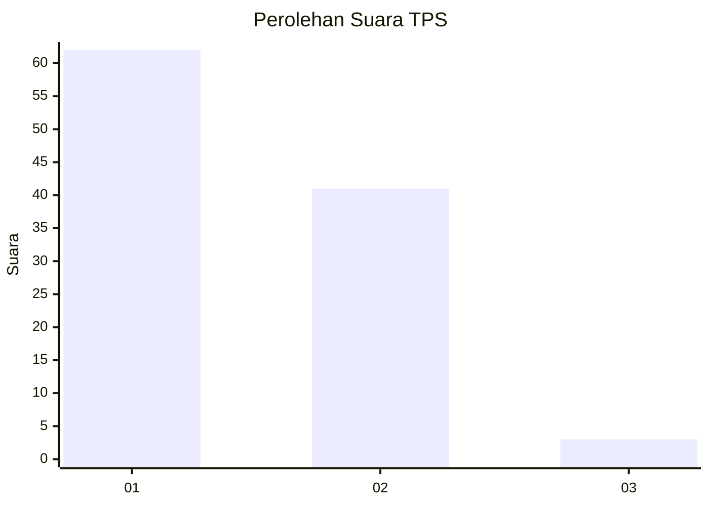
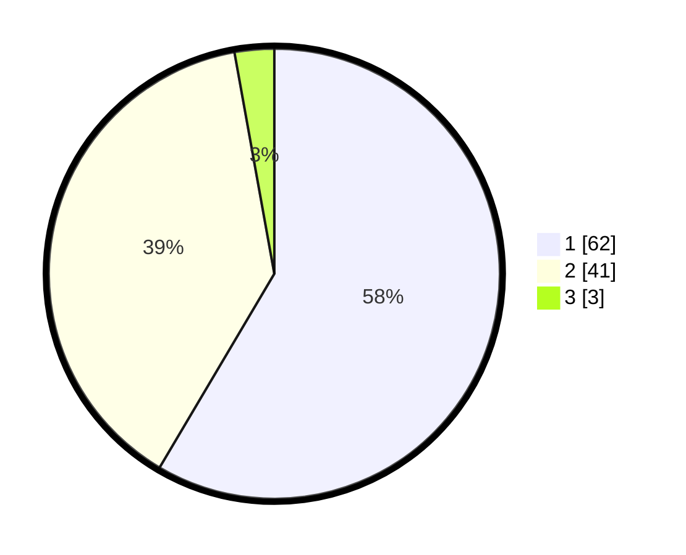

# Hasil

## Grafik

## Tabel

| No. | Nama Paslon    | Suara | Suara (raw) | Persentase |
|:--- |:-------------- | -----:| -----------:| ----------:|
| 1   | ANIES MUHAIMIN | 62    | [62][p-1]   | 58,49      |
| 2   | PRABOWO GIBRAN | 41    | [41][p-2]   | 38,68      |
| 3   | GANJAR MAHFUD  | 3     | [3][p-3]    | 2,83       |

[p-1]: https://github.com/gigit-pemilu/pemilu-2024/blob/main/pilpres/hitung-suara/sub/12-sumatera-utara/sub/23-labuhanbatu-utara/sub/06-na-ix-x/sub/2010-hatapang/sub/002-tps/sub/paslon-1.txt
[p-2]: https://github.com/gigit-pemilu/pemilu-2024/blob/main/pilpres/hitung-suara/sub/12-sumatera-utara/sub/23-labuhanbatu-utara/sub/06-na-ix-x/sub/2010-hatapang/sub/002-tps/sub/paslon-2.txt
[p-3]: https://github.com/gigit-pemilu/pemilu-2024/blob/main/pilpres/hitung-suara/sub/12-sumatera-utara/sub/23-labuhanbatu-utara/sub/06-na-ix-x/sub/2010-hatapang/sub/002-tps/sub/paslon-3.txt

## Foto C Plano

https://sirekap-obj-formc.kpu.go.id/e0d1/pemilu/ppwp/12/23/06/20/10/1223062010002-20240215-114708--030bf91a-8187-428b-91a3-88cfa2c7d86c.jpg

https://sirekap-obj-formc.kpu.go.id/e0d1/pemilu/ppwp/12/23/06/20/10/1223062010002-20240215-114805--c0d54108-f1fd-4278-a81b-10091d0cd04a.jpg

https://sirekap-obj-formc.kpu.go.id/e0d1/pemilu/ppwp/12/23/06/20/10/1223062010002-20240215-115020--e18d030f-839f-4f51-bf4e-1c67bbe21b69.jpg

## Metadata

| Key        | Value               |
| ---------- | ------------------- |
| Time Stamp | 2024-02-16 03:00:26 |

