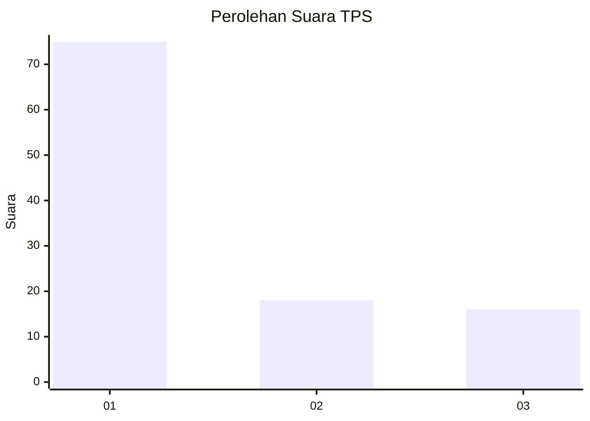
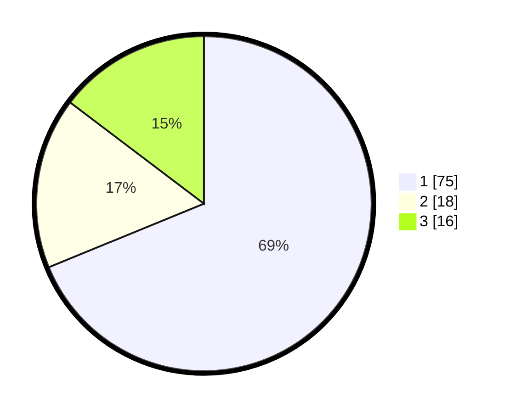

# Hasil

## Grafik

## Tabel

| No. | Nama Paslon    | Suara | Suara (raw) | Persentase |
|:--- |:-------------- | -----:| -----------:| ----------:|
| 1   | ANIES MUHAIMIN | 75    | [75][p-1]   | 68,81      |
| 2   | PRABOWO GIBRAN | 18    | [18][p-2]   | 16,51      |
| 3   | GANJAR MAHFUD  | 16    | [16][p-3]   | 14,68      |

[p-1]: https://github.com/gigit-pemilu/pemilu-2024-12-sumatera-utara/blob/main/pilpres/hitung-suara/sub/12-sumatera-utara/sub/23-labuhanbatu-utara/sub/06-na-ix-x/sub/2010-hatapang/sub/003-tps/sub/paslon-1.txt
[p-2]: https://github.com/gigit-pemilu/pemilu-2024-12-sumatera-utara/blob/main/pilpres/hitung-suara/sub/12-sumatera-utara/sub/23-labuhanbatu-utara/sub/06-na-ix-x/sub/2010-hatapang/sub/003-tps/sub/paslon-2.txt
[p-3]: https://github.com/gigit-pemilu/pemilu-2024-12-sumatera-utara/blob/main/pilpres/hitung-suara/sub/12-sumatera-utara/sub/23-labuhanbatu-utara/sub/06-na-ix-x/sub/2010-hatapang/sub/003-tps/sub/paslon-3.txt

## Foto C Plano

https://sirekap-obj-formc.kpu.go.id/d736/pemilu/ppwp/12/23/06/20/10/1223062010003-20240215-124950--a5e9742d-20d6-484f-86e4-89c1098c102d.jpg

https://sirekap-obj-formc.kpu.go.id/d736/pemilu/ppwp/12/23/06/20/10/1223062010003-20240215-145620--69cb23f9-854d-4600-8a39-cfee93829703.jpg

https://sirekap-obj-formc.kpu.go.id/d736/pemilu/ppwp/12/23/06/20/10/1223062010003-20240215-125352--c21ae51e-6ec3-433d-8f83-760a84459d5b.jpg

## Metadata

| Key        | Value               |
| ---------- | ------------------- |
| Time Stamp | 2024-02-16 03:00:26 |

