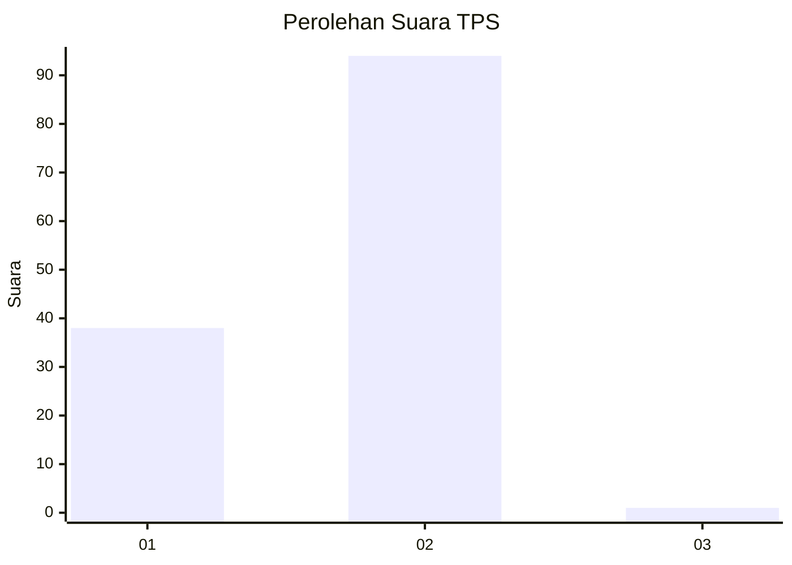
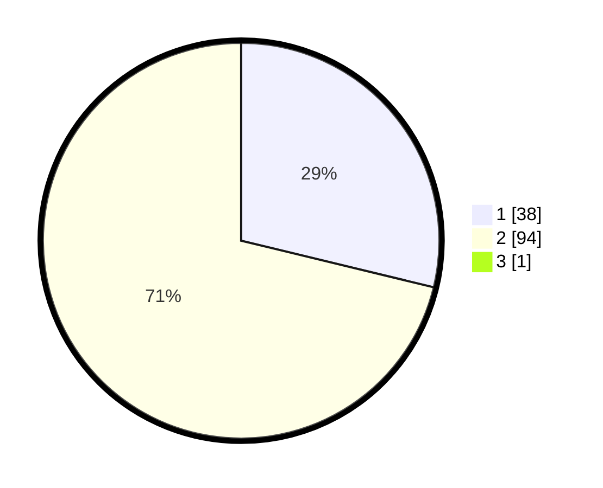

# Hasil

## Grafik

## Tabel

| No. | Nama Paslon    | Suara | Suara (raw) | Persentase |
|:--- |:-------------- | -----:| -----------:| ----------:|
| 1   | ANIES MUHAIMIN | 38    | [38][p-1]   | 28,57      |
| 2   | PRABOWO GIBRAN | 94    | [94][p-2]   | 70,68      |
| 3   | GANJAR MAHFUD  | 1     | [1][p-3]    | 0,75       |

[p-1]: https://github.com/gigit-pemilu/pemilu-2024/blob/main/pilpres/hitung-suara/sub/12-sumatera-utara/sub/23-labuhanbatu-utara/sub/07-aek-natas/sub/2003-rombisan/sub/003-tps/sub/paslon-1.txt
[p-2]: https://github.com/gigit-pemilu/pemilu-2024/blob/main/pilpres/hitung-suara/sub/12-sumatera-utara/sub/23-labuhanbatu-utara/sub/07-aek-natas/sub/2003-rombisan/sub/003-tps/sub/paslon-2.txt
[p-3]: https://github.com/gigit-pemilu/pemilu-2024/blob/main/pilpres/hitung-suara/sub/12-sumatera-utara/sub/23-labuhanbatu-utara/sub/07-aek-natas/sub/2003-rombisan/sub/003-tps/sub/paslon-3.txt

## Foto C Plano

https://sirekap-obj-formc.kpu.go.id/d80e/pemilu/ppwp/12/23/07/20/03/1223072003003-20240216-085529--84609cec-6db6-4731-ab44-847e01d052c7.jpg

https://sirekap-obj-formc.kpu.go.id/d80e/pemilu/ppwp/12/23/07/20/03/1223072003003-20240216-085555--b42c2c3e-b0f3-4b85-ad9e-e9acd5d97e2e.jpg

https://sirekap-obj-formc.kpu.go.id/d80e/pemilu/ppwp/12/23/07/20/03/1223072003003-20240216-085559--f38f67a9-229b-48eb-bca1-57feb15732d1.jpg

## Metadata

| Key        | Value               |
| ---------- | ------------------- |
| Time Stamp | 2024-02-16 10:30:29 |

