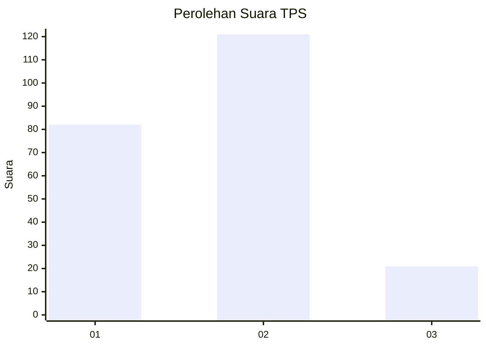

# Hasil

## Grafik

## Tabel

| No. | Nama Paslon    | Suara | Suara (raw) | Persentase |
|:--- |:-------------- | -----:| -----------:| ----------:|
| 1   | ANIES MUHAIMIN | 82    | [82][p-1]   | 36,61      |
| 2   | PRABOWO GIBRAN | 121   | [121][p-2]  | 54,02      |
| 3   | GANJAR MAHFUD  | 21    | [21][p-3]   | 9,38       |

[p-1]: https://github.com/gigit-pemilu/pemilu-2024-12-sumatera-utara/blob/main/pilpres/hitung-suara/sub/12-sumatera-utara/sub/23-labuhanbatu-utara/sub/07-aek-natas/sub/2003-rombisan/sub/004-tps/sub/paslon-1.txt
[p-2]: https://github.com/gigit-pemilu/pemilu-2024-12-sumatera-utara/blob/main/pilpres/hitung-suara/sub/12-sumatera-utara/sub/23-labuhanbatu-utara/sub/07-aek-natas/sub/2003-rombisan/sub/004-tps/sub/paslon-2.txt
[p-3]: https://github.com/gigit-pemilu/pemilu-2024-12-sumatera-utara/blob/main/pilpres/hitung-suara/sub/12-sumatera-utara/sub/23-labuhanbatu-utara/sub/07-aek-natas/sub/2003-rombisan/sub/004-tps/sub/paslon-3.txt

## Foto C Plano

https://sirekap-obj-formc.kpu.go.id/f27e/pemilu/ppwp/12/23/07/20/03/1223072003004-20240215-025401--9541e846-ee84-46af-81e9-96fb32734122.jpg

https://sirekap-obj-formc.kpu.go.id/f27e/pemilu/ppwp/12/23/07/20/03/1223072003004-20240215-025615--7bfb9a0e-caa5-4a2e-84e8-ceee0f6d43a1.jpg

https://sirekap-obj-formc.kpu.go.id/f27e/pemilu/ppwp/12/23/07/20/03/1223072003004-20240215-040627--1a33f177-3c4c-4584-8aef-f552100172d9.jpg

## Metadata

| Key        | Value               |
| ---------- | ------------------- |
| Time Stamp | 2024-02-15 15:30:25 |

