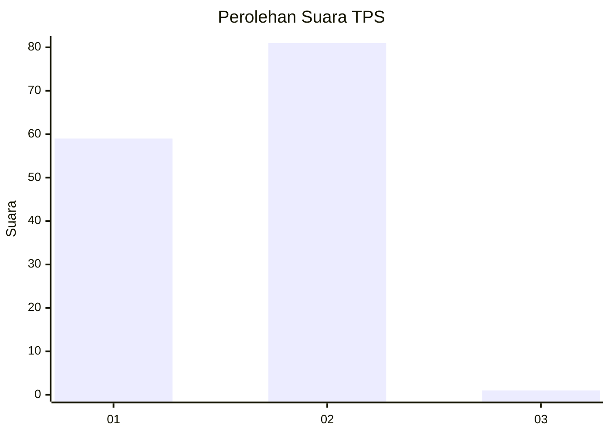
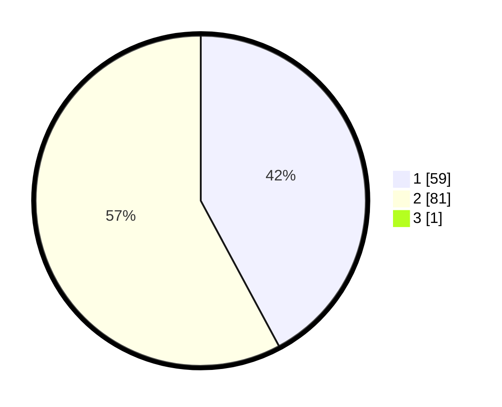

# Hasil

## Grafik

## Tabel

| No. | Nama Paslon    | Suara | Suara (raw) | Persentase |
|:--- |:-------------- | -----:| -----------:| ----------:|
| 1   | ANIES MUHAIMIN | 59    | [59][p-1]   | 41,84      |
| 2   | PRABOWO GIBRAN | 81    | [81][p-2]   | 57,45      |
| 3   | GANJAR MAHFUD  | 1     | [1][p-3]    | 0,71       |

[p-1]: https://github.com/gigit-pemilu/pemilu-2024-12-sumatera-utara/blob/main/pilpres/hitung-suara/sub/12-sumatera-utara/sub/23-labuhanbatu-utara/sub/07-aek-natas/sub/2003-rombisan/sub/005-tps/sub/paslon-1.txt
[p-2]: https://github.com/gigit-pemilu/pemilu-2024-12-sumatera-utara/blob/main/pilpres/hitung-suara/sub/12-sumatera-utara/sub/23-labuhanbatu-utara/sub/07-aek-natas/sub/2003-rombisan/sub/005-tps/sub/paslon-2.txt
[p-3]: https://github.com/gigit-pemilu/pemilu-2024-12-sumatera-utara/blob/main/pilpres/hitung-suara/sub/12-sumatera-utara/sub/23-labuhanbatu-utara/sub/07-aek-natas/sub/2003-rombisan/sub/005-tps/sub/paslon-3.txt

## Foto C Plano

https://sirekap-obj-formc.kpu.go.id/3ae4/pemilu/ppwp/12/23/07/20/03/1223072003005-20240215-042403--ceecea04-97ac-4b11-97aa-8846125f75e1.jpg

https://sirekap-obj-formc.kpu.go.id/3ae4/pemilu/ppwp/12/23/07/20/03/1223072003005-20240215-041906--ab74fd14-469e-4dbf-b84a-31d027ca4df1.jpg

https://sirekap-obj-formc.kpu.go.id/3ae4/pemilu/ppwp/12/23/07/20/03/1223072003005-20240215-042111--657f0f91-46a6-413a-84c9-530f434c6a18.jpg

## Metadata

| Key        | Value               |
| ---------- | ------------------- |
| Time Stamp | 2024-02-15 15:00:29 |

