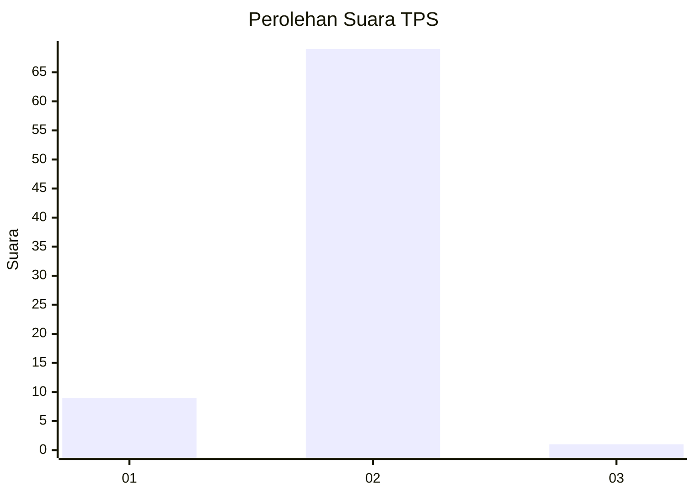
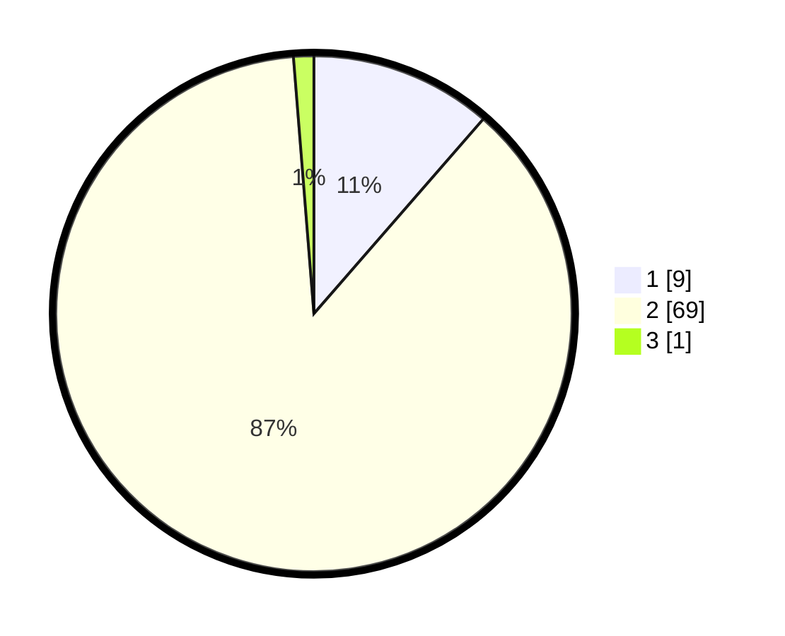

# Hasil

## Grafik

## Tabel

| No. | Nama Paslon    | Suara | Suara (raw) | Persentase |
|:--- |:-------------- | -----:| -----------:| ----------:|
| 1   | ANIES MUHAIMIN | 9     | [9][p-1]    | 11,39      |
| 2   | PRABOWO GIBRAN | 69    | [69][p-2]   | 87,34      |
| 3   | GANJAR MAHFUD  | 1     | [1][p-3]    | 1,27       |

[p-1]: https://github.com/gigit-pemilu/pemilu-2024/blob/main/pilpres/hitung-suara/sub/12-sumatera-utara/sub/23-labuhanbatu-utara/sub/07-aek-natas/sub/2006-perk-aek-pamienke/sub/001-tps/sub/paslon-1.txt
[p-2]: https://github.com/gigit-pemilu/pemilu-2024/blob/main/pilpres/hitung-suara/sub/12-sumatera-utara/sub/23-labuhanbatu-utara/sub/07-aek-natas/sub/2006-perk-aek-pamienke/sub/001-tps/sub/paslon-2.txt
[p-3]: https://github.com/gigit-pemilu/pemilu-2024/blob/main/pilpres/hitung-suara/sub/12-sumatera-utara/sub/23-labuhanbatu-utara/sub/07-aek-natas/sub/2006-perk-aek-pamienke/sub/001-tps/sub/paslon-3.txt

## Foto C Plano

https://sirekap-obj-formc.kpu.go.id/a0f7/pemilu/ppwp/12/23/07/20/06/1223072006001-20240215-081226--b0bae054-1df4-4d68-a265-c61d9c496375.jpg

https://sirekap-obj-formc.kpu.go.id/a0f7/pemilu/ppwp/12/23/07/20/06/1223072006001-20240215-081439--8febea17-1316-4c04-8602-becd766266ff.jpg

https://sirekap-obj-formc.kpu.go.id/a0f7/pemilu/ppwp/12/23/07/20/06/1223072006001-20240215-081734--4d047854-88ae-4c3e-8736-7d44222b612b.jpg

## Metadata

| Key        | Value               |
| ---------- | ------------------- |
| Time Stamp | 2024-02-15 15:30:25 |

