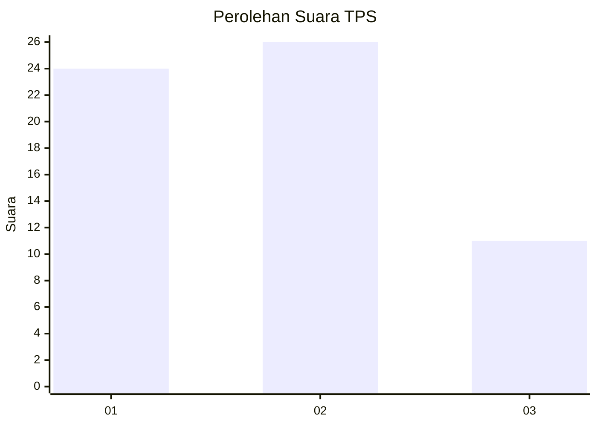
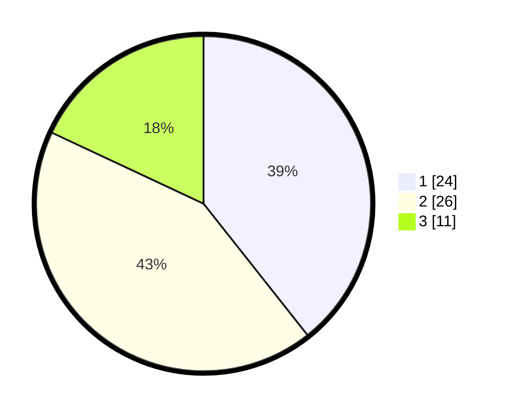

# Hasil

## Grafik

## Tabel

| No. | Nama Paslon    | Suara | Suara (raw) | Persentase |
|:--- |:-------------- | -----:| -----------:| ----------:|
| 1   | ANIES MUHAIMIN | 24    | [24][p-1]   | 39,34      |
| 2   | PRABOWO GIBRAN | 26    | [26][p-2]   | 42,62      |
| 3   | GANJAR MAHFUD  | 11    | [11][p-3]   | 18,03      |

[p-1]: https://github.com/gigit-pemilu/pemilu-2024/blob/main/pilpres/hitung-suara/sub/12-sumatera-utara/sub/23-labuhanbatu-utara/sub/07-aek-natas/sub/2011-terang-bulan/sub/011-tps/sub/paslon-1.txt
[p-2]: https://github.com/gigit-pemilu/pemilu-2024/blob/main/pilpres/hitung-suara/sub/12-sumatera-utara/sub/23-labuhanbatu-utara/sub/07-aek-natas/sub/2011-terang-bulan/sub/011-tps/sub/paslon-2.txt
[p-3]: https://github.com/gigit-pemilu/pemilu-2024/blob/main/pilpres/hitung-suara/sub/12-sumatera-utara/sub/23-labuhanbatu-utara/sub/07-aek-natas/sub/2011-terang-bulan/sub/011-tps/sub/paslon-3.txt

## Foto C Plano

https://sirekap-obj-formc.kpu.go.id/b166/pemilu/ppwp/12/23/07/20/11/1223072011011-20240215-114250--18568415-091a-4c61-8a31-88529a4efda4.jpg

https://sirekap-obj-formc.kpu.go.id/b166/pemilu/ppwp/12/23/07/20/11/1223072011011-20240215-114451--9826d0b9-3d31-4288-93af-163ed5304f06.jpg

https://sirekap-obj-formc.kpu.go.id/b166/pemilu/ppwp/12/23/07/20/11/1223072011011-20240215-114739--b99202a2-dd63-40de-8ac5-b81d1929968f.jpg

## Metadata

| Key        | Value               |
| ---------- | ------------------- |
| Time Stamp | 2024-02-15 19:00:26 |

