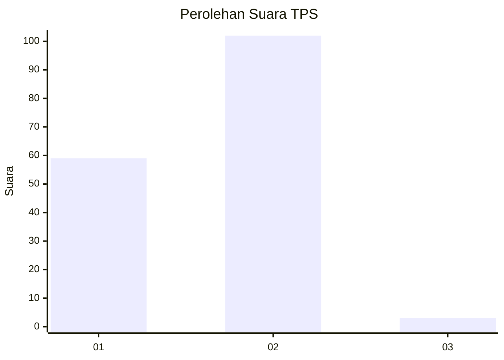
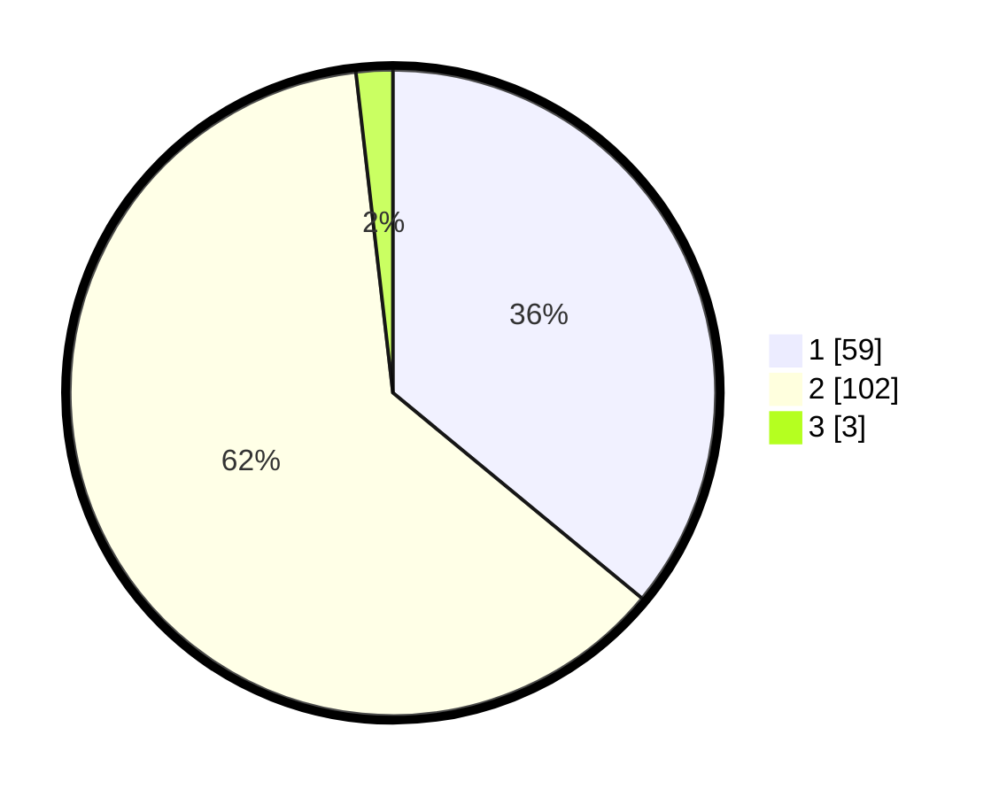

# Hasil

## Grafik

## Tabel

| No. | Nama Paslon    | Suara | Suara (raw) | Persentase |
|:--- |:-------------- | -----:| -----------:| ----------:|
| 1   | ANIES MUHAIMIN | 59    | [59][p-1]   | 35,98      |
| 2   | PRABOWO GIBRAN | 102   | [102][p-2]  | 62,20      |
| 3   | GANJAR MAHFUD  | 3     | [3][p-3]    | 1,83       |

[p-1]: https://github.com/gigit-pemilu/pemilu-2024-12-sumatera-utara/blob/main/pilpres/hitung-suara/sub/12-sumatera-utara/sub/23-labuhanbatu-utara/sub/08-kualuh-selatan/sub/1001-gunting-saga/sub/012-tps/sub/paslon-1.txt
[p-2]: https://github.com/gigit-pemilu/pemilu-2024-12-sumatera-utara/blob/main/pilpres/hitung-suara/sub/12-sumatera-utara/sub/23-labuhanbatu-utara/sub/08-kualuh-selatan/sub/1001-gunting-saga/sub/012-tps/sub/paslon-2.txt
[p-3]: https://github.com/gigit-pemilu/pemilu-2024-12-sumatera-utara/blob/main/pilpres/hitung-suara/sub/12-sumatera-utara/sub/23-labuhanbatu-utara/sub/08-kualuh-selatan/sub/1001-gunting-saga/sub/012-tps/sub/paslon-3.txt

## Foto C Plano

https://sirekap-obj-formc.kpu.go.id/539b/pemilu/ppwp/12/23/08/10/01/1223081001012-20240214-214738--1ac1f7ee-0bdd-48f0-b6e7-5e344ba92055.jpg

https://sirekap-obj-formc.kpu.go.id/539b/pemilu/ppwp/12/23/08/10/01/1223081001012-20240214-214852--df20f3a1-b0bf-4c0c-8c9a-40c264e5fc3b.jpg

https://sirekap-obj-formc.kpu.go.id/539b/pemilu/ppwp/12/23/08/10/01/1223081001012-20240214-214923--c6922021-3d98-46af-a4d5-3aa3729ac607.jpg

## Metadata

| Key        | Value               |
| ---------- | ------------------- |
| Time Stamp | 2024-02-16 02:30:27 |

