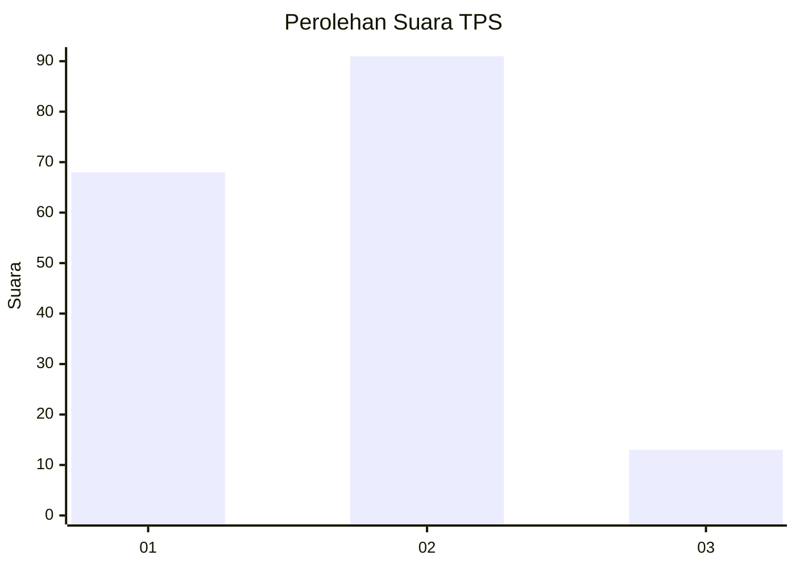

# Hasil

## Grafik

## Tabel

| No. | Nama Paslon    | Suara | Suara (raw) | Persentase |
|:--- |:-------------- | -----:| -----------:| ----------:|
| 1   | ANIES MUHAIMIN | 68    | [68][p-1]   | 39,53      |
| 2   | PRABOWO GIBRAN | 91    | [91][p-2]   | 52,91      |
| 3   | GANJAR MAHFUD  | 13    | [13][p-3]   | 7,56       |

[p-1]: https://github.com/gigit-pemilu/pemilu-2024-12-sumatera-utara/blob/main/pilpres/hitung-suara/sub/12-sumatera-utara/sub/23-labuhanbatu-utara/sub/08-kualuh-selatan/sub/1001-gunting-saga/sub/014-tps/sub/paslon-1.txt
[p-2]: https://github.com/gigit-pemilu/pemilu-2024-12-sumatera-utara/blob/main/pilpres/hitung-suara/sub/12-sumatera-utara/sub/23-labuhanbatu-utara/sub/08-kualuh-selatan/sub/1001-gunting-saga/sub/014-tps/sub/paslon-2.txt
[p-3]: https://github.com/gigit-pemilu/pemilu-2024-12-sumatera-utara/blob/main/pilpres/hitung-suara/sub/12-sumatera-utara/sub/23-labuhanbatu-utara/sub/08-kualuh-selatan/sub/1001-gunting-saga/sub/014-tps/sub/paslon-3.txt

## Foto C Plano

https://sirekap-obj-formc.kpu.go.id/7917/pemilu/ppwp/12/23/08/10/01/1223081001014-20240214-202232--8a7bba12-e157-4d18-9a88-b600e6424e40.jpg

https://sirekap-obj-formc.kpu.go.id/7917/pemilu/ppwp/12/23/08/10/01/1223081001014-20240215-051005--e43fbfe1-b80e-4277-bd36-fb78575aba31.jpg

https://sirekap-obj-formc.kpu.go.id/7917/pemilu/ppwp/12/23/08/10/01/1223081001014-20240215-051055--8397dce0-07b5-4dd4-8875-eb3980cf32a3.jpg

## Metadata

| Key        | Value               |
| ---------- | ------------------- |
| Time Stamp | 2024-02-15 15:30:25 |

