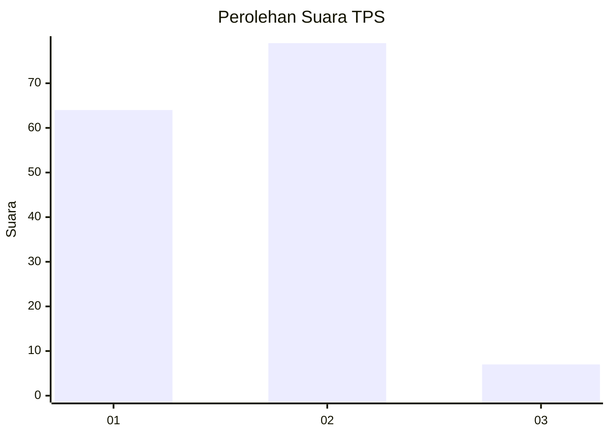
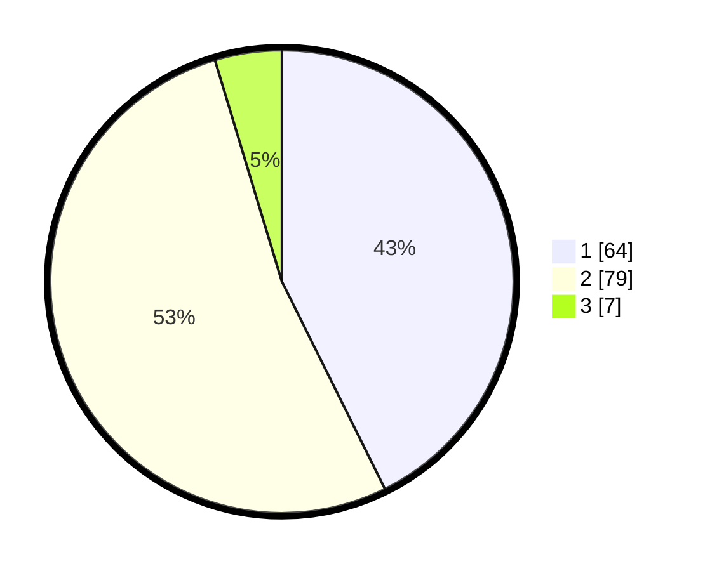

# Hasil

## Grafik

## Tabel

| No. | Nama Paslon    | Suara | Suara (raw) | Persentase |
|:--- |:-------------- | -----:| -----------:| ----------:|
| 1   | ANIES MUHAIMIN | 64    | [64][p-1]   | 42,67      |
| 2   | PRABOWO GIBRAN | 79    | [79][p-2]   | 52,67      |
| 3   | GANJAR MAHFUD  | 7     | [7][p-3]    | 4,67       |

[p-1]: https://github.com/gigit-pemilu/pemilu-2024-12-sumatera-utara/blob/main/pilpres/hitung-suara/sub/12-sumatera-utara/sub/23-labuhanbatu-utara/sub/08-kualuh-selatan/sub/1001-gunting-saga/sub/016-tps/sub/paslon-1.txt
[p-2]: https://github.com/gigit-pemilu/pemilu-2024-12-sumatera-utara/blob/main/pilpres/hitung-suara/sub/12-sumatera-utara/sub/23-labuhanbatu-utara/sub/08-kualuh-selatan/sub/1001-gunting-saga/sub/016-tps/sub/paslon-2.txt
[p-3]: https://github.com/gigit-pemilu/pemilu-2024-12-sumatera-utara/blob/main/pilpres/hitung-suara/sub/12-sumatera-utara/sub/23-labuhanbatu-utara/sub/08-kualuh-selatan/sub/1001-gunting-saga/sub/016-tps/sub/paslon-3.txt

## Foto C Plano

https://sirekap-obj-formc.kpu.go.id/7a3d/pemilu/ppwp/12/23/08/10/01/1223081001016-20240215-085303--16c398da-15dd-469e-a286-6f7aab5fee45.jpg

https://sirekap-obj-formc.kpu.go.id/7a3d/pemilu/ppwp/12/23/08/10/01/1223081001016-20240215-085709--af665c1b-a7f2-4840-a8e4-948541915502.jpg

https://sirekap-obj-formc.kpu.go.id/7a3d/pemilu/ppwp/12/23/08/10/01/1223081001016-20240215-085946--745b43dd-5154-43a5-911f-b4cc56149c35.jpg

## Metadata

| Key        | Value               |
| ---------- | ------------------- |
| Time Stamp | 2024-02-16 03:00:26 |

