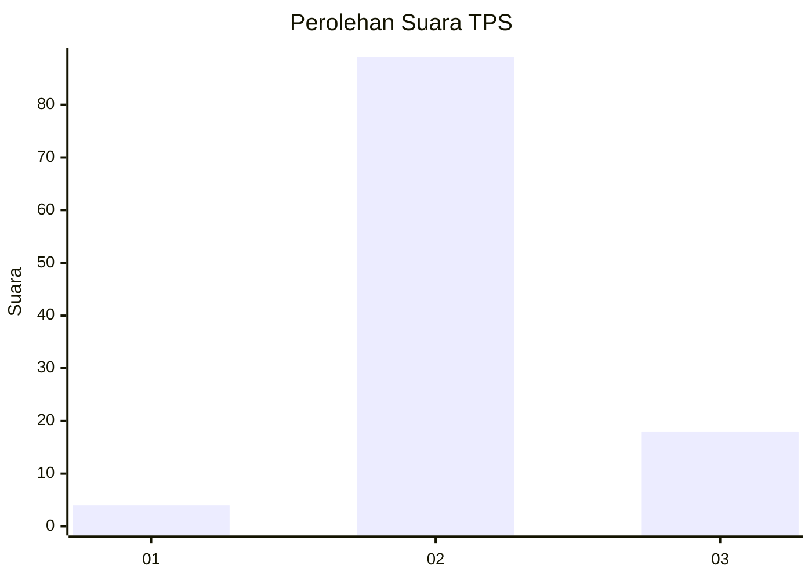
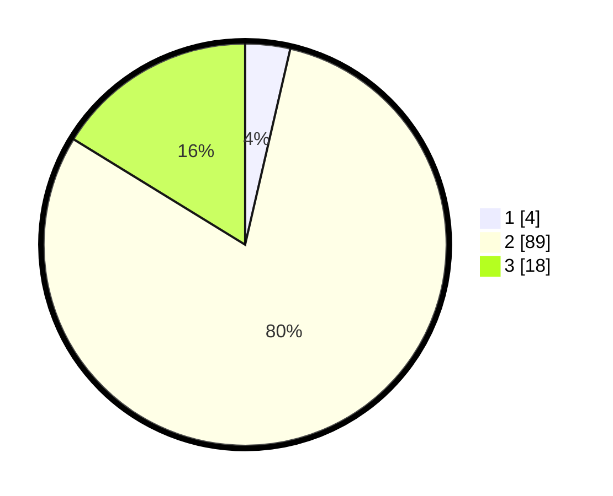

# Hasil

## Grafik

## Tabel

| No. | Nama Paslon    | Suara | Suara (raw) | Persentase |
|:--- |:-------------- | -----:| -----------:| ----------:|
| 1   | ANIES MUHAIMIN | 4     | [4][p-1]    | 3,60       |
| 2   | PRABOWO GIBRAN | 89    | [89][p-2]   | 80,18      |
| 3   | GANJAR MAHFUD  | 18    | [18][p-3]   | 16,22      |

[p-1]: https://github.com/gigit-pemilu/pemilu-2024/blob/main/pilpres/hitung-suara/sub/12-sumatera-utara/sub/24-nias-utara/sub/01-lotu/sub/2001-hilidundra/sub/003-tps/sub/paslon-1.txt
[p-2]: https://github.com/gigit-pemilu/pemilu-2024/blob/main/pilpres/hitung-suara/sub/12-sumatera-utara/sub/24-nias-utara/sub/01-lotu/sub/2001-hilidundra/sub/003-tps/sub/paslon-2.txt
[p-3]: https://github.com/gigit-pemilu/pemilu-2024/blob/main/pilpres/hitung-suara/sub/12-sumatera-utara/sub/24-nias-utara/sub/01-lotu/sub/2001-hilidundra/sub/003-tps/sub/paslon-3.txt

## Foto C Plano

https://sirekap-obj-formc.kpu.go.id/e0e1/pemilu/ppwp/12/24/01/20/01/1224012001003-20240218-212059--8456c5a8-711d-4839-9f92-3e22a0ac62f7.jpg

https://sirekap-obj-formc.kpu.go.id/e0e1/pemilu/ppwp/12/24/01/20/01/1224012001003-20240218-212101--e92e706a-262c-46a6-af0c-eac11dfa62da.jpg

https://sirekap-obj-formc.kpu.go.id/e0e1/pemilu/ppwp/12/24/01/20/01/1224012001003-20240218-212100--13b49ee3-f225-47b9-a193-c8250d26a71d.jpg

## Metadata

| Key        | Value               |
| ---------- | ------------------- |
| Time Stamp | 2024-02-19 10:00:00 |

## DATA PEMILIH TETAP

Jumlah pemilih dalam DPT: **163**.
 * L: **74**.
 * P: **89**.

## DATA PENGGUNA HAK PILIH

Jumlah pengguna hak pilih dalam DPT: **112**.
 * L: **53**.
 * P: **59**.

Jumlah pengguna hak pilih dalam DPTb: **1**.
 * L: **0**.
 * P: **1**.

Jumlah pengguna hak pilih dalam DPK: **115**.
 * L: **54**.
 * P: **61**.

Jumlah pengguna hak pilih: **115**.
 * L: **54**.
 * P: **61**.

## JUMLAH SUARA SAH DAN TIDAK SAH

JUMLAH SELURUH SUARA SAH: **111**.

JUMLAH SUARA TIDAK SAH: **4**.

JUMLAH SELURUH SUARA SAH DAN SUARA TIDAK SAH: **115**.

