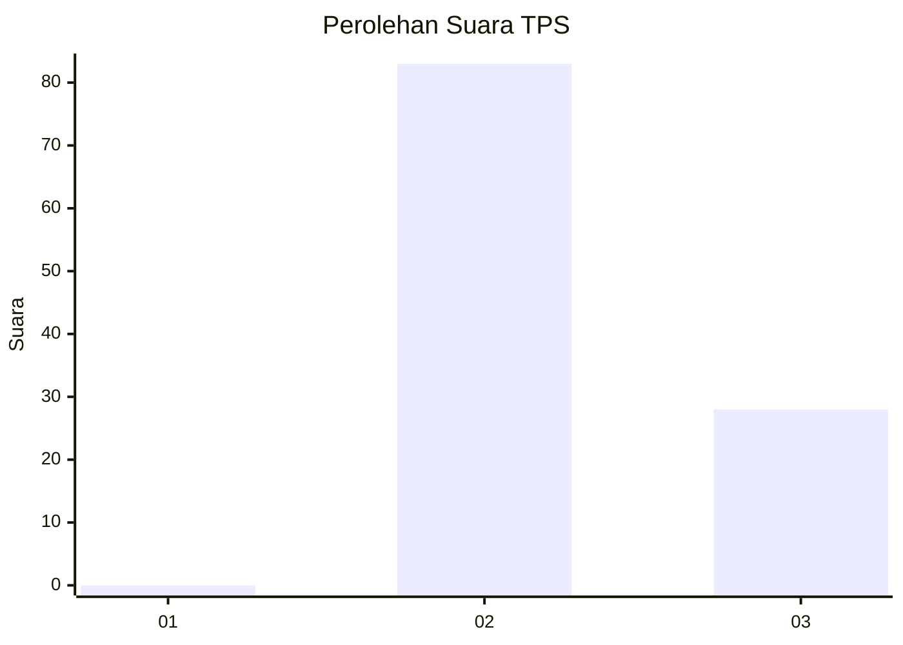
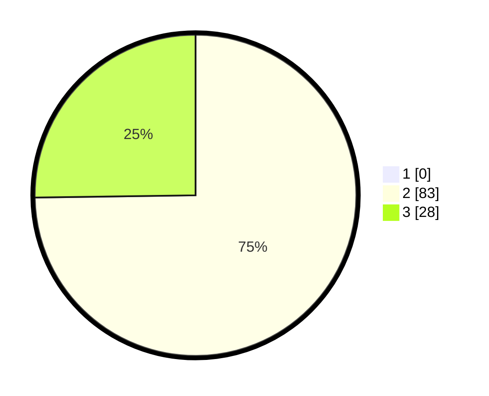

# Hasil

## Grafik

## Tabel

| No. | Nama Paslon    | Suara | Suara (raw) | Persentase |
|:--- |:-------------- | -----:| -----------:| ----------:|
| 1   | ANIES MUHAIMIN | 0     | [0][p-1]    | 0,00       |
| 2   | PRABOWO GIBRAN | 83    | [83][p-2]   | 74,77      |
| 3   | GANJAR MAHFUD  | 28    | [28][p-3]   | 25,23      |

[p-1]: https://github.com/gigit-pemilu/pemilu-2024/blob/main/pilpres/hitung-suara/sub/12-sumatera-utara/sub/24-nias-utara/sub/01-lotu/sub/2003-fadoro-fulolo/sub/001-tps/sub/paslon-1.txt
[p-2]: https://github.com/gigit-pemilu/pemilu-2024/blob/main/pilpres/hitung-suara/sub/12-sumatera-utara/sub/24-nias-utara/sub/01-lotu/sub/2003-fadoro-fulolo/sub/001-tps/sub/paslon-2.txt
[p-3]: https://github.com/gigit-pemilu/pemilu-2024/blob/main/pilpres/hitung-suara/sub/12-sumatera-utara/sub/24-nias-utara/sub/01-lotu/sub/2003-fadoro-fulolo/sub/001-tps/sub/paslon-3.txt

## Foto C Plano

https://sirekap-obj-formc.kpu.go.id/609a/pemilu/ppwp/12/24/01/20/03/1224012003001-20240215-013954--6a13495a-0d90-42bf-96e2-7e898800c52a.jpg

https://sirekap-obj-formc.kpu.go.id/609a/pemilu/ppwp/12/24/01/20/03/1224012003001-20240215-014120--f0580875-43d9-4dd9-8f67-0a2bcf617c3d.jpg

https://sirekap-obj-formc.kpu.go.id/609a/pemilu/ppwp/12/24/01/20/03/1224012003001-20240215-014349--01759f84-3304-4c0f-ae1b-30063a5e8ac1.jpg

## Metadata

| Key        | Value               |
| ---------- | ------------------- |
| Time Stamp | 2024-02-15 21:30:27 |

