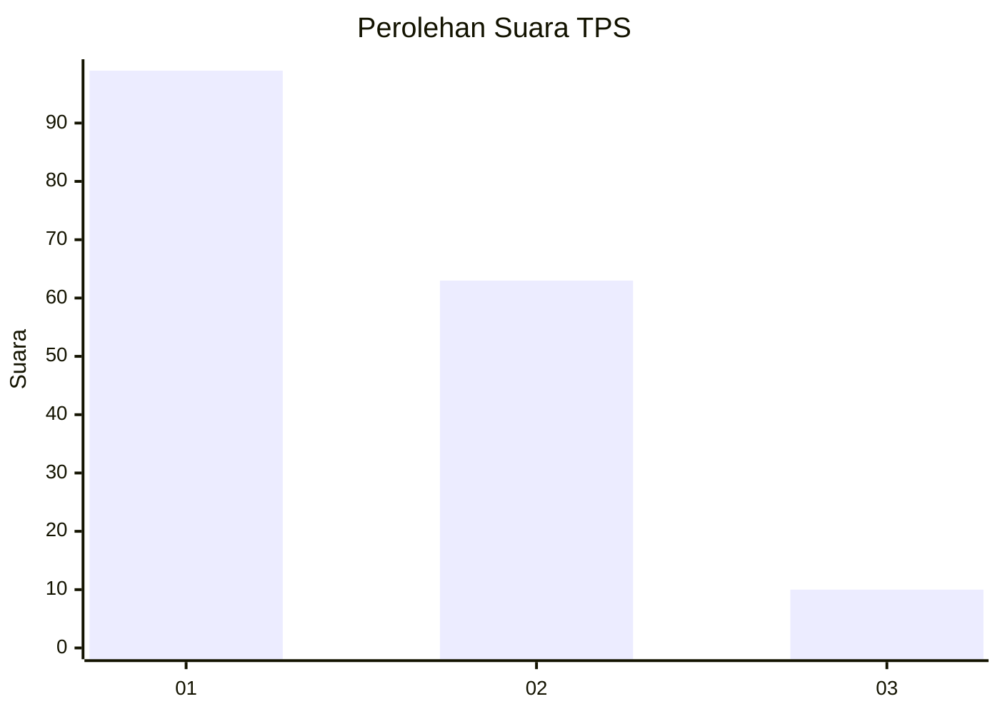
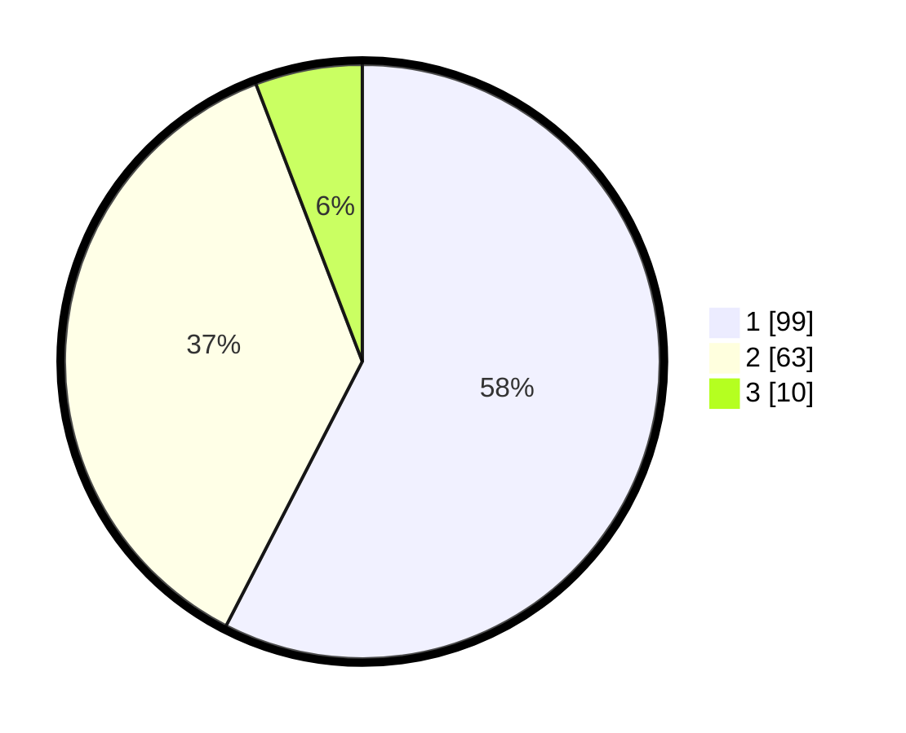

# Hasil

## Grafik

## Tabel

| No. | Nama Paslon    | Suara | Suara (raw) | Persentase |
|:--- |:-------------- | -----:| -----------:| ----------:|
| 1   | ANIES MUHAIMIN | 99    | [99][p-1]   | 57,56      |
| 2   | PRABOWO GIBRAN | 63    | [63][p-2]   | 36,63      |
| 3   | GANJAR MAHFUD  | 10    | [10][p-3]   | 5,81       |

[p-1]: https://github.com/gigit-pemilu/pemilu-2024/blob/main/pilpres/hitung-suara/sub/12-sumatera-utara/sub/24-nias-utara/sub/02-sawo/sub/2005-sifahandro/sub/001-tps/sub/paslon-1.txt
[p-2]: https://github.com/gigit-pemilu/pemilu-2024/blob/main/pilpres/hitung-suara/sub/12-sumatera-utara/sub/24-nias-utara/sub/02-sawo/sub/2005-sifahandro/sub/001-tps/sub/paslon-2.txt
[p-3]: https://github.com/gigit-pemilu/pemilu-2024/blob/main/pilpres/hitung-suara/sub/12-sumatera-utara/sub/24-nias-utara/sub/02-sawo/sub/2005-sifahandro/sub/001-tps/sub/paslon-3.txt

## Foto C Plano

https://sirekap-obj-formc.kpu.go.id/f576/pemilu/ppwp/12/24/02/20/05/1224022005001-20240217-180902--8feae9d5-2fc5-4aec-812b-5342a9bc34ba.jpg

https://sirekap-obj-formc.kpu.go.id/f576/pemilu/ppwp/12/24/02/20/05/1224022005001-20240217-181620--04677586-c422-4586-a0b3-deca45543ec1.jpg

https://sirekap-obj-formc.kpu.go.id/f576/pemilu/ppwp/12/24/02/20/05/1224022005001-20240217-181532--9db6db2f-eaf5-419d-bcd8-180ad2188d96.jpg

## Metadata

| Key        | Value               |
| ---------- | ------------------- |
| Time Stamp | 2024-02-17 19:30:00 |

