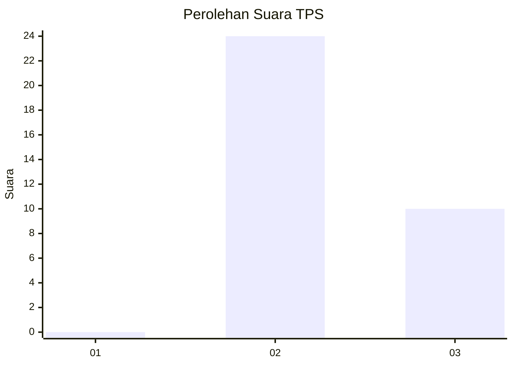
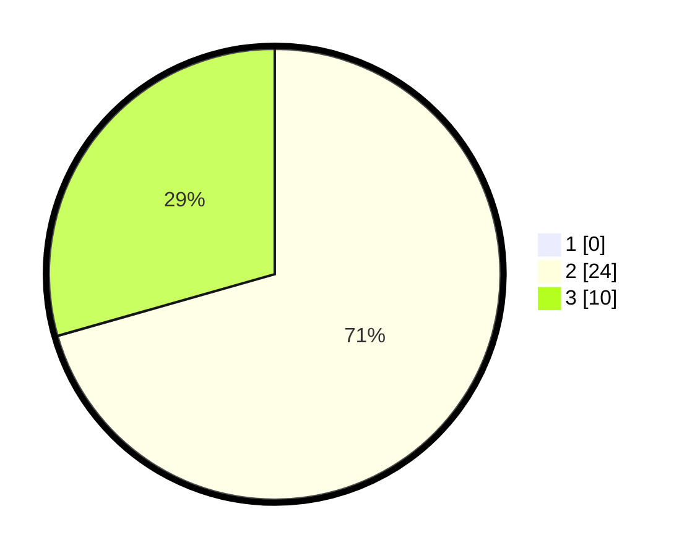

# Hasil

## Grafik

## Tabel

| No. | Nama Paslon    | Suara | Suara (raw) | Persentase |
|:--- |:-------------- | -----:| -----------:| ----------:|
| 1   | ANIES MUHAIMIN | 0     | [0][p-1]    | 0,00       |
| 2   | PRABOWO GIBRAN | 24    | [24][p-2]   | 70,59      |
| 3   | GANJAR MAHFUD  | 10    | [10][p-3]   | 29,41      |

[p-1]: https://github.com/gigit-pemilu/pemilu-2024-12-sumatera-utara/blob/main/pilpres/hitung-suara/sub/12-sumatera-utara/sub/24-nias-utara/sub/02-sawo/sub/2009-hiliduruwa/sub/006-tps/sub/paslon-1.txt
[p-2]: https://github.com/gigit-pemilu/pemilu-2024-12-sumatera-utara/blob/main/pilpres/hitung-suara/sub/12-sumatera-utara/sub/24-nias-utara/sub/02-sawo/sub/2009-hiliduruwa/sub/006-tps/sub/paslon-2.txt
[p-3]: https://github.com/gigit-pemilu/pemilu-2024-12-sumatera-utara/blob/main/pilpres/hitung-suara/sub/12-sumatera-utara/sub/24-nias-utara/sub/02-sawo/sub/2009-hiliduruwa/sub/006-tps/sub/paslon-3.txt

## Foto C Plano

https://sirekap-obj-formc.kpu.go.id/9eca/pemilu/ppwp/12/24/02/20/09/1224022009006-20240215-030612--6252af24-b25b-4a71-ad30-c008e1b8032f.jpg

https://sirekap-obj-formc.kpu.go.id/9eca/pemilu/ppwp/12/24/02/20/09/1224022009006-20240215-030905--5415cedb-9ce9-49c5-8875-39d4e10c25b5.jpg

https://sirekap-obj-formc.kpu.go.id/9eca/pemilu/ppwp/12/24/02/20/09/1224022009006-20240215-031018--10e95695-4bd4-442d-aa95-d4d4ed6ec11a.jpg

## Metadata

| Key        | Value               |
| ---------- | ------------------- |
| Time Stamp | 2024-02-15 19:00:26 |

