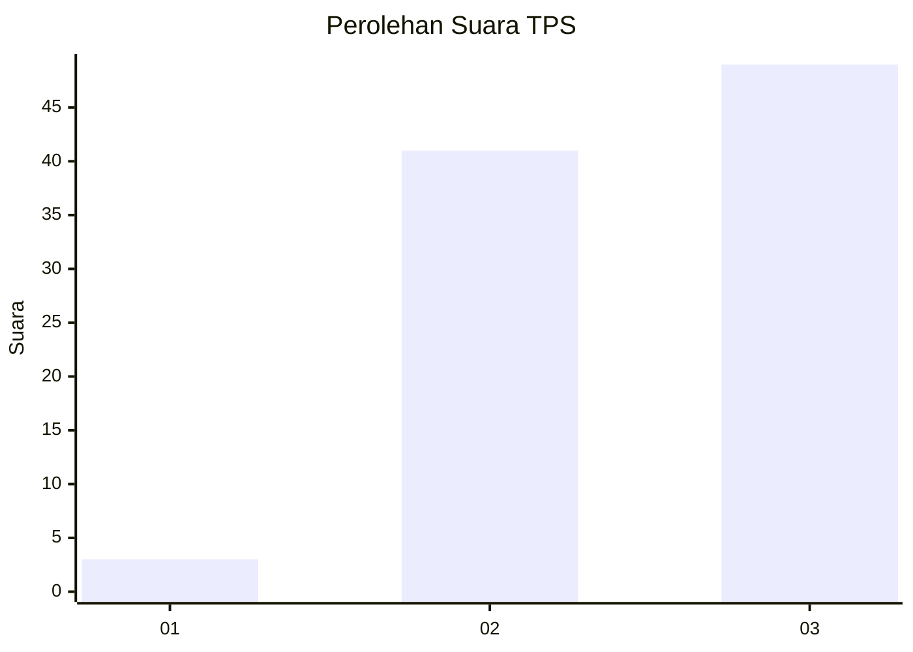
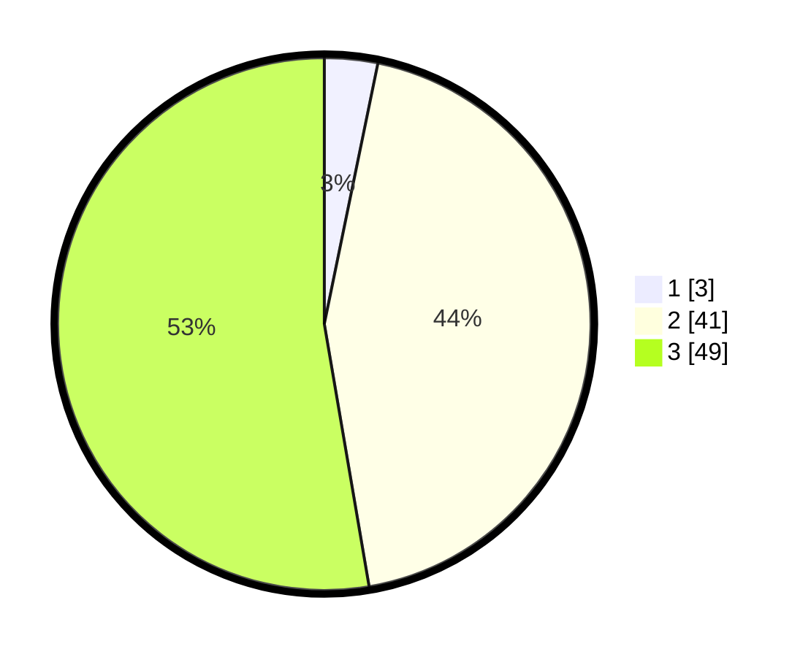

# Hasil

## Grafik

## Tabel

| No. | Nama Paslon    | Suara | Suara (raw) | Persentase |
|:--- |:-------------- | -----:| -----------:| ----------:|
| 1   | ANIES MUHAIMIN | 3     | [3][p-1]    | 3,23       |
| 2   | PRABOWO GIBRAN | 41    | [41][p-2]   | 44,09      |
| 3   | GANJAR MAHFUD  | 49    | [49][p-3]   | 52,69      |

[p-1]: https://github.com/gigit-pemilu/pemilu-2024-12-sumatera-utara/blob/main/pilpres/hitung-suara/sub/12-sumatera-utara/sub/24-nias-utara/sub/03-tuhemberua/sub/2006-banua-gea/sub/006-tps/sub/paslon-1.txt
[p-2]: https://github.com/gigit-pemilu/pemilu-2024-12-sumatera-utara/blob/main/pilpres/hitung-suara/sub/12-sumatera-utara/sub/24-nias-utara/sub/03-tuhemberua/sub/2006-banua-gea/sub/006-tps/sub/paslon-2.txt
[p-3]: https://github.com/gigit-pemilu/pemilu-2024-12-sumatera-utara/blob/main/pilpres/hitung-suara/sub/12-sumatera-utara/sub/24-nias-utara/sub/03-tuhemberua/sub/2006-banua-gea/sub/006-tps/sub/paslon-3.txt

## Foto C Plano

https://sirekap-obj-formc.kpu.go.id/3d52/pemilu/ppwp/12/24/03/20/06/1224032006006-20240215-110024--985db719-9cce-4b5d-aa5a-9b842cba31f2.jpg

https://sirekap-obj-formc.kpu.go.id/3d52/pemilu/ppwp/12/24/03/20/06/1224032006006-20240215-110137--747e622d-7dd7-47ac-84bf-195b8877b454.jpg

https://sirekap-obj-formc.kpu.go.id/3d52/pemilu/ppwp/12/24/03/20/06/1224032006006-20240215-110336--c6fef8e0-ac2e-4241-a05a-20abde6bbf40.jpg

## Metadata

| Key        | Value               |
| ---------- | ------------------- |
| Time Stamp | 2024-02-15 21:30:27 |

