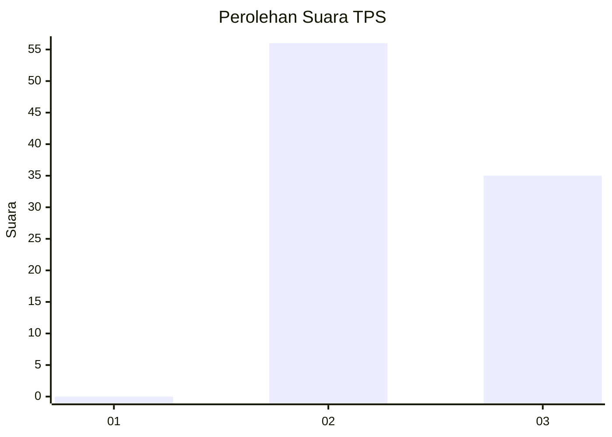
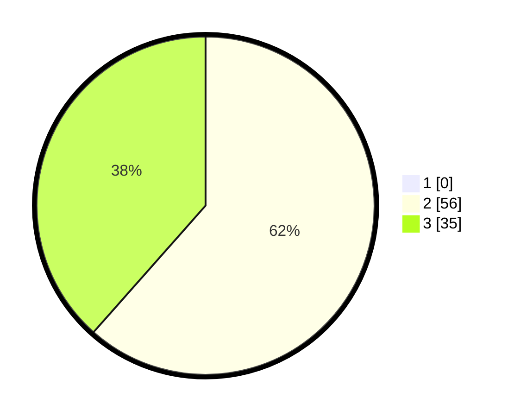

# Hasil

## Grafik

## Tabel

| No. | Nama Paslon    | Suara | Suara (raw) | Persentase |
|:--- |:-------------- | -----:| -----------:| ----------:|
| 1   | ANIES MUHAIMIN | 0     | [0][p-1]    | 0,00       |
| 2   | PRABOWO GIBRAN | 56    | [56][p-2]   | 61,54      |
| 3   | GANJAR MAHFUD  | 35    | [35][p-3]   | 38,46      |

[p-1]: https://github.com/gigit-pemilu/pemilu-2024-12-sumatera-utara/blob/main/pilpres/hitung-suara/sub/12-sumatera-utara/sub/24-nias-utara/sub/04-sitolu-ori/sub/2002-umbubalodano/sub/002-tps/sub/paslon-1.txt
[p-2]: https://github.com/gigit-pemilu/pemilu-2024-12-sumatera-utara/blob/main/pilpres/hitung-suara/sub/12-sumatera-utara/sub/24-nias-utara/sub/04-sitolu-ori/sub/2002-umbubalodano/sub/002-tps/sub/paslon-2.txt
[p-3]: https://github.com/gigit-pemilu/pemilu-2024-12-sumatera-utara/blob/main/pilpres/hitung-suara/sub/12-sumatera-utara/sub/24-nias-utara/sub/04-sitolu-ori/sub/2002-umbubalodano/sub/002-tps/sub/paslon-3.txt

## Foto C Plano

https://sirekap-obj-formc.kpu.go.id/f1f0/pemilu/ppwp/12/24/04/20/02/1224042002002-20240220-120524--2292053e-1b81-4039-a8b3-2fc2a6d59876.jpg

https://sirekap-obj-formc.kpu.go.id/f1f0/pemilu/ppwp/12/24/04/20/02/1224042002002-20240220-120631--d137b734-52c1-4c76-8952-c8308b58f831.jpg

https://sirekap-obj-formc.kpu.go.id/f1f0/pemilu/ppwp/12/24/04/20/02/1224042002002-20240220-120740--0d20b14a-5513-490f-a204-1776de427c39.jpg

## Metadata

| Key        | Value               |
| ---------- | ------------------- |
| Time Stamp | 2024-02-20 19:00:00 |

