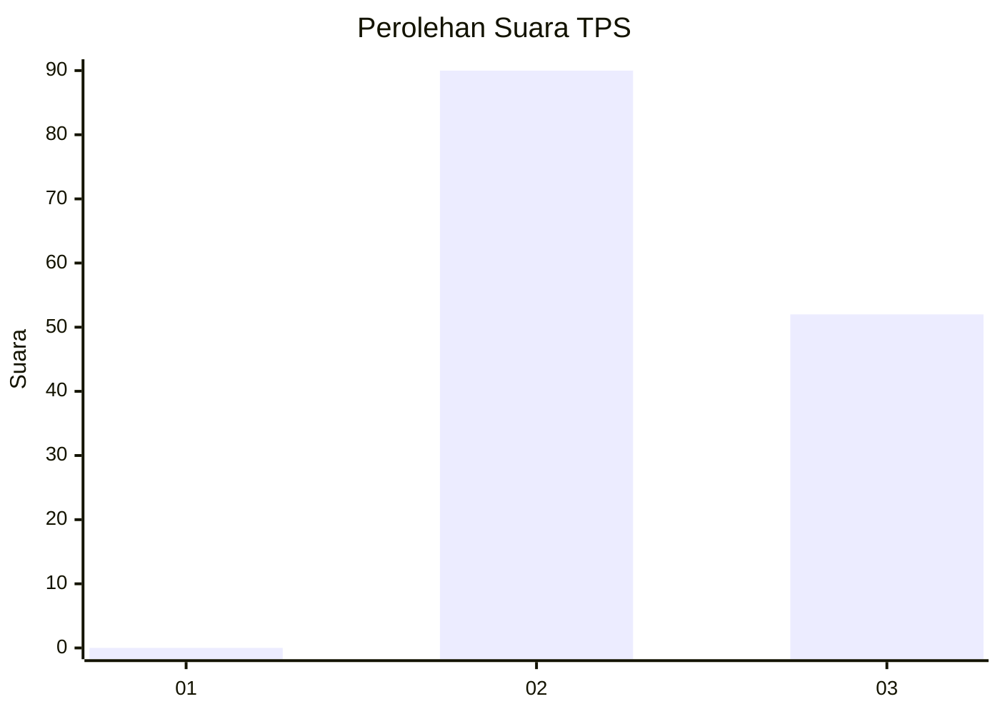
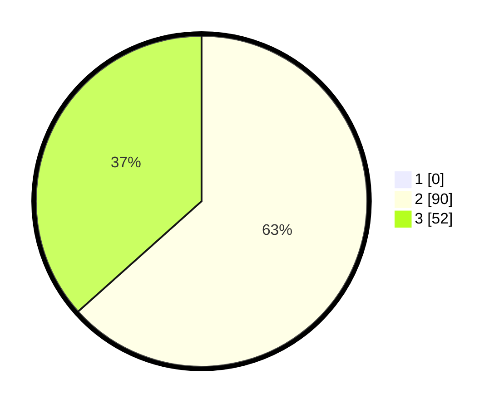

# Hasil

## Grafik

## Tabel

| No. | Nama Paslon    | Suara | Suara (raw) | Persentase |
|:--- |:-------------- | -----:| -----------:| ----------:|
| 1   | ANIES MUHAIMIN | 0     | [0][p-1]    | 0,00       |
| 2   | PRABOWO GIBRAN | 90    | [90][p-2]   | 63,38      |
| 3   | GANJAR MAHFUD  | 52    | [52][p-3]   | 36,62      |

[p-1]: https://github.com/gigit-pemilu/pemilu-2024-12-sumatera-utara/blob/main/pilpres/hitung-suara/sub/12-sumatera-utara/sub/24-nias-utara/sub/05-namohalu-esiwa/sub/2003-dahana-hiligodu/sub/003-tps/sub/paslon-1.txt
[p-2]: https://github.com/gigit-pemilu/pemilu-2024-12-sumatera-utara/blob/main/pilpres/hitung-suara/sub/12-sumatera-utara/sub/24-nias-utara/sub/05-namohalu-esiwa/sub/2003-dahana-hiligodu/sub/003-tps/sub/paslon-2.txt
[p-3]: https://github.com/gigit-pemilu/pemilu-2024-12-sumatera-utara/blob/main/pilpres/hitung-suara/sub/12-sumatera-utara/sub/24-nias-utara/sub/05-namohalu-esiwa/sub/2003-dahana-hiligodu/sub/003-tps/sub/paslon-3.txt

## Foto C Plano

https://sirekap-obj-formc.kpu.go.id/0691/pemilu/ppwp/12/24/05/20/03/1224052003003-20240215-104007--72829caf-2e4b-445c-8911-60ed24fa6cc8.jpg

https://sirekap-obj-formc.kpu.go.id/0691/pemilu/ppwp/12/24/05/20/03/1224052003003-20240215-104125--a9f71a3b-0d65-4b96-b450-13b2f8cf4d2b.jpg

https://sirekap-obj-formc.kpu.go.id/0691/pemilu/ppwp/12/24/05/20/03/1224052003003-20240215-104211--de47d6b5-2c20-4879-81af-774f32010e8b.jpg

## Metadata

| Key        | Value               |
| ---------- | ------------------- |
| Time Stamp | 2024-02-15 16:30:25 |

