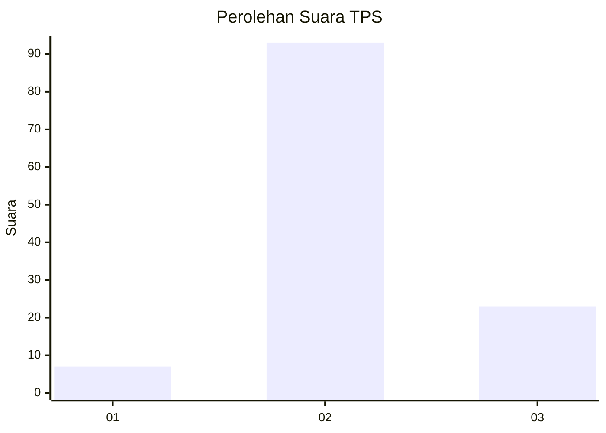
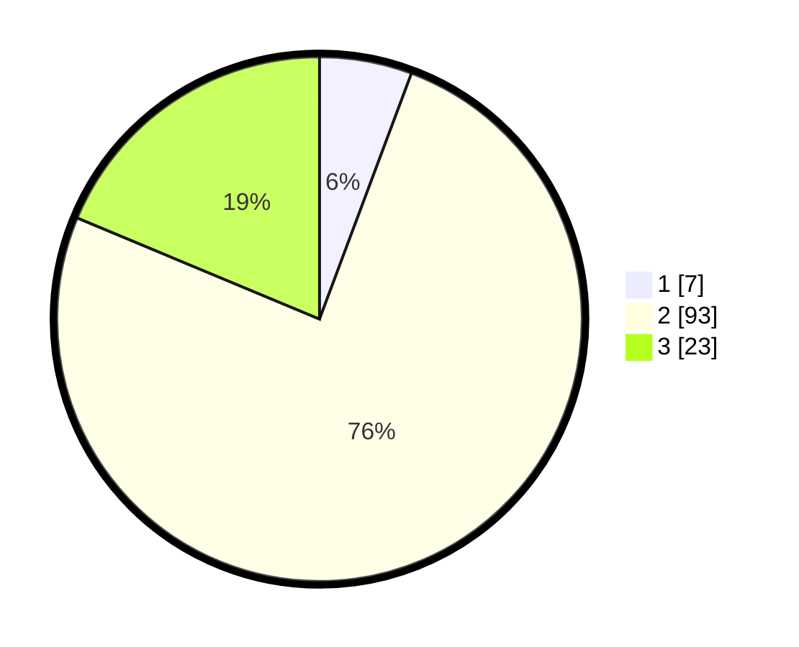

# Hasil

## Grafik

## Tabel

| No. | Nama Paslon    | Suara | Suara (raw) | Persentase |
|:--- |:-------------- | -----:| -----------:| ----------:|
| 1   | ANIES MUHAIMIN | 7     | [7][p-1]    | 5,69       |
| 2   | PRABOWO GIBRAN | 93    | [93][p-2]   | 75,61      |
| 3   | GANJAR MAHFUD  | 23    | [23][p-3]   | 18,70      |

[p-1]: https://github.com/gigit-pemilu/pemilu-2024-12-sumatera-utara/blob/main/pilpres/hitung-suara/sub/12-sumatera-utara/sub/24-nias-utara/sub/06-alasa-talumuzoi/sub/2004-laehuwa/sub/001-tps/sub/paslon-1.txt
[p-2]: https://github.com/gigit-pemilu/pemilu-2024-12-sumatera-utara/blob/main/pilpres/hitung-suara/sub/12-sumatera-utara/sub/24-nias-utara/sub/06-alasa-talumuzoi/sub/2004-laehuwa/sub/001-tps/sub/paslon-2.txt
[p-3]: https://github.com/gigit-pemilu/pemilu-2024-12-sumatera-utara/blob/main/pilpres/hitung-suara/sub/12-sumatera-utara/sub/24-nias-utara/sub/06-alasa-talumuzoi/sub/2004-laehuwa/sub/001-tps/sub/paslon-3.txt

## Foto C Plano

https://sirekap-obj-formc.kpu.go.id/e110/pemilu/ppwp/12/24/06/20/04/1224062004001-20240215-122955--8eef1436-8efd-4ec8-b9c2-e27686533494.jpg

https://sirekap-obj-formc.kpu.go.id/e110/pemilu/ppwp/12/24/06/20/04/1224062004001-20240215-144053--f77eaa38-509d-48fb-8a90-288fd47a567b.jpg

https://sirekap-obj-formc.kpu.go.id/e110/pemilu/ppwp/12/24/06/20/04/1224062004001-20240215-144129--591a47fa-3092-479d-9251-cb02cd111490.jpg

## Metadata

| Key        | Value               |
| ---------- | ------------------- |
| Time Stamp | 2024-02-15 22:40:13 |

