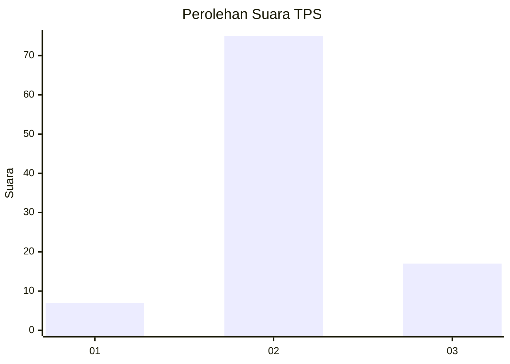
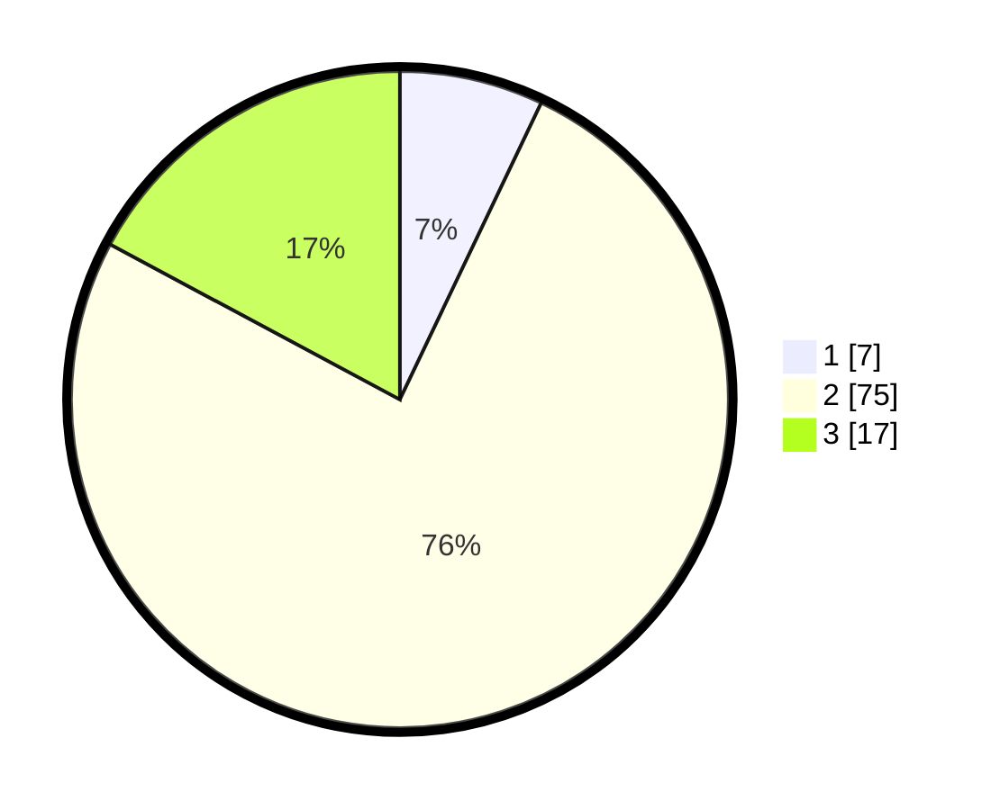

# Hasil

## Grafik

## Tabel

| No. | Nama Paslon    | Suara | Suara (raw) | Persentase |
|:--- |:-------------- | -----:| -----------:| ----------:|
| 1   | ANIES MUHAIMIN | 7     | [7][p-1]    | 7,07       |
| 2   | PRABOWO GIBRAN | 75    | [75][p-2]   | 75,76      |
| 3   | GANJAR MAHFUD  | 17    | [17][p-3]   | 17,17      |

[p-1]: https://github.com/gigit-pemilu/pemilu-2024-12-sumatera-utara/blob/main/pilpres/hitung-suara/sub/12-sumatera-utara/sub/24-nias-utara/sub/07-alasa/sub/2010-banua-sibohou-ii/sub/001-tps/sub/paslon-1.txt
[p-2]: https://github.com/gigit-pemilu/pemilu-2024-12-sumatera-utara/blob/main/pilpres/hitung-suara/sub/12-sumatera-utara/sub/24-nias-utara/sub/07-alasa/sub/2010-banua-sibohou-ii/sub/001-tps/sub/paslon-2.txt
[p-3]: https://github.com/gigit-pemilu/pemilu-2024-12-sumatera-utara/blob/main/pilpres/hitung-suara/sub/12-sumatera-utara/sub/24-nias-utara/sub/07-alasa/sub/2010-banua-sibohou-ii/sub/001-tps/sub/paslon-3.txt

## Foto C Plano

https://sirekap-obj-formc.kpu.go.id/da93/pemilu/ppwp/12/24/07/20/10/1224072010001-20240214-230851--174db49f-c67f-4ce5-97d9-deb6ef1f5e7b.jpg

https://sirekap-obj-formc.kpu.go.id/da93/pemilu/ppwp/12/24/07/20/10/1224072010001-20240214-231831--894fe957-88d8-4b4d-884b-66b1a4ed43d4.jpg

https://sirekap-obj-formc.kpu.go.id/da93/pemilu/ppwp/12/24/07/20/10/1224072010001-20240214-232541--695d5495-dfac-4315-91f5-31b19d1ce889.jpg

## Metadata

| Key        | Value               |
| ---------- | ------------------- |
| Time Stamp | 2024-02-15 21:01:18 |

