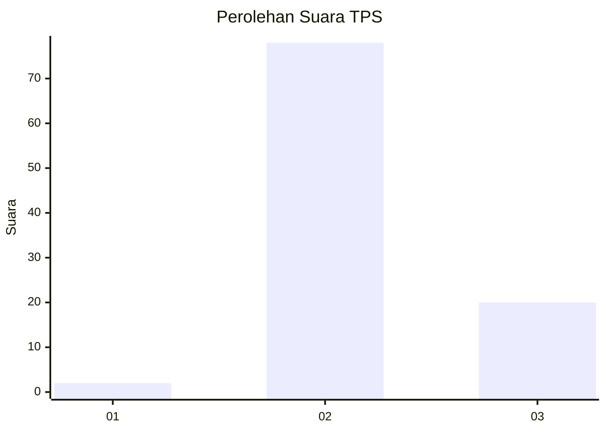

# Hasil

## Grafik

## Tabel

| No. | Nama Paslon    | Suara | Suara (raw) | Persentase |
|:--- |:-------------- | -----:| -----------:| ----------:|
| 1   | ANIES MUHAIMIN | 2     | [2][p-1]    | 2,00       |
| 2   | PRABOWO GIBRAN | 78    | [78][p-2]   | 78,00      |
| 3   | GANJAR MAHFUD  | 20    | [20][p-3]   | 20,00      |

[p-1]: https://github.com/gigit-pemilu/pemilu-2024-12-sumatera-utara/blob/main/pilpres/hitung-suara/sub/12-sumatera-utara/sub/24-nias-utara/sub/09-afulu/sub/2004-ombolata-afulu/sub/002-tps/sub/paslon-1.txt
[p-2]: https://github.com/gigit-pemilu/pemilu-2024-12-sumatera-utara/blob/main/pilpres/hitung-suara/sub/12-sumatera-utara/sub/24-nias-utara/sub/09-afulu/sub/2004-ombolata-afulu/sub/002-tps/sub/paslon-2.txt
[p-3]: https://github.com/gigit-pemilu/pemilu-2024-12-sumatera-utara/blob/main/pilpres/hitung-suara/sub/12-sumatera-utara/sub/24-nias-utara/sub/09-afulu/sub/2004-ombolata-afulu/sub/002-tps/sub/paslon-3.txt

## Foto C Plano

https://sirekap-obj-formc.kpu.go.id/ad93/pemilu/ppwp/12/24/09/20/04/1224092004002-20240216-125857--93d09c13-691c-4980-a5c4-6bd48af86566.jpg

https://sirekap-obj-formc.kpu.go.id/ad93/pemilu/ppwp/12/24/09/20/04/1224092004002-20240216-125913--a56d8d01-d1cd-40ce-a181-3d3b3c47351f.jpg

https://sirekap-obj-formc.kpu.go.id/ad93/pemilu/ppwp/12/24/09/20/04/1224092004002-20240216-125929--e35ddc2c-ceb4-4167-9e2b-161aa2944a6c.jpg

## Metadata

| Key        | Value               |
| ---------- | ------------------- |
| Time Stamp | 2024-02-16 14:30:33 |

