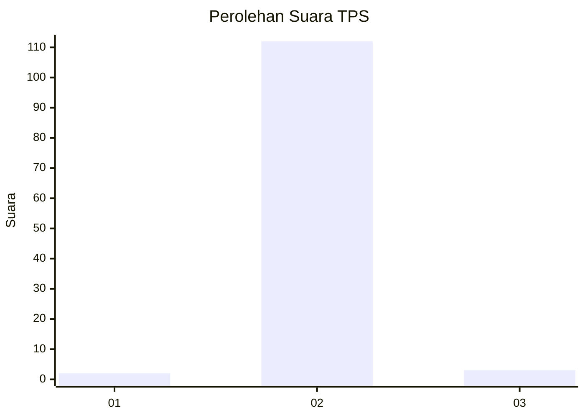
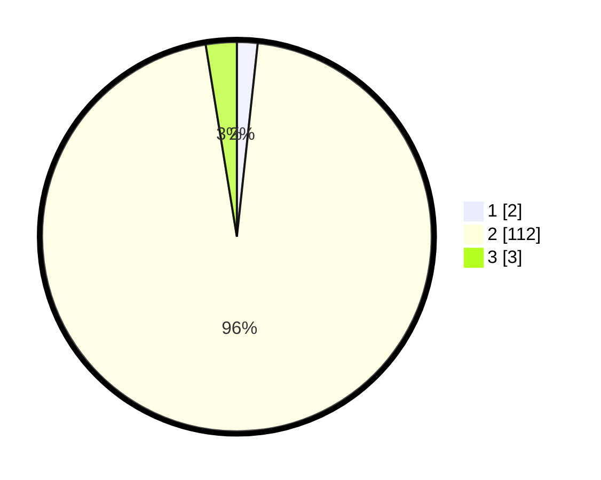

# Hasil

## Grafik

## Tabel

| No. | Nama Paslon    | Suara | Suara (raw) | Persentase |
|:--- |:-------------- | -----:| -----------:| ----------:|
| 1   | ANIES MUHAIMIN | 2     | [2][p-1]    | 1,71       |
| 2   | PRABOWO GIBRAN | 112   | [112][p-2]  | 95,73      |
| 3   | GANJAR MAHFUD  | 3     | [3][p-3]    | 2,56       |

[p-1]: https://github.com/gigit-pemilu/pemilu-2024/blob/main/pilpres/hitung-suara/sub/12-sumatera-utara/sub/24-nias-utara/sub/10-lahewa/sub/2020-fadoro-hilimbowo/sub/001-tps/sub/paslon-1.txt
[p-2]: https://github.com/gigit-pemilu/pemilu-2024/blob/main/pilpres/hitung-suara/sub/12-sumatera-utara/sub/24-nias-utara/sub/10-lahewa/sub/2020-fadoro-hilimbowo/sub/001-tps/sub/paslon-2.txt
[p-3]: https://github.com/gigit-pemilu/pemilu-2024/blob/main/pilpres/hitung-suara/sub/12-sumatera-utara/sub/24-nias-utara/sub/10-lahewa/sub/2020-fadoro-hilimbowo/sub/001-tps/sub/paslon-3.txt

## Foto C Plano

https://sirekap-obj-formc.kpu.go.id/fecf/pemilu/ppwp/12/24/10/20/20/1224102020001-20240215-100834--6ad24296-ad54-4bc4-ad33-a258d49efd64.jpg

https://sirekap-obj-formc.kpu.go.id/fecf/pemilu/ppwp/12/24/10/20/20/1224102020001-20240215-101219--a1a8f2a4-7a9b-4a3e-b0b3-b79c7f3c76b9.jpg

https://sirekap-obj-formc.kpu.go.id/fecf/pemilu/ppwp/12/24/10/20/20/1224102020001-20240215-102112--09aec830-20fa-46b8-ab6c-4fea53827e57.jpg

## Metadata

| Key        | Value               |
| ---------- | ------------------- |
| Time Stamp | 2024-02-15 22:30:27 |

