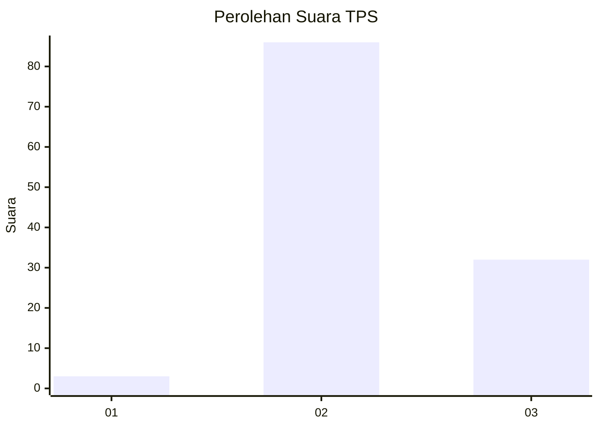
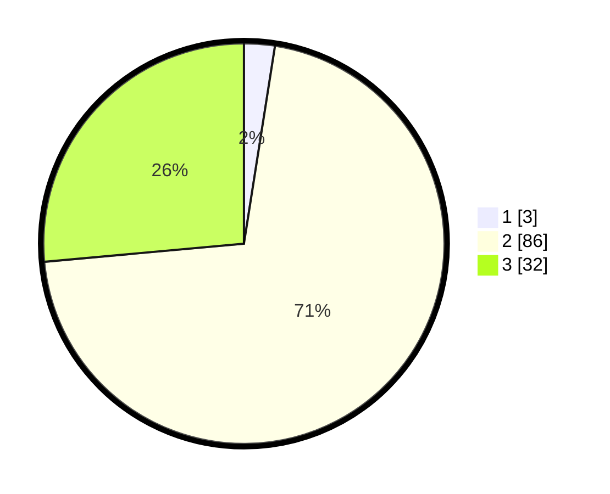

# Hasil

## Grafik

## Tabel

| No. | Nama Paslon    | Suara | Suara (raw) | Persentase |
|:--- |:-------------- | -----:| -----------:| ----------:|
| 1   | ANIES MUHAIMIN | 3     | [3][p-1]    | 2,48       |
| 2   | PRABOWO GIBRAN | 86    | [86][p-2]   | 71,07      |
| 3   | GANJAR MAHFUD  | 32    | [32][p-3]   | 26,45      |

[p-1]: https://github.com/gigit-pemilu/pemilu-2024/blob/main/pilpres/hitung-suara/sub/12-sumatera-utara/sub/24-nias-utara/sub/11-lahewa-timur/sub/2001-laowowaga/sub/002-tps/sub/paslon-1.txt
[p-2]: https://github.com/gigit-pemilu/pemilu-2024/blob/main/pilpres/hitung-suara/sub/12-sumatera-utara/sub/24-nias-utara/sub/11-lahewa-timur/sub/2001-laowowaga/sub/002-tps/sub/paslon-2.txt
[p-3]: https://github.com/gigit-pemilu/pemilu-2024/blob/main/pilpres/hitung-suara/sub/12-sumatera-utara/sub/24-nias-utara/sub/11-lahewa-timur/sub/2001-laowowaga/sub/002-tps/sub/paslon-3.txt

## Foto C Plano

https://sirekap-obj-formc.kpu.go.id/957a/pemilu/ppwp/12/24/11/20/01/1224112001002-20240215-022342--744f0e1b-a126-4831-907f-507825c59b67.jpg

https://sirekap-obj-formc.kpu.go.id/957a/pemilu/ppwp/12/24/11/20/01/1224112001002-20240215-022423--723ec2c3-b83f-419d-abc6-e92e6d704619.jpg

https://sirekap-obj-formc.kpu.go.id/957a/pemilu/ppwp/12/24/11/20/01/1224112001002-20240215-022444--fa8fb133-0991-4d0d-9fde-0b75eafdfafc.jpg

## Metadata

| Key        | Value               |
| ---------- | ------------------- |
| Time Stamp | 2024-02-15 12:00:28 |

