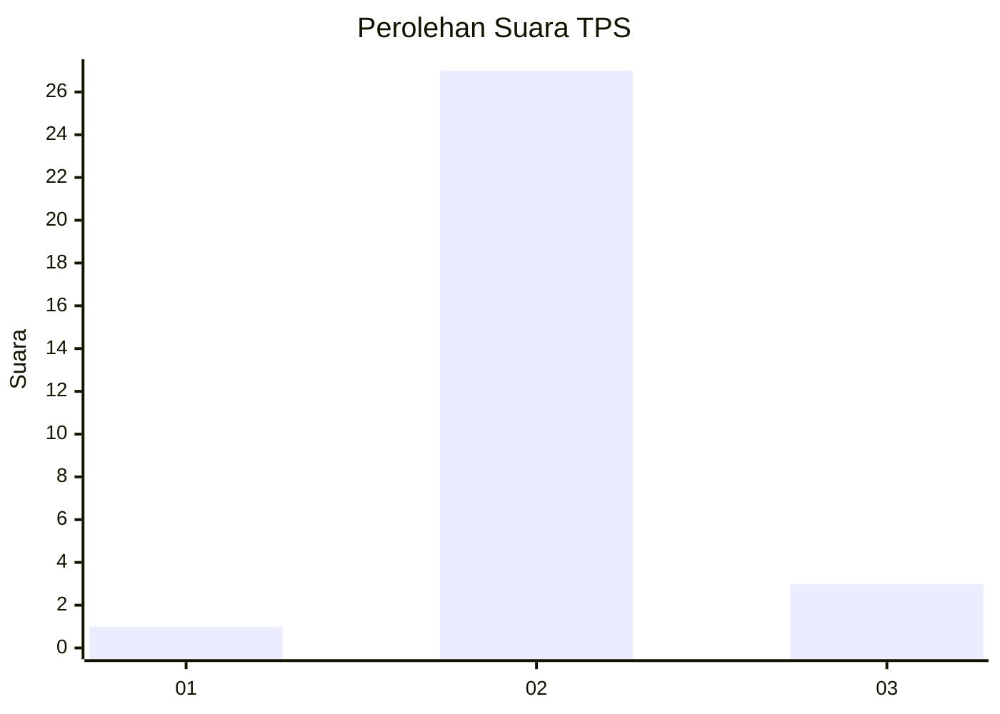
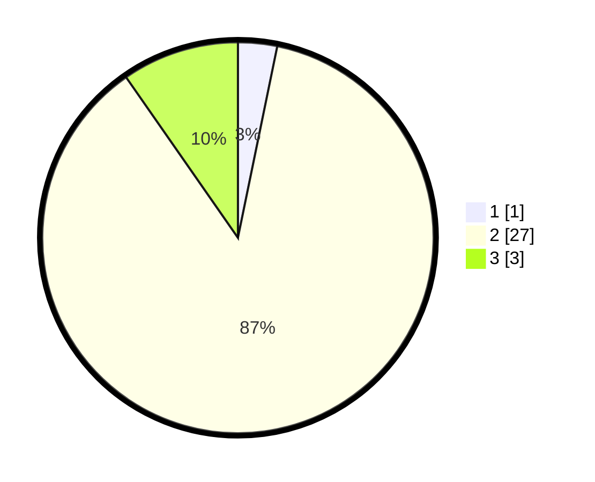

# Hasil

## Grafik

## Tabel

| No. | Nama Paslon    | Suara | Suara (raw) | Persentase |
|:--- |:-------------- | -----:| -----------:| ----------:|
| 1   | ANIES MUHAIMIN | 1     | [1][p-1]    | 3,23       |
| 2   | PRABOWO GIBRAN | 27    | [27][p-2]   | 87,10      |
| 3   | GANJAR MAHFUD  | 3     | [3][p-3]    | 9,68       |

[p-1]: https://github.com/gigit-pemilu/pemilu-2024/blob/main/pilpres/hitung-suara/sub/12-sumatera-utara/sub/25-nias-barat/sub/02-sirombu/sub/2001-bawosaloo/sub/001-tps/sub/paslon-1.txt
[p-2]: https://github.com/gigit-pemilu/pemilu-2024/blob/main/pilpres/hitung-suara/sub/12-sumatera-utara/sub/25-nias-barat/sub/02-sirombu/sub/2001-bawosaloo/sub/001-tps/sub/paslon-2.txt
[p-3]: https://github.com/gigit-pemilu/pemilu-2024/blob/main/pilpres/hitung-suara/sub/12-sumatera-utara/sub/25-nias-barat/sub/02-sirombu/sub/2001-bawosaloo/sub/001-tps/sub/paslon-3.txt

## Foto C Plano

https://sirekap-obj-formc.kpu.go.id/098e/pemilu/ppwp/12/25/02/20/01/1225022001001-20240216-003421--d3300fa2-2357-4c6a-adea-dbd01fcc2a8b.jpg

https://sirekap-obj-formc.kpu.go.id/098e/pemilu/ppwp/12/25/02/20/01/1225022001001-20240216-003433--a72b1cd1-6f8a-47aa-9224-ef7084c2efe0.jpg

https://sirekap-obj-formc.kpu.go.id/098e/pemilu/ppwp/12/25/02/20/01/1225022001001-20240216-003427--6cb281d1-11a7-4035-9e72-b768c3ab930d.jpg

## Metadata

| Key        | Value               |
| ---------- | ------------------- |
| Time Stamp | 2024-02-16 21:01:00 |

## DATA PEMILIH TETAP

Jumlah pemilih dalam DPT: **63**.
 * L: **26**.
 * P: **37**.

## DATA PENGGUNA HAK PILIH

Jumlah pengguna hak pilih dalam DPT: **29**.
 * L: **13**.
 * P: **16**.

Jumlah pengguna hak pilih dalam DPTb: **2**.
 * L: **2**.
 * P: **0**.

Jumlah pengguna hak pilih dalam DPK: **0**.
 * L: **0**.
 * P: **0**.

Jumlah pengguna hak pilih: **31**.
 * L: **15**.
 * P: **16**.

## JUMLAH SUARA SAH DAN TIDAK SAH

JUMLAH SELURUH SUARA SAH: **31**.

JUMLAH SUARA TIDAK SAH: **0**.

JUMLAH SELURUH SUARA SAH DAN SUARA TIDAK SAH: **31**.

