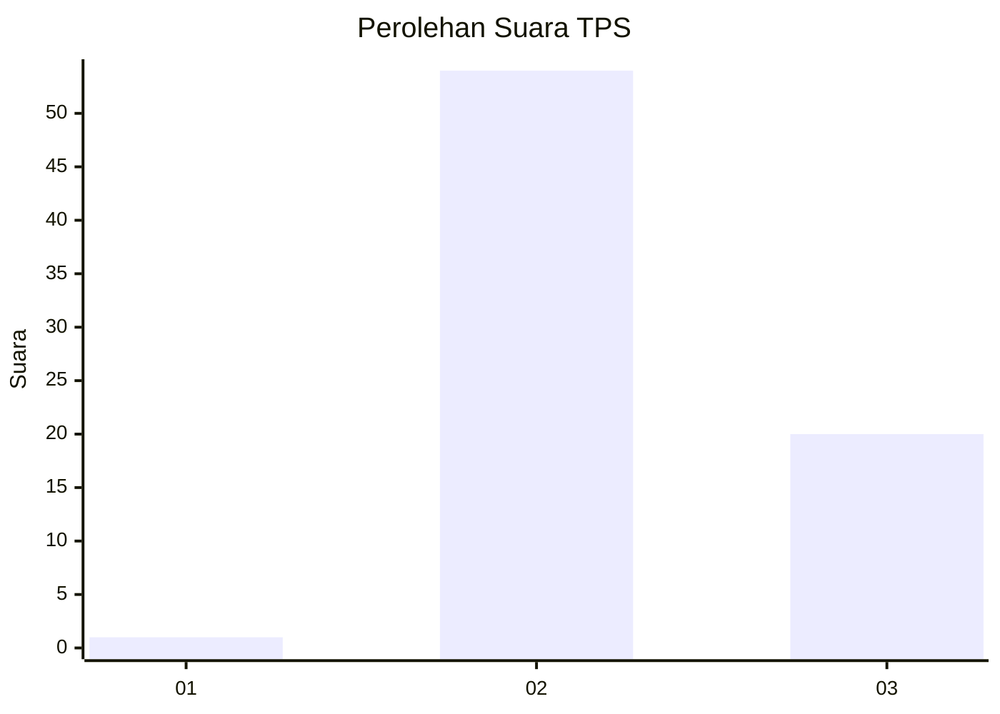
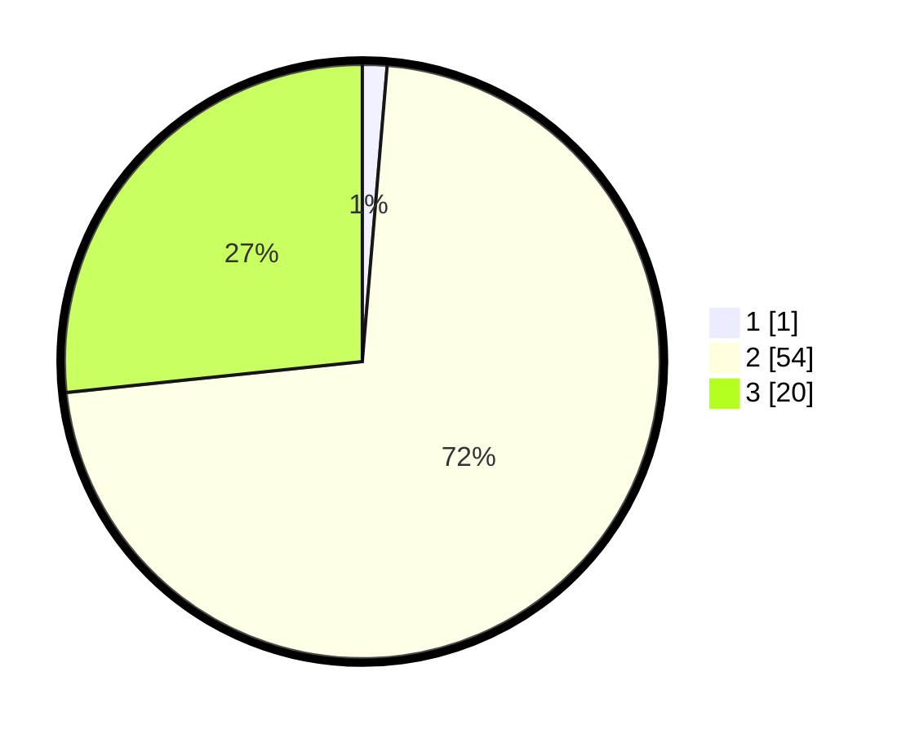

# Hasil

## Grafik

## Tabel

| No. | Nama Paslon    | Suara | Suara (raw) | Persentase |
|:--- |:-------------- | -----:| -----------:| ----------:|
| 1   | ANIES MUHAIMIN | 1     | [1][p-1]    | 1,33       |
| 2   | PRABOWO GIBRAN | 54    | [54][p-2]   | 72,00      |
| 3   | GANJAR MAHFUD  | 20    | [20][p-3]   | 26,67      |

[p-1]: https://github.com/gigit-pemilu/pemilu-2024/blob/main/pilpres/hitung-suara/sub/12-sumatera-utara/sub/25-nias-barat/sub/03-mandrehe-barat/sub/2002-ononamolo-iii/sub/001-tps/sub/paslon-1.txt
[p-2]: https://github.com/gigit-pemilu/pemilu-2024/blob/main/pilpres/hitung-suara/sub/12-sumatera-utara/sub/25-nias-barat/sub/03-mandrehe-barat/sub/2002-ononamolo-iii/sub/001-tps/sub/paslon-2.txt
[p-3]: https://github.com/gigit-pemilu/pemilu-2024/blob/main/pilpres/hitung-suara/sub/12-sumatera-utara/sub/25-nias-barat/sub/03-mandrehe-barat/sub/2002-ononamolo-iii/sub/001-tps/sub/paslon-3.txt

## Foto C Plano

https://sirekap-obj-formc.kpu.go.id/2a51/pemilu/ppwp/12/25/03/20/02/1225032002001-20240215-020241--fb9fe539-fdd1-4cf8-a881-cc2279bc09ff.jpg

https://sirekap-obj-formc.kpu.go.id/2a51/pemilu/ppwp/12/25/03/20/02/1225032002001-20240215-003210--38e14a9c-72ff-4b6d-824e-9b994f4291a9.jpg

https://sirekap-obj-formc.kpu.go.id/2a51/pemilu/ppwp/12/25/03/20/02/1225032002001-20240215-020419--6386b802-76e0-4ea4-9ac8-4464fda01dd7.jpg

## Metadata

| Key        | Value               |
| ---------- | ------------------- |
| Time Stamp | 2024-02-15 15:00:29 |

