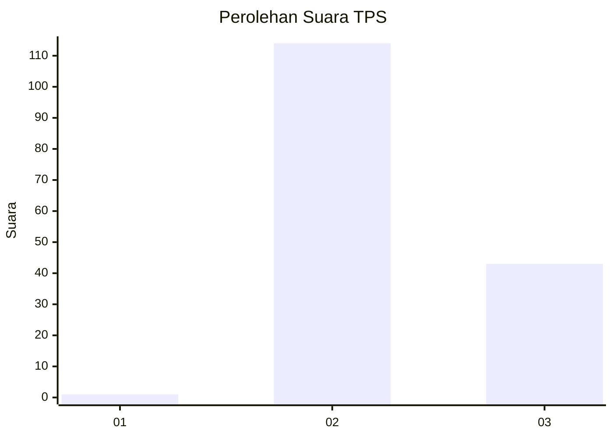
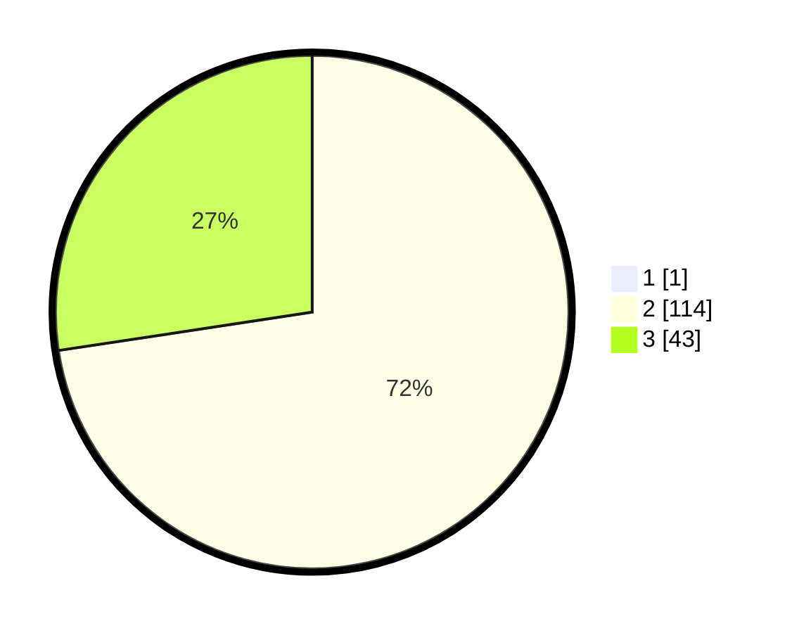

# Hasil

## Grafik

## Tabel

| No. | Nama Paslon    | Suara | Suara (raw) | Persentase |
|:--- |:-------------- | -----:| -----------:| ----------:|
| 1   | ANIES MUHAIMIN | 1     | [1][p-1]    | 0,63       |
| 2   | PRABOWO GIBRAN | 114   | [114][p-2]  | 72,15      |
| 3   | GANJAR MAHFUD  | 43    | [43][p-3]   | 27,22      |

[p-1]: https://github.com/gigit-pemilu/pemilu-2024/blob/main/pilpres/hitung-suara/sub/12-sumatera-utara/sub/25-nias-barat/sub/03-mandrehe-barat/sub/2004-iraonogeba/sub/001-tps/sub/paslon-1.txt
[p-2]: https://github.com/gigit-pemilu/pemilu-2024/blob/main/pilpres/hitung-suara/sub/12-sumatera-utara/sub/25-nias-barat/sub/03-mandrehe-barat/sub/2004-iraonogeba/sub/001-tps/sub/paslon-2.txt
[p-3]: https://github.com/gigit-pemilu/pemilu-2024/blob/main/pilpres/hitung-suara/sub/12-sumatera-utara/sub/25-nias-barat/sub/03-mandrehe-barat/sub/2004-iraonogeba/sub/001-tps/sub/paslon-3.txt

## Foto C Plano

https://sirekap-obj-formc.kpu.go.id/f0ea/pemilu/ppwp/12/25/03/20/04/1225032004001-20240215-030130--a8b729a8-1c4e-43e5-bb20-ed36af6a922f.jpg

https://sirekap-obj-formc.kpu.go.id/f0ea/pemilu/ppwp/12/25/03/20/04/1225032004001-20240215-003532--c7ee6266-93bb-4aab-afdd-a83fd22b207a.jpg

https://sirekap-obj-formc.kpu.go.id/f0ea/pemilu/ppwp/12/25/03/20/04/1225032004001-20240215-003625--f3db6a5d-a21a-498f-8fc4-f1b13b7b6b45.jpg

## Metadata

| Key        | Value               |
| ---------- | ------------------- |
| Time Stamp | 2024-02-15 18:00:26 |

## DATA PEMILIH TETAP

Jumlah pemilih dalam DPT: **264**.
 * L: **127**.
 * P: **137**.

## DATA PENGGUNA HAK PILIH

Jumlah pengguna hak pilih dalam DPT: **660**.
 * L: **72**.
 * P: **88**.

Jumlah pengguna hak pilih dalam DPTb: **0**.
 * L: **8**.
 * P: **85**.

Jumlah pengguna hak pilih dalam DPK: **7**.
 * L: **2**.
 * P: **41**.

Jumlah pengguna hak pilih: **663**.
 * L: **74**.
 * P: **89**.

## JUMLAH SUARA SAH DAN TIDAK SAH

JUMLAH SELURUH SUARA SAH: **158**.

JUMLAH SUARA TIDAK SAH: **5**.

JUMLAH SELURUH SUARA SAH DAN SUARA TIDAK SAH: **163**.

