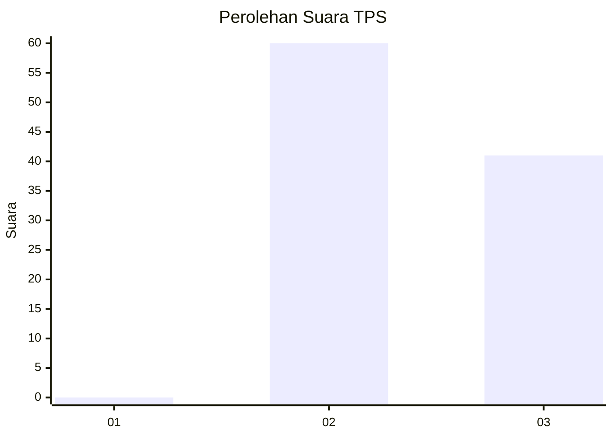
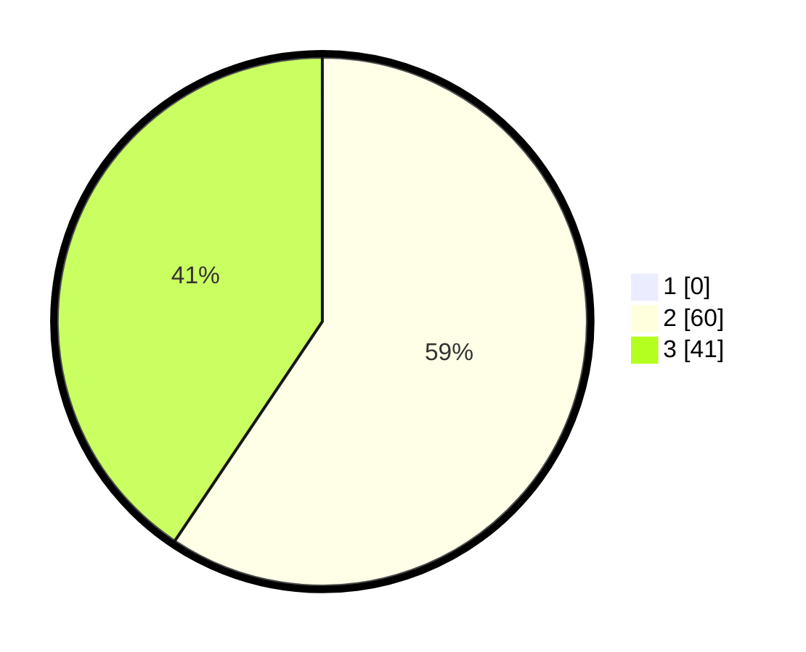

# Hasil

## Grafik

## Tabel

| No. | Nama Paslon    | Suara | Suara (raw) | Persentase |
|:--- |:-------------- | -----:| -----------:| ----------:|
| 1   | ANIES MUHAIMIN | 0     | [0][p-1]    | 0,00       |
| 2   | PRABOWO GIBRAN | 60    | [60][p-2]   | 59,41      |
| 3   | GANJAR MAHFUD  | 41    | [41][p-3]   | 40,59      |

[p-1]: https://github.com/gigit-pemilu/pemilu-2024/blob/main/pilpres/hitung-suara/sub/12-sumatera-utara/sub/25-nias-barat/sub/03-mandrehe-barat/sub/2004-iraonogeba/sub/002-tps/sub/paslon-1.txt
[p-2]: https://github.com/gigit-pemilu/pemilu-2024/blob/main/pilpres/hitung-suara/sub/12-sumatera-utara/sub/25-nias-barat/sub/03-mandrehe-barat/sub/2004-iraonogeba/sub/002-tps/sub/paslon-2.txt
[p-3]: https://github.com/gigit-pemilu/pemilu-2024/blob/main/pilpres/hitung-suara/sub/12-sumatera-utara/sub/25-nias-barat/sub/03-mandrehe-barat/sub/2004-iraonogeba/sub/002-tps/sub/paslon-3.txt

## Foto C Plano

https://sirekap-obj-formc.kpu.go.id/3666/pemilu/ppwp/12/25/03/20/04/1225032004002-20240215-111110--531bf0bc-ca84-4d0c-845e-497afe13d634.jpg

https://sirekap-obj-formc.kpu.go.id/3666/pemilu/ppwp/12/25/03/20/04/1225032004002-20240215-111107--ecc07739-65cd-4b2e-b996-e40461548f14.jpg

https://sirekap-obj-formc.kpu.go.id/3666/pemilu/ppwp/12/25/03/20/04/1225032004002-20240215-110957--d5b54bc3-8908-4885-8b5b-fcbd005d8bbd.jpg

## Metadata

| Key        | Value               |
| ---------- | ------------------- |
| Time Stamp | 2024-02-15 19:00:26 |

