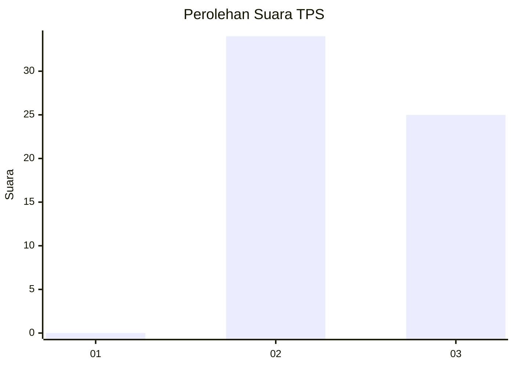
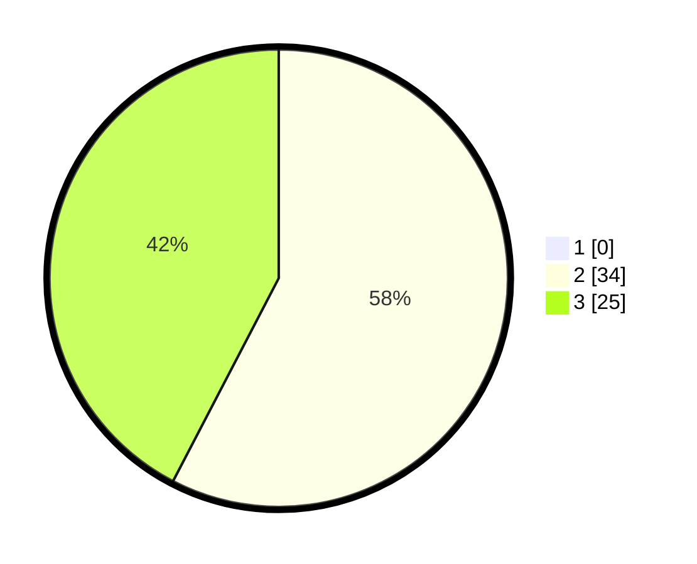

# Hasil

## Grafik

## Tabel

| No. | Nama Paslon    | Suara | Suara (raw) | Persentase |
|:--- |:-------------- | -----:| -----------:| ----------:|
| 1   | ANIES MUHAIMIN | 0     | [0][p-1]    | 0,00       |
| 2   | PRABOWO GIBRAN | 34    | [34][p-2]   | 57,63      |
| 3   | GANJAR MAHFUD  | 25    | [25][p-3]   | 42,37      |

[p-1]: https://github.com/gigit-pemilu/pemilu-2024-12-sumatera-utara/blob/main/pilpres/hitung-suara/sub/12-sumatera-utara/sub/25-nias-barat/sub/03-mandrehe-barat/sub/2005-lolohia/sub/002-tps/sub/paslon-1.txt
[p-2]: https://github.com/gigit-pemilu/pemilu-2024-12-sumatera-utara/blob/main/pilpres/hitung-suara/sub/12-sumatera-utara/sub/25-nias-barat/sub/03-mandrehe-barat/sub/2005-lolohia/sub/002-tps/sub/paslon-2.txt
[p-3]: https://github.com/gigit-pemilu/pemilu-2024-12-sumatera-utara/blob/main/pilpres/hitung-suara/sub/12-sumatera-utara/sub/25-nias-barat/sub/03-mandrehe-barat/sub/2005-lolohia/sub/002-tps/sub/paslon-3.txt

## Foto C Plano

https://sirekap-obj-formc.kpu.go.id/482c/pemilu/ppwp/12/25/03/20/05/1225032005002-20240215-141808--2edae326-0dd7-4a43-82e0-96dcbb28ce4e.jpg

https://sirekap-obj-formc.kpu.go.id/482c/pemilu/ppwp/12/25/03/20/05/1225032005002-20240215-142038--58bc1d97-434d-48ec-acf8-0d2e1dc73948.jpg

https://sirekap-obj-formc.kpu.go.id/482c/pemilu/ppwp/12/25/03/20/05/1225032005002-20240215-142220--79d764a3-dcda-45c5-9cd6-f2f5162e80d5.jpg

## Metadata

| Key        | Value               |
| ---------- | ------------------- |
| Time Stamp | 2024-02-25 12:00:00 |

