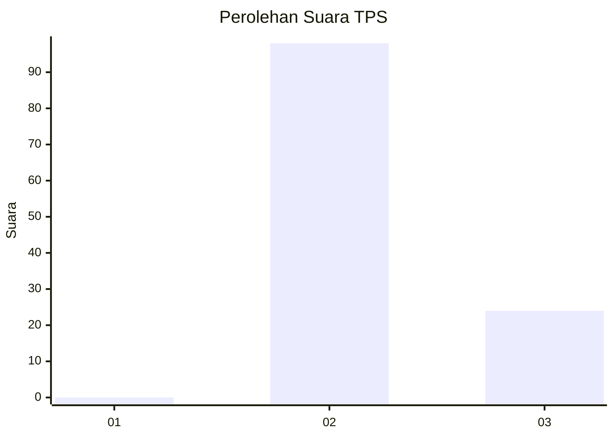
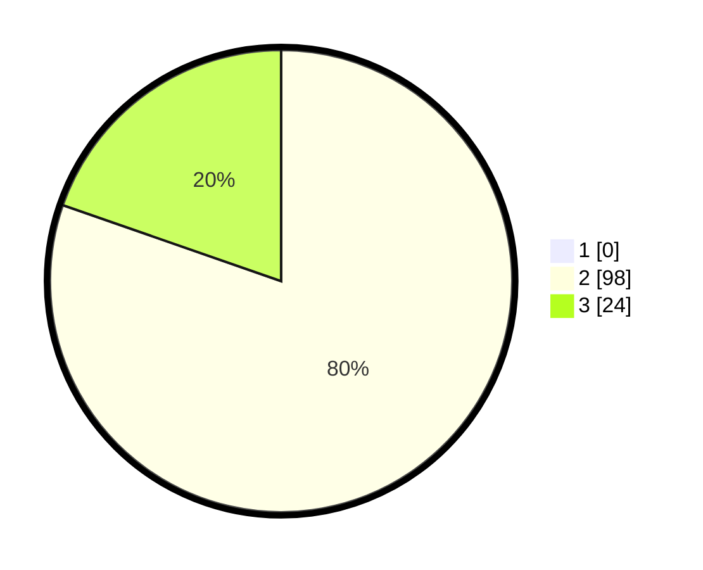

# Hasil

## Grafik

## Tabel

| No. | Nama Paslon    | Suara | Suara (raw) | Persentase |
|:--- |:-------------- | -----:| -----------:| ----------:|
| 1   | ANIES MUHAIMIN | 0     | [0][p-1]    | 0,00       |
| 2   | PRABOWO GIBRAN | 98    | [98][p-2]   | 80,33      |
| 3   | GANJAR MAHFUD  | 24    | [24][p-3]   | 19,67      |

[p-1]: https://github.com/gigit-pemilu/pemilu-2024/blob/main/pilpres/hitung-suara/sub/12-sumatera-utara/sub/25-nias-barat/sub/04-moro'o/sub/2002-gunungbaru/sub/001-tps/sub/paslon-1.txt
[p-2]: https://github.com/gigit-pemilu/pemilu-2024/blob/main/pilpres/hitung-suara/sub/12-sumatera-utara/sub/25-nias-barat/sub/04-moro'o/sub/2002-gunungbaru/sub/001-tps/sub/paslon-2.txt
[p-3]: https://github.com/gigit-pemilu/pemilu-2024/blob/main/pilpres/hitung-suara/sub/12-sumatera-utara/sub/25-nias-barat/sub/04-moro'o/sub/2002-gunungbaru/sub/001-tps/sub/paslon-3.txt

## Foto C Plano

https://sirekap-obj-formc.kpu.go.id/affc/pemilu/ppwp/12/25/04/20/02/1225042002001-20240215-032900--f18af7fc-aa76-43df-9bf0-f51c4f88f91e.jpg

https://sirekap-obj-formc.kpu.go.id/affc/pemilu/ppwp/12/25/04/20/02/1225042002001-20240215-032954--9a0eee56-4e19-41b5-90a4-58526ad57822.jpg

https://sirekap-obj-formc.kpu.go.id/affc/pemilu/ppwp/12/25/04/20/02/1225042002001-20240215-033038--5157c878-32c3-47e2-b9d3-91a5ad1ea2f7.jpg

## Metadata

| Key        | Value               |
| ---------- | ------------------- |
| Time Stamp | 2024-02-15 15:00:29 |

