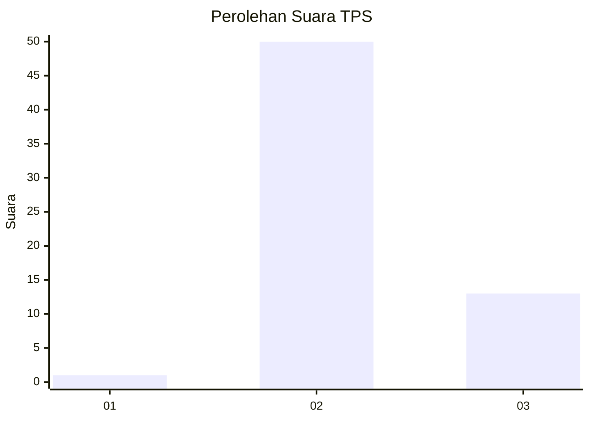

# Hasil

## Grafik

## Tabel

| No. | Nama Paslon    | Suara | Suara (raw) | Persentase |
|:--- |:-------------- | -----:| -----------:| ----------:|
| 1   | ANIES MUHAIMIN | 1     | [1][p-1]    | 1,56       |
| 2   | PRABOWO GIBRAN | 50    | [50][p-2]   | 78,13      |
| 3   | GANJAR MAHFUD  | 13    | [13][p-3]   | 20,31      |

[p-1]: https://github.com/gigit-pemilu/pemilu-2024/blob/main/pilpres/hitung-suara/sub/12-sumatera-utara/sub/25-nias-barat/sub/04-moro'o/sub/2009-sitoluewali/sub/006-tps/sub/paslon-1.txt
[p-2]: https://github.com/gigit-pemilu/pemilu-2024/blob/main/pilpres/hitung-suara/sub/12-sumatera-utara/sub/25-nias-barat/sub/04-moro'o/sub/2009-sitoluewali/sub/006-tps/sub/paslon-2.txt
[p-3]: https://github.com/gigit-pemilu/pemilu-2024/blob/main/pilpres/hitung-suara/sub/12-sumatera-utara/sub/25-nias-barat/sub/04-moro'o/sub/2009-sitoluewali/sub/006-tps/sub/paslon-3.txt

## Foto C Plano

https://sirekap-obj-formc.kpu.go.id/5ba9/pemilu/ppwp/12/25/04/20/09/1225042009006-20240215-082445--c02ee3d3-96f6-4906-8a10-642b10ccc0b7.jpg

https://sirekap-obj-formc.kpu.go.id/5ba9/pemilu/ppwp/12/25/04/20/09/1225042009006-20240215-110957--3fdc9dab-08ce-4ba9-8efb-b1495ff23380.jpg

https://sirekap-obj-formc.kpu.go.id/5ba9/pemilu/ppwp/12/25/04/20/09/1225042009006-20240215-110801--4d92de3b-5821-4985-9b1b-2e82ae6c4998.jpg

## Metadata

| Key        | Value               |
| ---------- | ------------------- |
| Time Stamp | 2024-02-15 17:30:25 |

