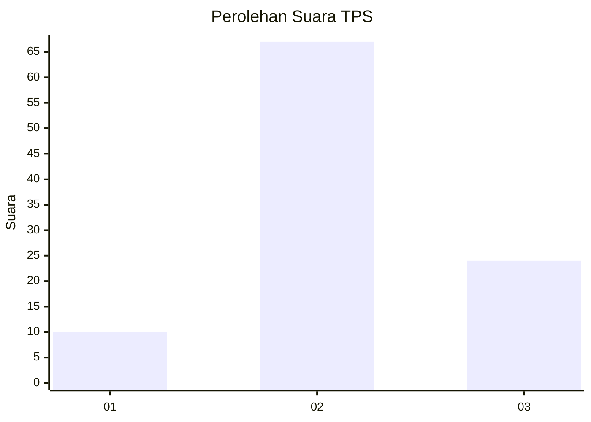
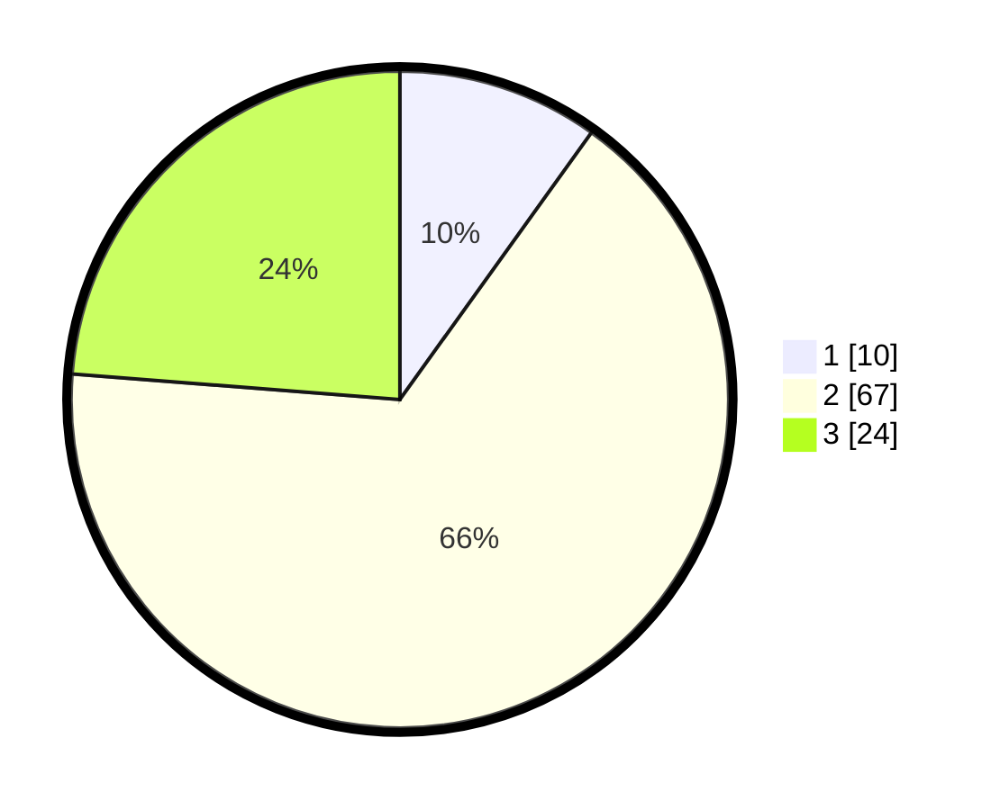

# Hasil

## Grafik

## Tabel

| No. | Nama Paslon    | Suara | Suara (raw) | Persentase |
|:--- |:-------------- | -----:| -----------:| ----------:|
| 1   | ANIES MUHAIMIN | 10    | [10][p-1]   | 9,90       |
| 2   | PRABOWO GIBRAN | 67    | [67][p-2]   | 66,34      |
| 3   | GANJAR MAHFUD  | 24    | [24][p-3]   | 23,76      |

[p-1]: https://github.com/gigit-pemilu/pemilu-2024/blob/main/pilpres/hitung-suara/sub/12-sumatera-utara/sub/25-nias-barat/sub/06-mandrehe-utara/sub/2005-lolomboli/sub/001-tps/sub/paslon-1.txt
[p-2]: https://github.com/gigit-pemilu/pemilu-2024/blob/main/pilpres/hitung-suara/sub/12-sumatera-utara/sub/25-nias-barat/sub/06-mandrehe-utara/sub/2005-lolomboli/sub/001-tps/sub/paslon-2.txt
[p-3]: https://github.com/gigit-pemilu/pemilu-2024/blob/main/pilpres/hitung-suara/sub/12-sumatera-utara/sub/25-nias-barat/sub/06-mandrehe-utara/sub/2005-lolomboli/sub/001-tps/sub/paslon-3.txt

## Foto C Plano

https://sirekap-obj-formc.kpu.go.id/6feb/pemilu/ppwp/12/25/06/20/05/1225062005001-20240215-140313--333c8478-19f2-4467-af2c-7ba6dbfe860a.jpg

https://sirekap-obj-formc.kpu.go.id/6feb/pemilu/ppwp/12/25/06/20/05/1225062005001-20240215-100122--046bab2c-2d32-4b6f-8083-a75c829b26fc.jpg

https://sirekap-obj-formc.kpu.go.id/6feb/pemilu/ppwp/12/25/06/20/05/1225062005001-20240215-140206--cedeac03-84c0-495b-9538-199f05b1e7f9.jpg

## Metadata

| Key        | Value               |
| ---------- | ------------------- |
| Time Stamp | 2024-02-25 16:00:00 |

