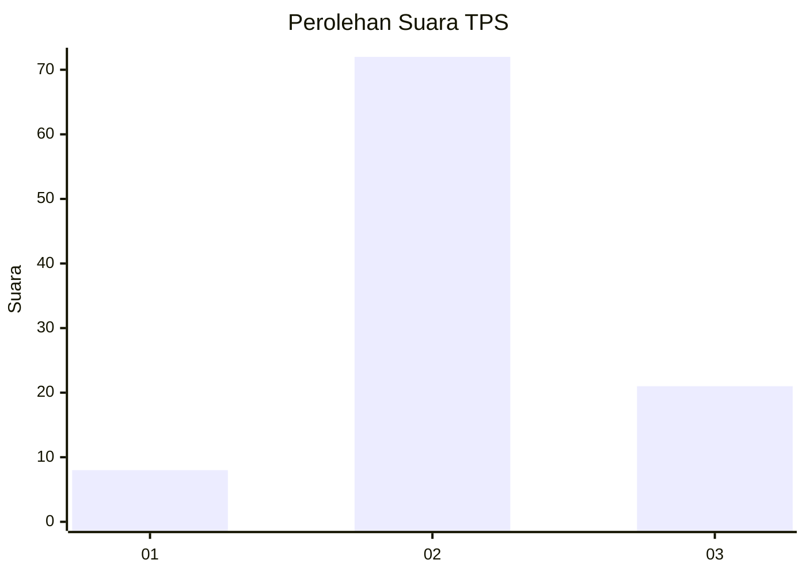
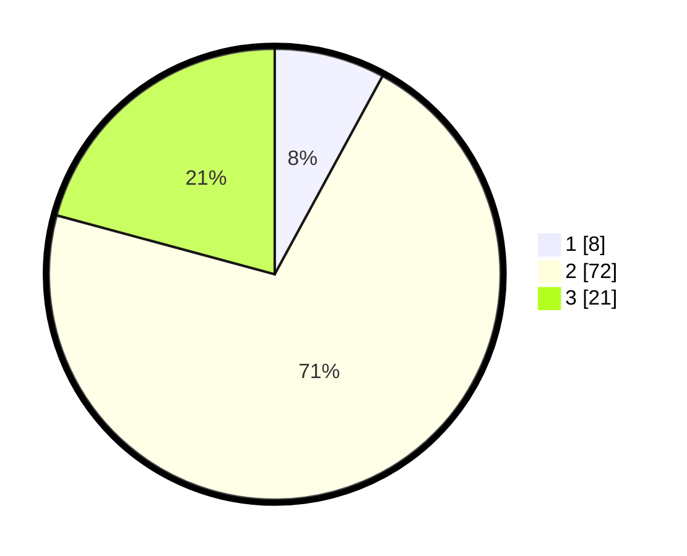

# Hasil

## Grafik

## Tabel

| No. | Nama Paslon    | Suara | Suara (raw) | Persentase |
|:--- |:-------------- | -----:| -----------:| ----------:|
| 1   | ANIES MUHAIMIN | 8     | [8][p-1]    | 7,92       |
| 2   | PRABOWO GIBRAN | 72    | [72][p-2]   | 71,29      |
| 3   | GANJAR MAHFUD  | 21    | [21][p-3]   | 20,79      |

[p-1]: https://github.com/gigit-pemilu/pemilu-2024-12-sumatera-utara/blob/main/pilpres/hitung-suara/sub/12-sumatera-utara/sub/25-nias-barat/sub/06-mandrehe-utara/sub/2006-ononamolo-i/sub/002-tps/sub/paslon-1.txt
[p-2]: https://github.com/gigit-pemilu/pemilu-2024-12-sumatera-utara/blob/main/pilpres/hitung-suara/sub/12-sumatera-utara/sub/25-nias-barat/sub/06-mandrehe-utara/sub/2006-ononamolo-i/sub/002-tps/sub/paslon-2.txt
[p-3]: https://github.com/gigit-pemilu/pemilu-2024-12-sumatera-utara/blob/main/pilpres/hitung-suara/sub/12-sumatera-utara/sub/25-nias-barat/sub/06-mandrehe-utara/sub/2006-ononamolo-i/sub/002-tps/sub/paslon-3.txt

## Foto C Plano

https://sirekap-obj-formc.kpu.go.id/7c35/pemilu/ppwp/12/25/06/20/06/1225062006002-20240214-162211--06bf4d7f-ef77-47fe-9609-b6c64f004573.jpg

https://sirekap-obj-formc.kpu.go.id/7c35/pemilu/ppwp/12/25/06/20/06/1225062006002-20240214-160113--ea09a0d4-5262-4d23-854b-66b2e3bf3de0.jpg

https://sirekap-obj-formc.kpu.go.id/7c35/pemilu/ppwp/12/25/06/20/06/1225062006002-20240214-160130--5ca80b0b-c268-4038-8cdf-66d7103c7e04.jpg

## Metadata

| Key        | Value               |
| ---------- | ------------------- |
| Time Stamp | 2024-02-15 09:00:24 |

