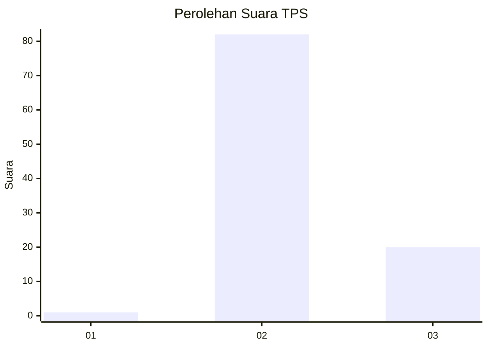
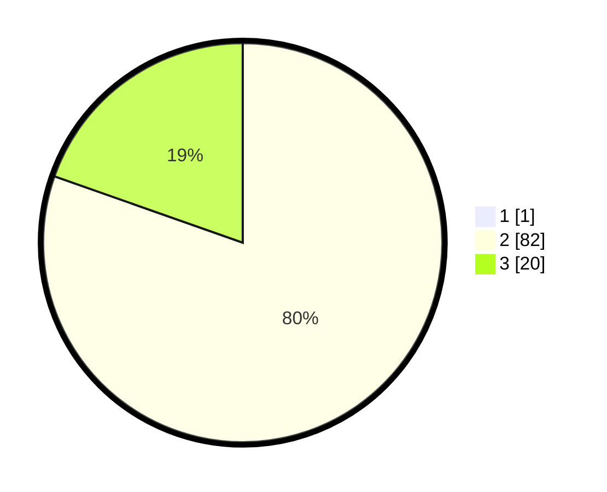

# Hasil

## Grafik

## Tabel

| No. | Nama Paslon    | Suara | Suara (raw) | Persentase |
|:--- |:-------------- | -----:| -----------:| ----------:|
| 1   | ANIES MUHAIMIN | 1     | [1][p-1]    | 0,97       |
| 2   | PRABOWO GIBRAN | 82    | [82][p-2]   | 79,61      |
| 3   | GANJAR MAHFUD  | 20    | [20][p-3]   | 19,42      |

[p-1]: https://github.com/gigit-pemilu/pemilu-2024-12-sumatera-utara/blob/main/pilpres/hitung-suara/sub/12-sumatera-utara/sub/25-nias-barat/sub/07-lolofitu-moi/sub/2002-duria/sub/003-tps/sub/paslon-1.txt
[p-2]: https://github.com/gigit-pemilu/pemilu-2024-12-sumatera-utara/blob/main/pilpres/hitung-suara/sub/12-sumatera-utara/sub/25-nias-barat/sub/07-lolofitu-moi/sub/2002-duria/sub/003-tps/sub/paslon-2.txt
[p-3]: https://github.com/gigit-pemilu/pemilu-2024-12-sumatera-utara/blob/main/pilpres/hitung-suara/sub/12-sumatera-utara/sub/25-nias-barat/sub/07-lolofitu-moi/sub/2002-duria/sub/003-tps/sub/paslon-3.txt

## Foto C Plano

https://sirekap-obj-formc.kpu.go.id/f909/pemilu/ppwp/12/25/07/20/02/1225072002003-20240215-092032--4d751d24-0f98-4df8-aa62-5b6067b07f64.jpg

https://sirekap-obj-formc.kpu.go.id/f909/pemilu/ppwp/12/25/07/20/02/1225072002003-20240215-093546--a55cf885-bb2b-40d0-894d-f1bc76eac139.jpg

https://sirekap-obj-formc.kpu.go.id/f909/pemilu/ppwp/12/25/07/20/02/1225072002003-20240215-093747--83083986-804a-4b46-99bf-e22af7f284cc.jpg

## Metadata

| Key        | Value               |
| ---------- | ------------------- |
| Time Stamp | 2024-02-25 16:00:00 |

