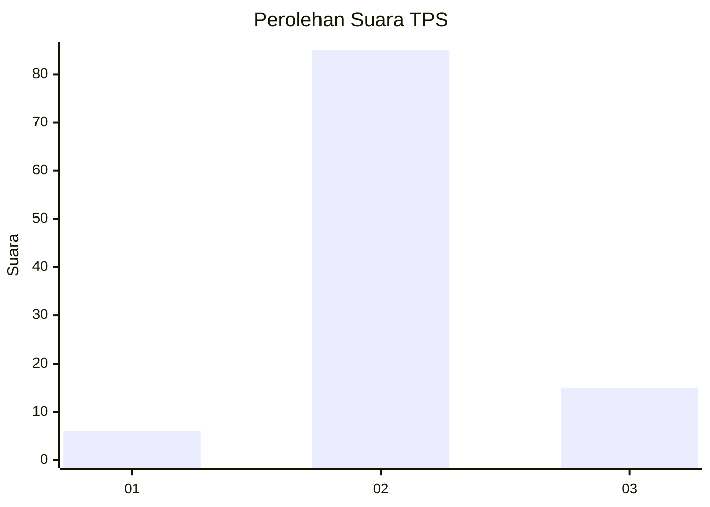
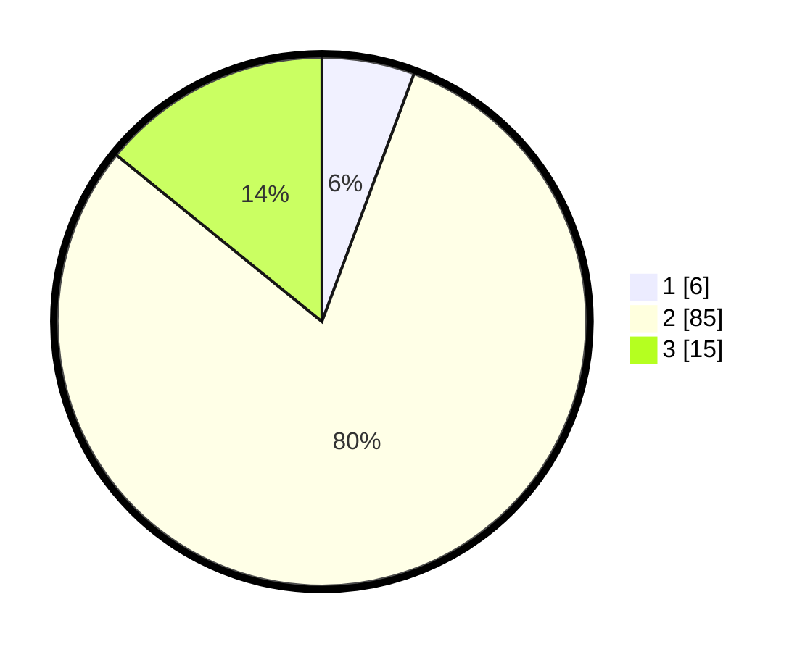

# Hasil

## Grafik

## Tabel

| No. | Nama Paslon    | Suara | Suara (raw) | Persentase |
|:--- |:-------------- | -----:| -----------:| ----------:|
| 1   | ANIES MUHAIMIN | 6     | [6][p-1]    | 5,66       |
| 2   | PRABOWO GIBRAN | 85    | [85][p-2]   | 80,19      |
| 3   | GANJAR MAHFUD  | 15    | [15][p-3]   | 14,15      |

[p-1]: https://github.com/gigit-pemilu/pemilu-2024-12-sumatera-utara/blob/main/pilpres/hitung-suara/sub/12-sumatera-utara/sub/25-nias-barat/sub/07-lolofitu-moi/sub/2007-hiliuso/sub/002-tps/sub/paslon-1.txt
[p-2]: https://github.com/gigit-pemilu/pemilu-2024-12-sumatera-utara/blob/main/pilpres/hitung-suara/sub/12-sumatera-utara/sub/25-nias-barat/sub/07-lolofitu-moi/sub/2007-hiliuso/sub/002-tps/sub/paslon-2.txt
[p-3]: https://github.com/gigit-pemilu/pemilu-2024-12-sumatera-utara/blob/main/pilpres/hitung-suara/sub/12-sumatera-utara/sub/25-nias-barat/sub/07-lolofitu-moi/sub/2007-hiliuso/sub/002-tps/sub/paslon-3.txt

## Foto C Plano

https://sirekap-obj-formc.kpu.go.id/3bb5/pemilu/ppwp/12/25/07/20/07/1225072007002-20240215-073056--867e551a-3fcd-40eb-b033-d30124646bba.jpg

https://sirekap-obj-formc.kpu.go.id/3bb5/pemilu/ppwp/12/25/07/20/07/1225072007002-20240215-093954--1922c5f2-aafd-4485-9418-f7e0670e6ca5.jpg

https://sirekap-obj-formc.kpu.go.id/3bb5/pemilu/ppwp/12/25/07/20/07/1225072007002-20240215-073846--2a727f8b-30ce-46b6-8a24-e0beb301d173.jpg

## Metadata

| Key        | Value               |
| ---------- | ------------------- |
| Time Stamp | 2024-02-25 14:00:00 |

