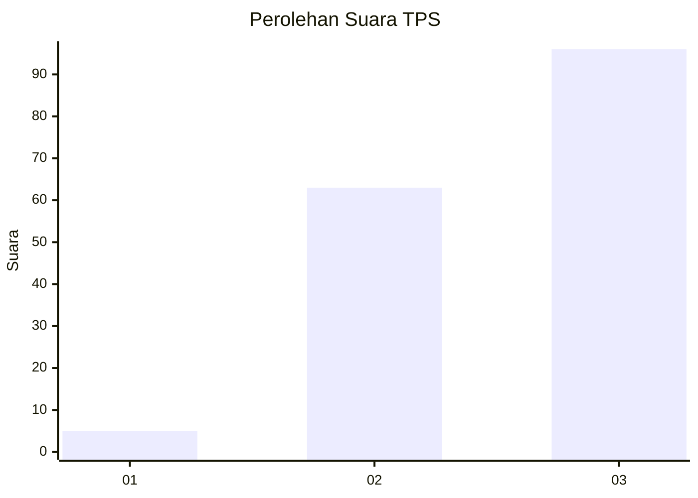
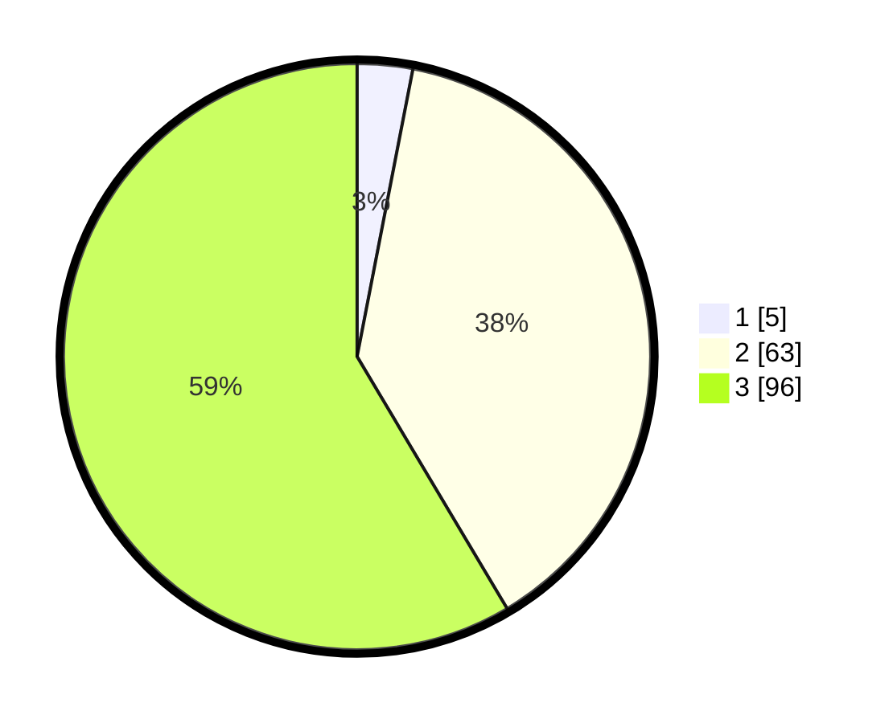

# Hasil

## Grafik

## Tabel

| No. | Nama Paslon    | Suara | Suara (raw) | Persentase |
|:--- |:-------------- | -----:| -----------:| ----------:|
| 1   | ANIES MUHAIMIN | 5     | [5][p-1]    | 3,05       |
| 2   | PRABOWO GIBRAN | 63    | [63][p-2]   | 38,41      |
| 3   | GANJAR MAHFUD  | 96    | [96][p-3]   | 58,54      |

[p-1]: https://github.com/gigit-pemilu/pemilu-2024/blob/main/pilpres/hitung-suara/sub/12-sumatera-utara/sub/71-kota-medan/sub/01-medan-kota/sub/1001-pasar-baru/sub/001-tps/sub/paslon-1.txt
[p-2]: https://github.com/gigit-pemilu/pemilu-2024/blob/main/pilpres/hitung-suara/sub/12-sumatera-utara/sub/71-kota-medan/sub/01-medan-kota/sub/1001-pasar-baru/sub/001-tps/sub/paslon-2.txt
[p-3]: https://github.com/gigit-pemilu/pemilu-2024/blob/main/pilpres/hitung-suara/sub/12-sumatera-utara/sub/71-kota-medan/sub/01-medan-kota/sub/1001-pasar-baru/sub/001-tps/sub/paslon-3.txt

## Foto C Plano

https://sirekap-obj-formc.kpu.go.id/d3b7/pemilu/ppwp/12/71/01/10/01/1271011001001-20240214-203149--bc77edd2-7b9f-4d09-a39b-009e12ecc6b5.jpg

https://sirekap-obj-formc.kpu.go.id/d3b7/pemilu/ppwp/12/71/01/10/01/1271011001001-20240214-203353--dfaec2f1-6154-4769-8b66-b3c4cb5a6f06.jpg

https://sirekap-obj-formc.kpu.go.id/d3b7/pemilu/ppwp/12/71/01/10/01/1271011001001-20240214-203733--b65c69d0-56d9-4dee-9ec0-3db1d24bb6e8.jpg

## Metadata

| Key        | Value               |
| ---------- | ------------------- |
| Time Stamp | 2024-02-15 20:00:44 |

