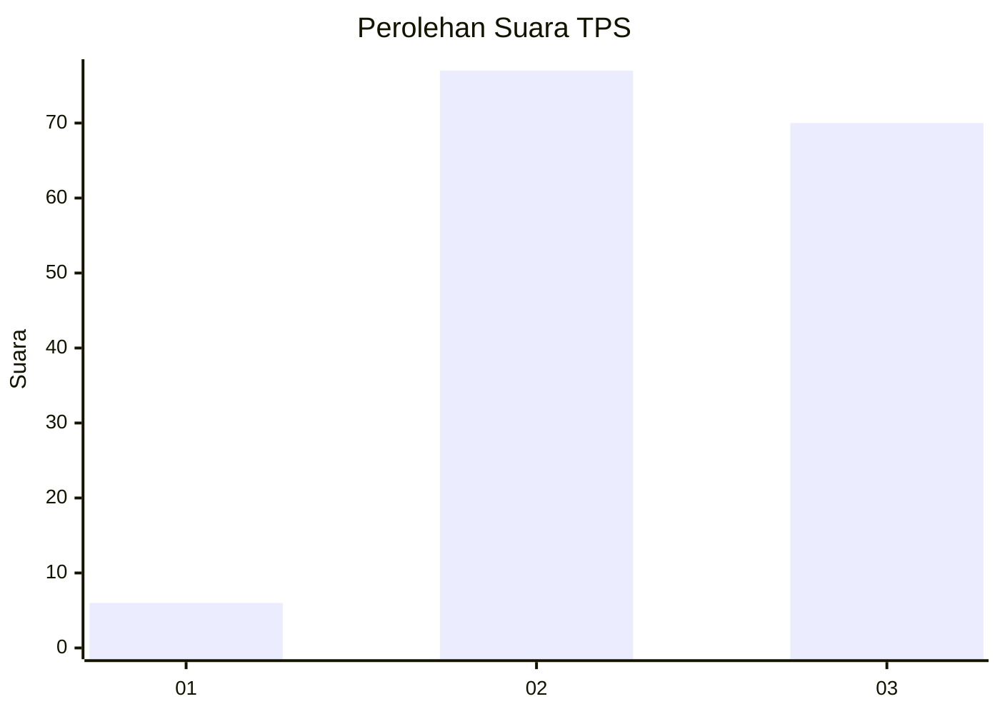
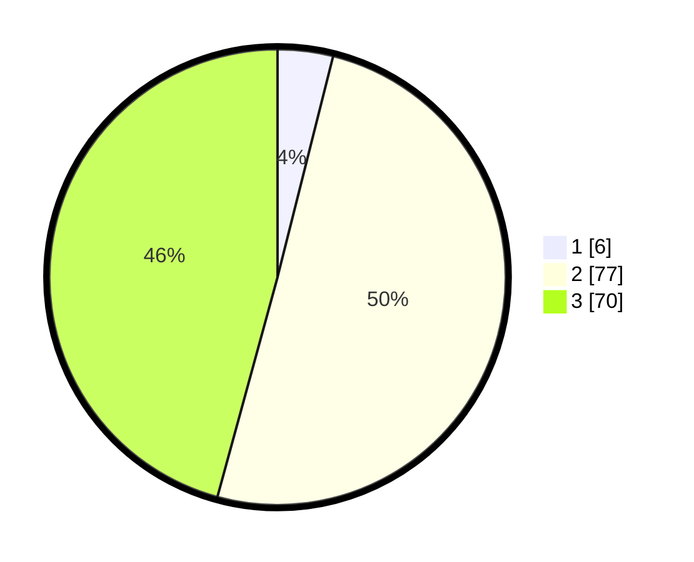

# Hasil

## Grafik

## Tabel

| No. | Nama Paslon    | Suara | Suara (raw) | Persentase |
|:--- |:-------------- | -----:| -----------:| ----------:|
| 1   | ANIES MUHAIMIN | 6     | [6][p-1]    | 3,92       |
| 2   | PRABOWO GIBRAN | 77    | [77][p-2]   | 50,33      |
| 3   | GANJAR MAHFUD  | 70    | [70][p-3]   | 45,75      |

[p-1]: https://github.com/gigit-pemilu/pemilu-2024-12-sumatera-utara/blob/main/pilpres/hitung-suara/sub/12-sumatera-utara/sub/71-kota-medan/sub/01-medan-kota/sub/1001-pasar-baru/sub/005-tps/sub/paslon-1.txt
[p-2]: https://github.com/gigit-pemilu/pemilu-2024-12-sumatera-utara/blob/main/pilpres/hitung-suara/sub/12-sumatera-utara/sub/71-kota-medan/sub/01-medan-kota/sub/1001-pasar-baru/sub/005-tps/sub/paslon-2.txt
[p-3]: https://github.com/gigit-pemilu/pemilu-2024-12-sumatera-utara/blob/main/pilpres/hitung-suara/sub/12-sumatera-utara/sub/71-kota-medan/sub/01-medan-kota/sub/1001-pasar-baru/sub/005-tps/sub/paslon-3.txt

## Foto C Plano

https://sirekap-obj-formc.kpu.go.id/6d0d/pemilu/ppwp/12/71/01/10/01/1271011001005-20240214-213913--0589bd17-440e-4126-babd-9ddd074ace45.jpg

https://sirekap-obj-formc.kpu.go.id/6d0d/pemilu/ppwp/12/71/01/10/01/1271011001005-20240214-214018--4e5fef6e-a0bc-49a8-8900-68a7cb41fefe.jpg

https://sirekap-obj-formc.kpu.go.id/6d0d/pemilu/ppwp/12/71/01/10/01/1271011001005-20240214-214033--cdee17da-d0d4-4ae0-b7ab-c6b1e675902b.jpg

## Metadata

| Key        | Value               |
| ---------- | ------------------- |
| Time Stamp | 2024-02-15 20:00:44 |

