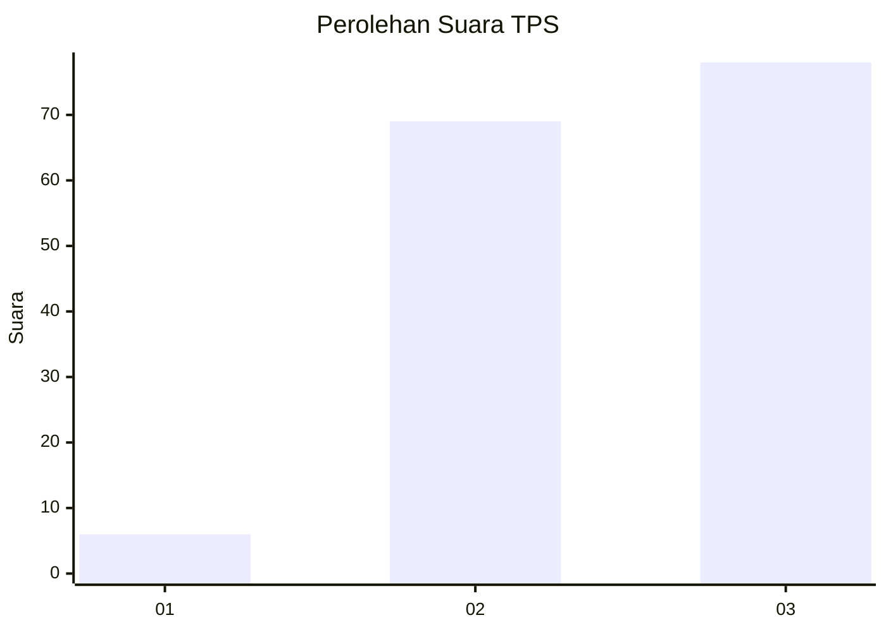
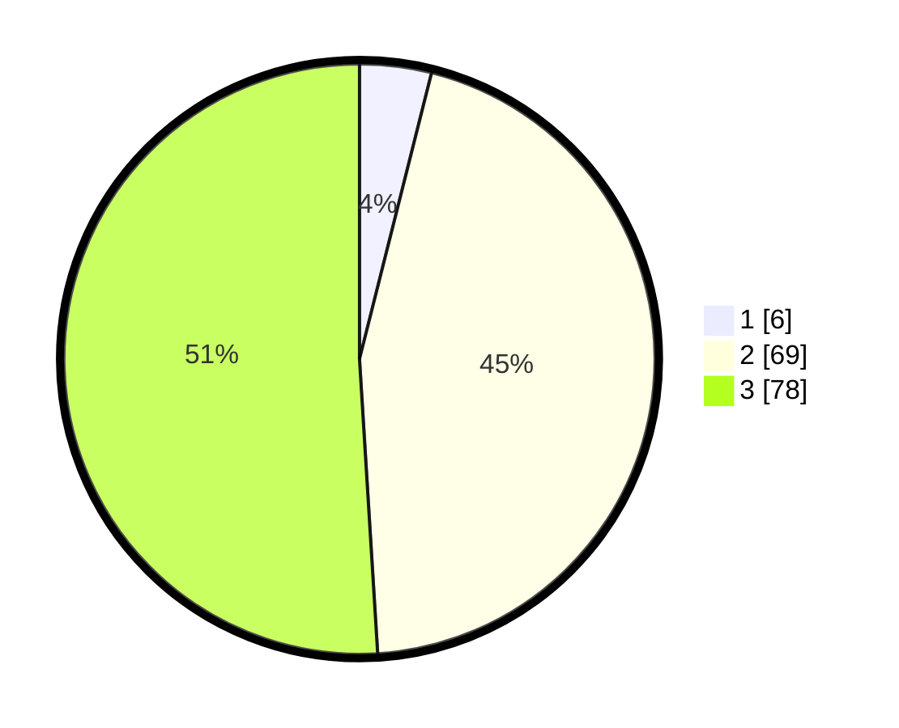

# Hasil

## Grafik

## Tabel

| No. | Nama Paslon    | Suara | Suara (raw) | Persentase |
|:--- |:-------------- | -----:| -----------:| ----------:|
| 1   | ANIES MUHAIMIN | 6     | [6][p-1]    | 3,92       |
| 2   | PRABOWO GIBRAN | 69    | [69][p-2]   | 45,10      |
| 3   | GANJAR MAHFUD  | 78    | [78][p-3]   | 50,98      |

[p-1]: https://github.com/gigit-pemilu/pemilu-2024-12-sumatera-utara/blob/main/pilpres/hitung-suara/sub/12-sumatera-utara/sub/71-kota-medan/sub/01-medan-kota/sub/1001-pasar-baru/sub/008-tps/sub/paslon-1.txt
[p-2]: https://github.com/gigit-pemilu/pemilu-2024-12-sumatera-utara/blob/main/pilpres/hitung-suara/sub/12-sumatera-utara/sub/71-kota-medan/sub/01-medan-kota/sub/1001-pasar-baru/sub/008-tps/sub/paslon-2.txt
[p-3]: https://github.com/gigit-pemilu/pemilu-2024-12-sumatera-utara/blob/main/pilpres/hitung-suara/sub/12-sumatera-utara/sub/71-kota-medan/sub/01-medan-kota/sub/1001-pasar-baru/sub/008-tps/sub/paslon-3.txt

## Foto C Plano

https://sirekap-obj-formc.kpu.go.id/3972/pemilu/ppwp/12/71/01/10/01/1271011001008-20240214-232458--952da9ea-6a55-436d-b268-9ae477665d44.jpg

https://sirekap-obj-formc.kpu.go.id/3972/pemilu/ppwp/12/71/01/10/01/1271011001008-20240214-232520--85358f61-da75-495d-8bbd-9a2c3b2fce92.jpg

https://sirekap-obj-formc.kpu.go.id/3972/pemilu/ppwp/12/71/01/10/01/1271011001008-20240214-232537--6454f159-95d5-4c7c-bfd7-39bc5fbe725b.jpg

## Metadata

| Key        | Value               |
| ---------- | ------------------- |
| Time Stamp | 2024-02-25 11:00:00 |

