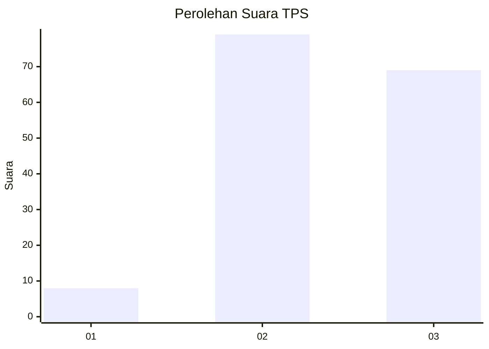
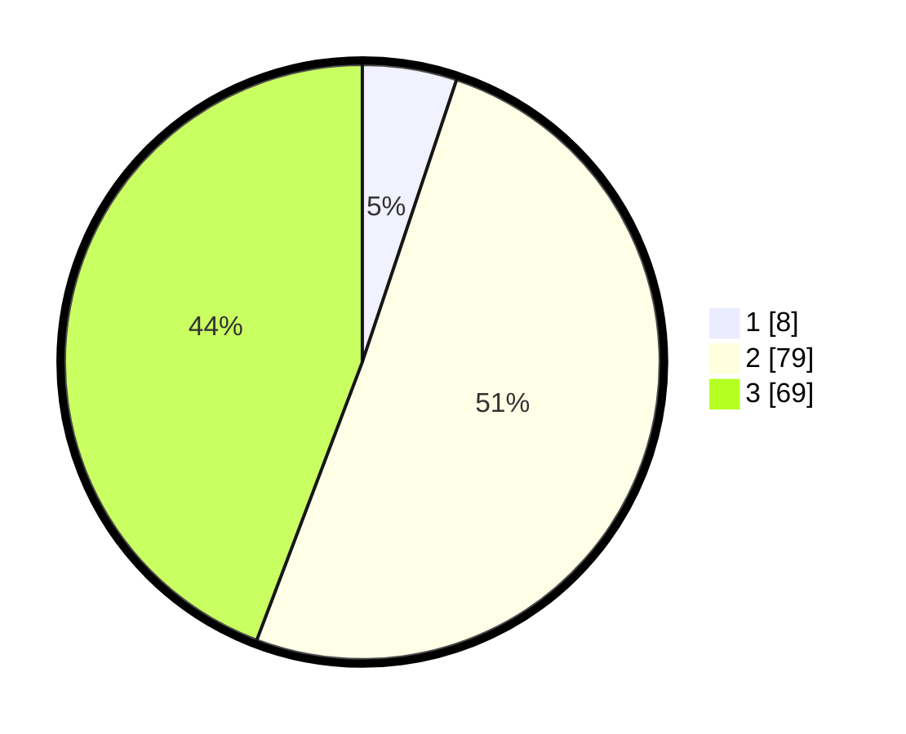

# Hasil

## Grafik

## Tabel

| No. | Nama Paslon    | Suara | Suara (raw) | Persentase |
|:--- |:-------------- | -----:| -----------:| ----------:|
| 1   | ANIES MUHAIMIN | 8     | [8][p-1]    | 5,13       |
| 2   | PRABOWO GIBRAN | 79    | [79][p-2]   | 50,64      |
| 3   | GANJAR MAHFUD  | 69    | [69][p-3]   | 44,23      |

[p-1]: https://github.com/gigit-pemilu/pemilu-2024/blob/main/pilpres/hitung-suara/sub/12-sumatera-utara/sub/71-kota-medan/sub/01-medan-kota/sub/1001-pasar-baru/sub/009-tps/sub/paslon-1.txt
[p-2]: https://github.com/gigit-pemilu/pemilu-2024/blob/main/pilpres/hitung-suara/sub/12-sumatera-utara/sub/71-kota-medan/sub/01-medan-kota/sub/1001-pasar-baru/sub/009-tps/sub/paslon-2.txt
[p-3]: https://github.com/gigit-pemilu/pemilu-2024/blob/main/pilpres/hitung-suara/sub/12-sumatera-utara/sub/71-kota-medan/sub/01-medan-kota/sub/1001-pasar-baru/sub/009-tps/sub/paslon-3.txt

## Foto C Plano

https://sirekap-obj-formc.kpu.go.id/bd42/pemilu/ppwp/12/71/01/10/01/1271011001009-20240214-221100--02c72029-90a6-467a-8749-43bdabc7ae78.jpg

https://sirekap-obj-formc.kpu.go.id/bd42/pemilu/ppwp/12/71/01/10/01/1271011001009-20240214-221154--672ac035-b709-430f-a6c9-2cdab102501e.jpg

https://sirekap-obj-formc.kpu.go.id/bd42/pemilu/ppwp/12/71/01/10/01/1271011001009-20240214-221216--4c0fbee1-2a83-4a62-a59f-25e0458f129e.jpg

## Metadata

| Key        | Value               |
| ---------- | ------------------- |
| Time Stamp | 2024-02-16 01:00:27 |

