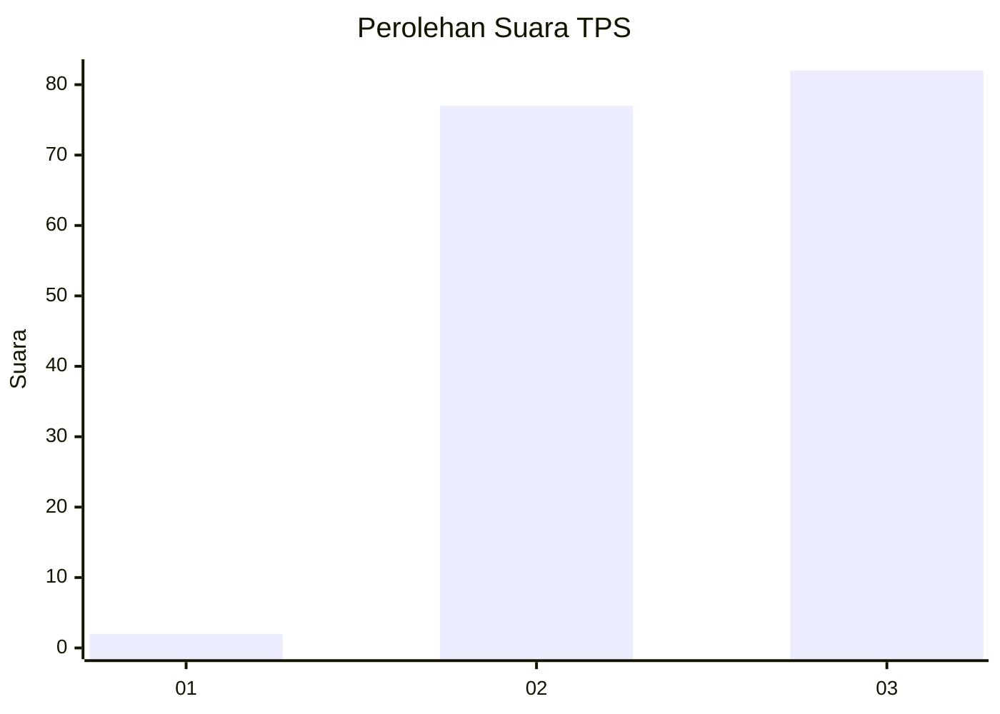
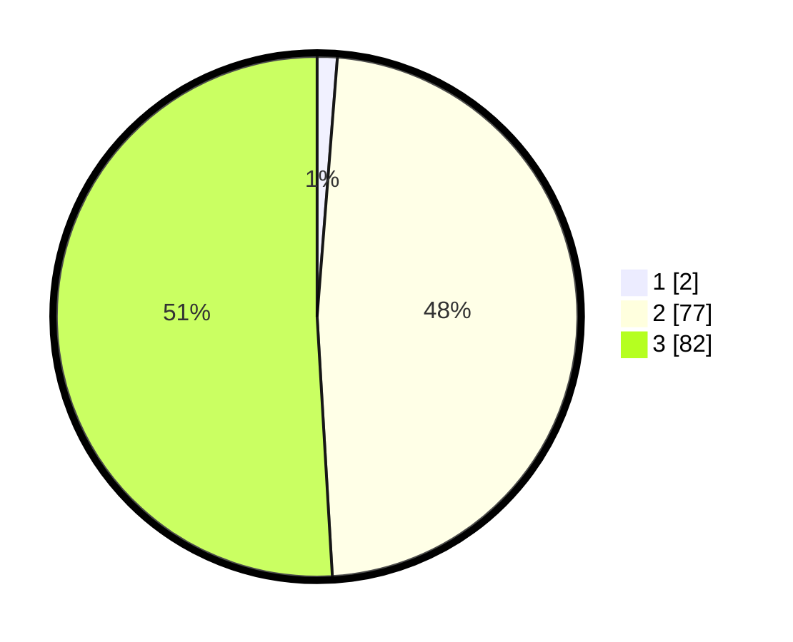

# Hasil

## Grafik

## Tabel

| No. | Nama Paslon    | Suara | Suara (raw) | Persentase |
|:--- |:-------------- | -----:| -----------:| ----------:|
| 1   | ANIES MUHAIMIN | 2     | [2][p-1]    | 1,24       |
| 2   | PRABOWO GIBRAN | 77    | [77][p-2]   | 47,83      |
| 3   | GANJAR MAHFUD  | 82    | [82][p-3]   | 50,93      |

[p-1]: https://github.com/gigit-pemilu/pemilu-2024/blob/main/pilpres/hitung-suara/sub/12-sumatera-utara/sub/71-kota-medan/sub/01-medan-kota/sub/1003-sei-rengas-i/sub/009-tps/sub/paslon-1.txt
[p-2]: https://github.com/gigit-pemilu/pemilu-2024/blob/main/pilpres/hitung-suara/sub/12-sumatera-utara/sub/71-kota-medan/sub/01-medan-kota/sub/1003-sei-rengas-i/sub/009-tps/sub/paslon-2.txt
[p-3]: https://github.com/gigit-pemilu/pemilu-2024/blob/main/pilpres/hitung-suara/sub/12-sumatera-utara/sub/71-kota-medan/sub/01-medan-kota/sub/1003-sei-rengas-i/sub/009-tps/sub/paslon-3.txt

## Foto C Plano

https://sirekap-obj-formc.kpu.go.id/9644/pemilu/ppwp/12/71/01/10/03/1271011003009-20240214-185748--150cac94-58f2-41d4-ac49-9d5abeea44fb.jpg

https://sirekap-obj-formc.kpu.go.id/9644/pemilu/ppwp/12/71/01/10/03/1271011003009-20240214-185757--f6843300-581b-4981-a9e8-55fb818db7e4.jpg

https://sirekap-obj-formc.kpu.go.id/9644/pemilu/ppwp/12/71/01/10/03/1271011003009-20240214-185803--021ec94f-65d2-42a7-843d-d6600f28e44f.jpg

## Metadata

| Key        | Value               |
| ---------- | ------------------- |
| Time Stamp | 2024-02-15 03:06:03 |

## DATA PEMILIH TETAP

Jumlah pemilih dalam DPT: **143**.
 * L: **840**.
 * P: **873**.

## DATA PENGGUNA HAK PILIH

Jumlah pengguna hak pilih dalam DPT: **157**.
 * L: **840**.
 * P: **77**.

Jumlah pengguna hak pilih dalam DPTb: **805**.
 * L: **484**.
 * P: **82**.

Jumlah pengguna hak pilih dalam DPK: **80**.
 * L: **0**.
 * P: **80**.

Jumlah pengguna hak pilih: **172**.
 * L: **157**.
 * P: **880**.

## JUMLAH SUARA SAH DAN TIDAK SAH

JUMLAH SELURUH SUARA SAH: **0**.

JUMLAH SUARA TIDAK SAH: **553**.

JUMLAH SELURUH SUARA SAH DAN SUARA TIDAK SAH: **0**.

