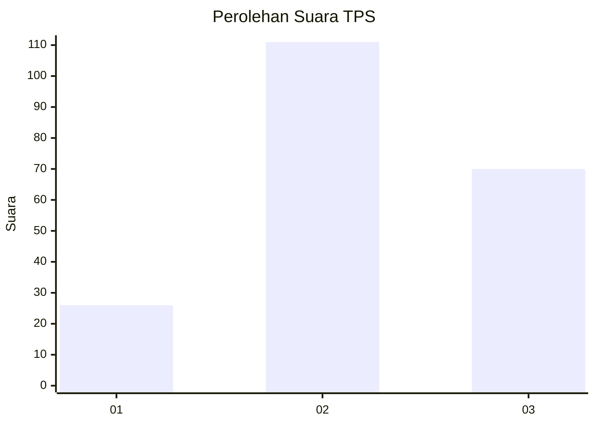
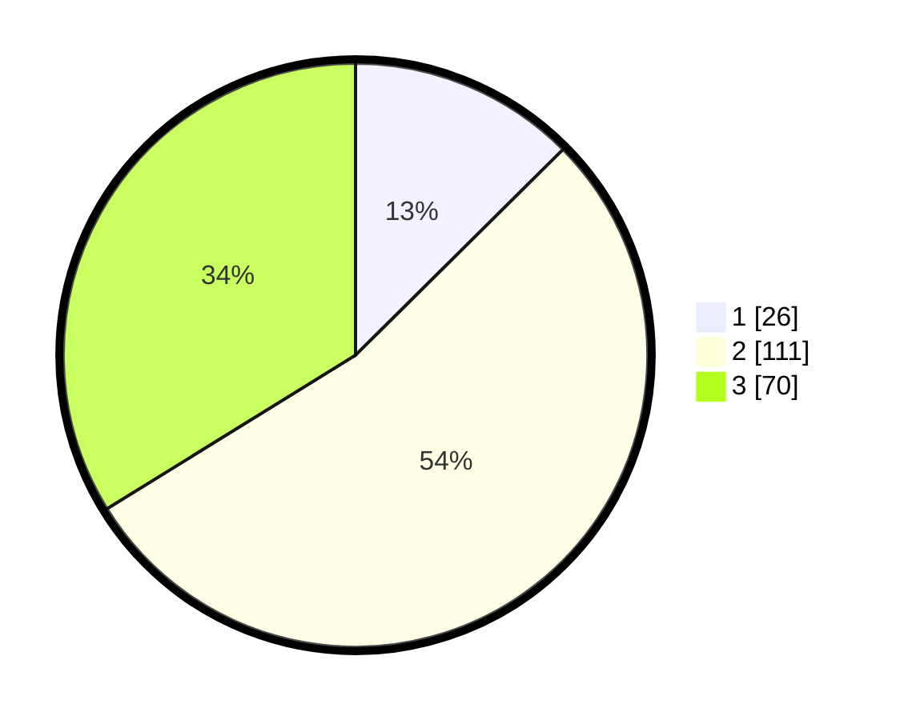

# Hasil

## Grafik

## Tabel

| No. | Nama Paslon    | Suara | Suara (raw) | Persentase |
|:--- |:-------------- | -----:| -----------:| ----------:|
| 1   | ANIES MUHAIMIN | 26    | [26][p-1]   | 12,56      |
| 2   | PRABOWO GIBRAN | 111   | [111][p-2]  | 53,62      |
| 3   | GANJAR MAHFUD  | 70    | [70][p-3]   | 33,82      |

[p-1]: https://github.com/gigit-pemilu/pemilu-2024/blob/main/pilpres/hitung-suara/sub/12-sumatera-utara/sub/71-kota-medan/sub/01-medan-kota/sub/1005-pandau-hulu-i/sub/004-tps/sub/paslon-1.txt
[p-2]: https://github.com/gigit-pemilu/pemilu-2024/blob/main/pilpres/hitung-suara/sub/12-sumatera-utara/sub/71-kota-medan/sub/01-medan-kota/sub/1005-pandau-hulu-i/sub/004-tps/sub/paslon-2.txt
[p-3]: https://github.com/gigit-pemilu/pemilu-2024/blob/main/pilpres/hitung-suara/sub/12-sumatera-utara/sub/71-kota-medan/sub/01-medan-kota/sub/1005-pandau-hulu-i/sub/004-tps/sub/paslon-3.txt

## Foto C Plano

https://sirekap-obj-formc.kpu.go.id/96c0/pemilu/ppwp/12/71/01/10/05/1271011005004-20240214-203502--2fba79c4-7cc3-4a07-b4a8-669c2df07621.jpg

https://sirekap-obj-formc.kpu.go.id/96c0/pemilu/ppwp/12/71/01/10/05/1271011005004-20240214-202944--9d0e4367-2b1e-4c6c-9190-b35b31ec042e.jpg

https://sirekap-obj-formc.kpu.go.id/96c0/pemilu/ppwp/12/71/01/10/05/1271011005004-20240214-214330--d731ed6b-bb75-4474-b536-a17d2749dad3.jpg

## Metadata

| Key        | Value               |
| ---------- | ------------------- |
| Time Stamp | 2024-02-15 05:00:24 |

