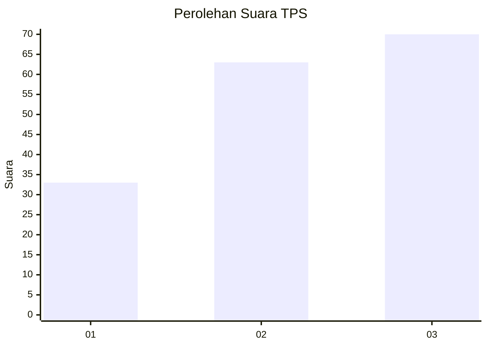
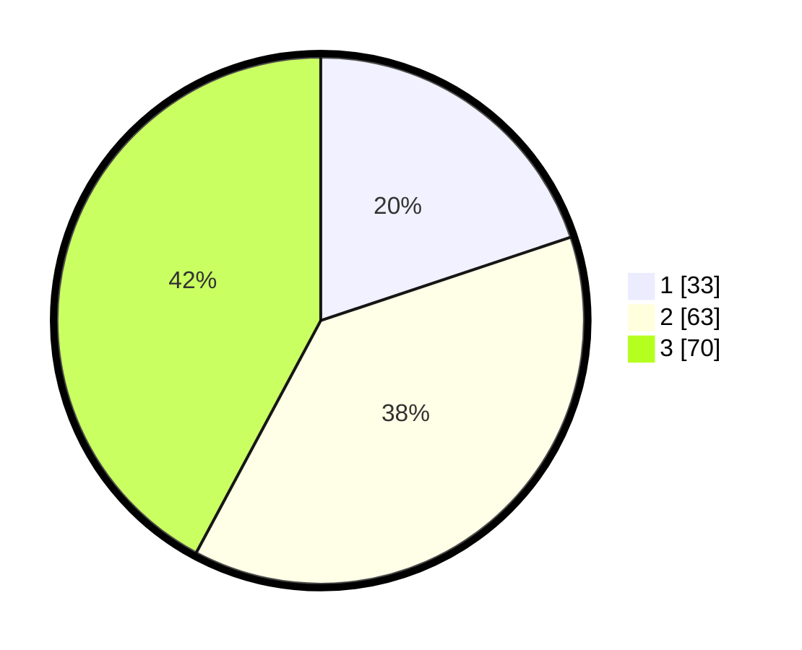

# Hasil

## Grafik

## Tabel

| No. | Nama Paslon    | Suara | Suara (raw) | Persentase |
|:--- |:-------------- | -----:| -----------:| ----------:|
| 1   | ANIES MUHAIMIN | 33    | [33][p-1]   | 19,88      |
| 2   | PRABOWO GIBRAN | 63    | [63][p-2]   | 37,95      |
| 3   | GANJAR MAHFUD  | 70    | [70][p-3]   | 42,17      |

[p-1]: https://github.com/gigit-pemilu/pemilu-2024/blob/main/pilpres/hitung-suara/sub/12-sumatera-utara/sub/71-kota-medan/sub/01-medan-kota/sub/1006-kotamatsum-iii/sub/001-tps/sub/paslon-1.txt
[p-2]: https://github.com/gigit-pemilu/pemilu-2024/blob/main/pilpres/hitung-suara/sub/12-sumatera-utara/sub/71-kota-medan/sub/01-medan-kota/sub/1006-kotamatsum-iii/sub/001-tps/sub/paslon-2.txt
[p-3]: https://github.com/gigit-pemilu/pemilu-2024/blob/main/pilpres/hitung-suara/sub/12-sumatera-utara/sub/71-kota-medan/sub/01-medan-kota/sub/1006-kotamatsum-iii/sub/001-tps/sub/paslon-3.txt

## Foto C Plano

https://sirekap-obj-formc.kpu.go.id/e53f/pemilu/ppwp/12/71/01/10/06/1271011006001-20240215-000844--1536342b-38f8-4373-b9a1-f138f0baf387.jpg

https://sirekap-obj-formc.kpu.go.id/e53f/pemilu/ppwp/12/71/01/10/06/1271011006001-20240215-000555--96795c3a-fc48-441c-8c2d-57d2bc167c9e.jpg

https://sirekap-obj-formc.kpu.go.id/e53f/pemilu/ppwp/12/71/01/10/06/1271011006001-20240215-000625--172be424-8d6c-42de-85cf-666ec5f94bf9.jpg

## Metadata

| Key        | Value               |
| ---------- | ------------------- |
| Time Stamp | 2024-02-16 23:00:00 |

