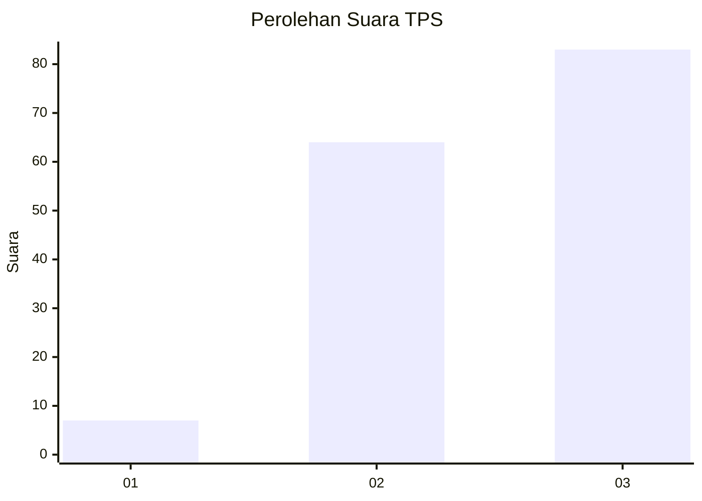
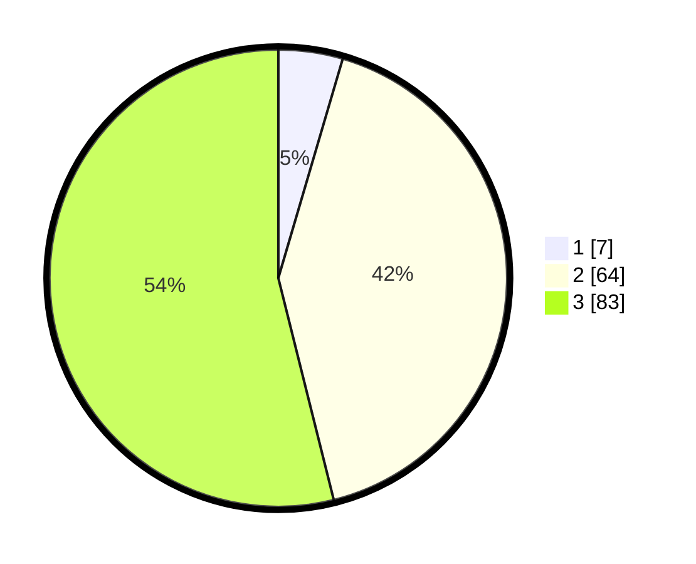

# Hasil

## Grafik

## Tabel

| No. | Nama Paslon    | Suara | Suara (raw) | Persentase |
|:--- |:-------------- | -----:| -----------:| ----------:|
| 1   | ANIES MUHAIMIN | 7     | [7][p-1]    | 4,55       |
| 2   | PRABOWO GIBRAN | 64    | [64][p-2]   | 41,56      |
| 3   | GANJAR MAHFUD  | 83    | [83][p-3]   | 53,90      |

[p-1]: https://github.com/gigit-pemilu/pemilu-2024/blob/main/pilpres/hitung-suara/sub/12-sumatera-utara/sub/71-kota-medan/sub/01-medan-kota/sub/1006-kotamatsum-iii/sub/004-tps/sub/paslon-1.txt
[p-2]: https://github.com/gigit-pemilu/pemilu-2024/blob/main/pilpres/hitung-suara/sub/12-sumatera-utara/sub/71-kota-medan/sub/01-medan-kota/sub/1006-kotamatsum-iii/sub/004-tps/sub/paslon-2.txt
[p-3]: https://github.com/gigit-pemilu/pemilu-2024/blob/main/pilpres/hitung-suara/sub/12-sumatera-utara/sub/71-kota-medan/sub/01-medan-kota/sub/1006-kotamatsum-iii/sub/004-tps/sub/paslon-3.txt

## Foto C Plano

https://sirekap-obj-formc.kpu.go.id/c6c9/pemilu/ppwp/12/71/01/10/06/1271011006004-20240214-193718--8be67cfb-8202-4850-901a-e9c1fa58dbf0.jpg

https://sirekap-obj-formc.kpu.go.id/c6c9/pemilu/ppwp/12/71/01/10/06/1271011006004-20240214-204723--4275bcbe-6290-4be3-a305-7b78d68f5351.jpg

https://sirekap-obj-formc.kpu.go.id/c6c9/pemilu/ppwp/12/71/01/10/06/1271011006004-20240214-204928--a03c8d94-487c-466f-bf9e-54d2bb0b5890.jpg

## Metadata

| Key        | Value               |
| ---------- | ------------------- |
| Time Stamp | 2024-02-25 17:00:00 |

