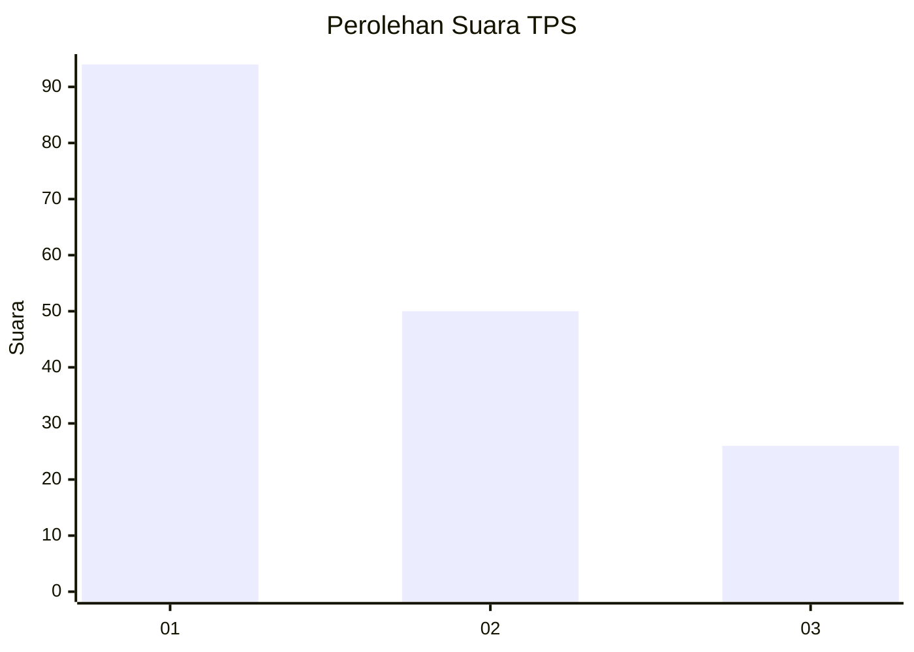
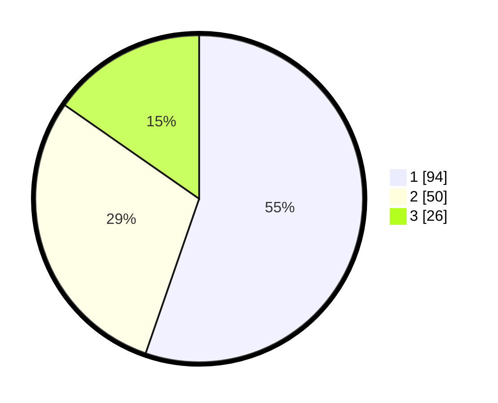

# Hasil

## Grafik

## Tabel

| No. | Nama Paslon    | Suara | Suara (raw) | Persentase |
|:--- |:-------------- | -----:| -----------:| ----------:|
| 1   | ANIES MUHAIMIN | 94    | [94][p-1]   | 55,29      |
| 2   | PRABOWO GIBRAN | 50    | [50][p-2]   | 29,41      |
| 3   | GANJAR MAHFUD  | 26    | [26][p-3]   | 15,29      |

[p-1]: https://github.com/gigit-pemilu/pemilu-2024/blob/main/pilpres/hitung-suara/sub/12-sumatera-utara/sub/71-kota-medan/sub/01-medan-kota/sub/1006-kotamatsum-iii/sub/013-tps/sub/paslon-1.txt
[p-2]: https://github.com/gigit-pemilu/pemilu-2024/blob/main/pilpres/hitung-suara/sub/12-sumatera-utara/sub/71-kota-medan/sub/01-medan-kota/sub/1006-kotamatsum-iii/sub/013-tps/sub/paslon-2.txt
[p-3]: https://github.com/gigit-pemilu/pemilu-2024/blob/main/pilpres/hitung-suara/sub/12-sumatera-utara/sub/71-kota-medan/sub/01-medan-kota/sub/1006-kotamatsum-iii/sub/013-tps/sub/paslon-3.txt

## Foto C Plano

https://sirekap-obj-formc.kpu.go.id/3193/pemilu/ppwp/12/71/01/10/06/1271011006013-20240214-235210--f2c90309-d885-4210-8d51-4b97ad2e6f28.jpg

https://sirekap-obj-formc.kpu.go.id/3193/pemilu/ppwp/12/71/01/10/06/1271011006013-20240214-235349--058245d4-e491-47de-adc7-8fb6e5e965af.jpg

https://sirekap-obj-formc.kpu.go.id/3193/pemilu/ppwp/12/71/01/10/06/1271011006013-20240214-235736--c92311d6-a8d8-4499-9a5e-963c74c51c82.jpg

## Metadata

| Key        | Value               |
| ---------- | ------------------- |
| Time Stamp | 2024-02-25 18:00:00 |

