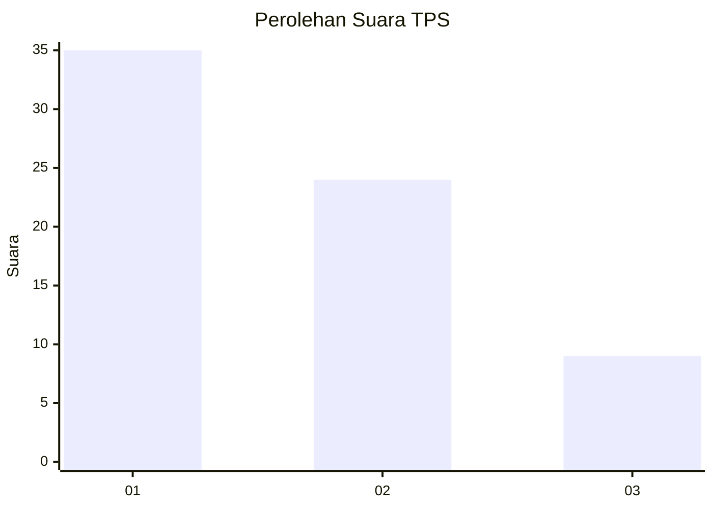
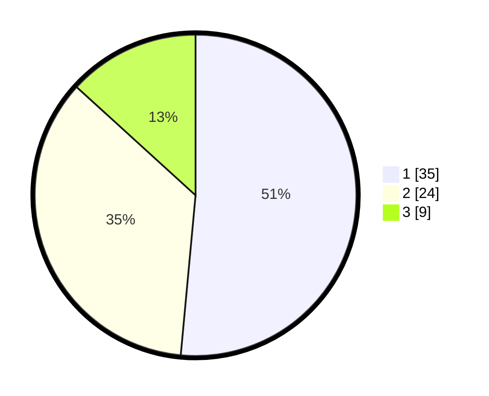

# Hasil

## Grafik

## Tabel

| No. | Nama Paslon    | Suara | Suara (raw) | Persentase |
|:--- |:-------------- | -----:| -----------:| ----------:|
| 1   | ANIES MUHAIMIN | 35    | [35][p-1]   | 51,47      |
| 2   | PRABOWO GIBRAN | 24    | [24][p-2]   | 35,29      |
| 3   | GANJAR MAHFUD  | 9     | [9][p-3]    | 13,24      |

[p-1]: https://github.com/gigit-pemilu/pemilu-2024/blob/main/pilpres/hitung-suara/sub/12-sumatera-utara/sub/71-kota-medan/sub/01-medan-kota/sub/1007-pasar-merah-barat/sub/002-tps/sub/paslon-1.txt
[p-2]: https://github.com/gigit-pemilu/pemilu-2024/blob/main/pilpres/hitung-suara/sub/12-sumatera-utara/sub/71-kota-medan/sub/01-medan-kota/sub/1007-pasar-merah-barat/sub/002-tps/sub/paslon-2.txt
[p-3]: https://github.com/gigit-pemilu/pemilu-2024/blob/main/pilpres/hitung-suara/sub/12-sumatera-utara/sub/71-kota-medan/sub/01-medan-kota/sub/1007-pasar-merah-barat/sub/002-tps/sub/paslon-3.txt

## Foto C Plano

https://sirekap-obj-formc.kpu.go.id/4ca5/pemilu/ppwp/12/71/01/10/07/1271011007002-20240215-002421--3e692ad3-7681-4363-9d4a-f8f5da230f00.jpg

https://sirekap-obj-formc.kpu.go.id/4ca5/pemilu/ppwp/12/71/01/10/07/1271011007002-20240215-002431--8b5d752f-904a-4de8-9830-f33f945c14f1.jpg

https://sirekap-obj-formc.kpu.go.id/4ca5/pemilu/ppwp/12/71/01/10/07/1271011007002-20240215-002441--2de8919f-e1b5-49ef-bb2d-8414ffdd4f31.jpg

## Metadata

| Key        | Value               |
| ---------- | ------------------- |
| Time Stamp | 2024-02-25 15:00:00 |

