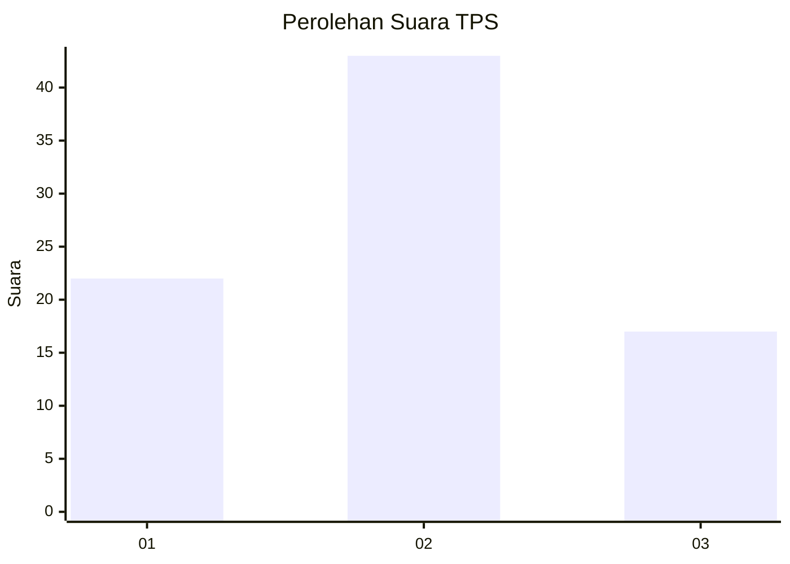
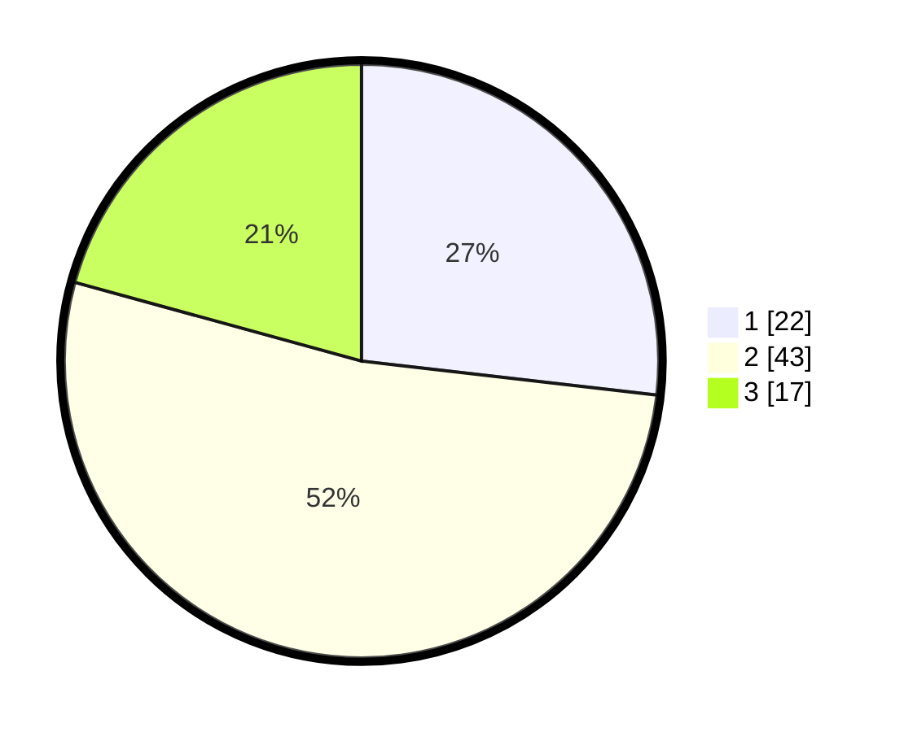

# Hasil

## Grafik

## Tabel

| No. | Nama Paslon    | Suara | Suara (raw) | Persentase |
|:--- |:-------------- | -----:| -----------:| ----------:|
| 1   | ANIES MUHAIMIN | 22    | [22][p-1]   | 26,83      |
| 2   | PRABOWO GIBRAN | 43    | [43][p-2]   | 52,44      |
| 3   | GANJAR MAHFUD  | 17    | [17][p-3]   | 20,73      |

[p-1]: https://github.com/gigit-pemilu/pemilu-2024-12-sumatera-utara/blob/main/pilpres/hitung-suara/sub/12-sumatera-utara/sub/71-kota-medan/sub/01-medan-kota/sub/1009-teladan-barat/sub/012-tps/sub/paslon-1.txt
[p-2]: https://github.com/gigit-pemilu/pemilu-2024-12-sumatera-utara/blob/main/pilpres/hitung-suara/sub/12-sumatera-utara/sub/71-kota-medan/sub/01-medan-kota/sub/1009-teladan-barat/sub/012-tps/sub/paslon-2.txt
[p-3]: https://github.com/gigit-pemilu/pemilu-2024-12-sumatera-utara/blob/main/pilpres/hitung-suara/sub/12-sumatera-utara/sub/71-kota-medan/sub/01-medan-kota/sub/1009-teladan-barat/sub/012-tps/sub/paslon-3.txt

## Foto C Plano

https://sirekap-obj-formc.kpu.go.id/4514/pemilu/ppwp/12/71/01/10/09/1271011009012-20240214-195511--121c4356-4b80-4069-ab03-daaf6177c9f3.jpg

https://sirekap-obj-formc.kpu.go.id/4514/pemilu/ppwp/12/71/01/10/09/1271011009012-20240215-000928--01131054-88ae-4d2b-ae1b-67cf07e806a9.jpg

https://sirekap-obj-formc.kpu.go.id/4514/pemilu/ppwp/12/71/01/10/09/1271011009012-20240215-001125--a9e491ec-ef0a-4d8a-811d-40859c93c2b2.jpg

## Metadata

| Key        | Value               |
| ---------- | ------------------- |
| Time Stamp | 2024-02-25 16:00:00 |

